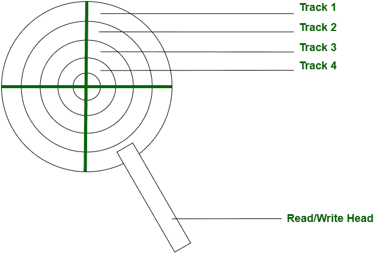
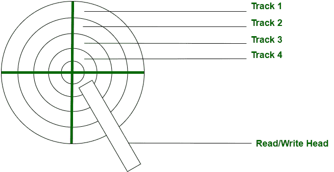
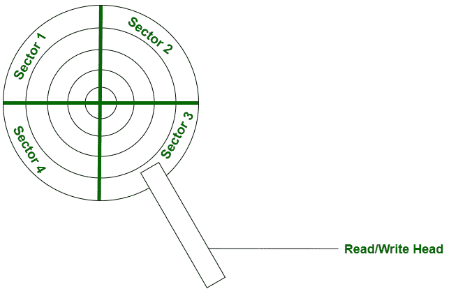
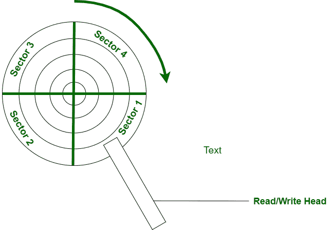

# 磁盘调度中寻道时间和旋转延迟之间的差异

> 原文:[https://www . geeksforgeeks . org/寻道时间和旋转延迟磁盘调度之间的差异/](https://www.geeksforgeeks.org/difference-between-seek-time-and-rotational-latency-in-disk-scheduling/)

**寻道时间:**
一个[圆盘](https://www.geeksforgeeks.org/hard-disk-drive-hdd-secondary-memory/)被分成许多圆形轨迹。寻道时间定义为读/写磁头从一个磁道移动到另一个磁道所需的时间。

例如，
考虑下图，读/写磁头当前在磁道 1 上。

现在，在下一个读/写请求中，我们可能希望从磁道 4 读取数据，在这种情况下，我们的读/写磁头将移动到磁道 4。到达轨道 4 所需的时间是**寻道时间**。

**旋转延迟:**
磁盘被分成许多圆形磁道，这些磁道又被进一步分成称为扇区的块。读/写磁头从当前位置旋转到所请求的扇区所需的时间称为旋转延迟。

例如，
考虑下图，我们已经将每个轨道划分为 4 个扇区。
系统收到从磁道 1 读取扇区的请求，因此读/写磁头将移动到磁道 1，此时将是寻道时间。
读/写磁头目前在扇区 3。

但是数据可能不在扇区 3。数据块可以存在于扇区 1 中。读/写磁头从扇区 3 移动到扇区 1 所需的时间是**旋转延迟**。
下面是最终配置。

让我们看看旋转延迟和寻道时间之间的区别。

| 没有 | 寻道时间 | 旋转延迟 |
| --- | --- | --- |
| one | 它是读/写磁头从一个磁道移动到另一个磁道所需的时间。 | 读/写磁头从一个扇区移动到另一个扇区所需的时间。 |
| Two | 大多数磁盘调度只使用寻道时间。 | 大多数磁盘调度不考虑旋转频率，因为在大多数现代系统中，块的实际物理位置不可用。 |
| three | 如果后续请求属于同一轨道或附近，则可以减少。 | 如果后续请求属于相邻扇区，则可以减少。 |
| four | 寻道时间=(穿过 1 个柱面(磁道)的时间))*(穿过柱面(磁道)的数量)。 | 旋转延迟=(当前位置和所需扇区之间的角度)/(旋转频率)。 |

