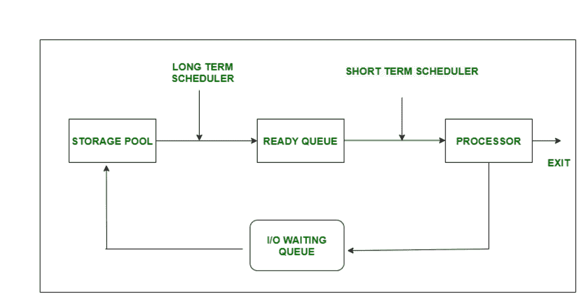
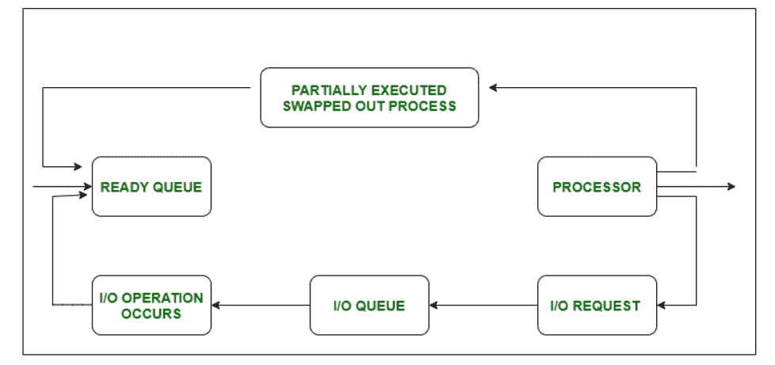
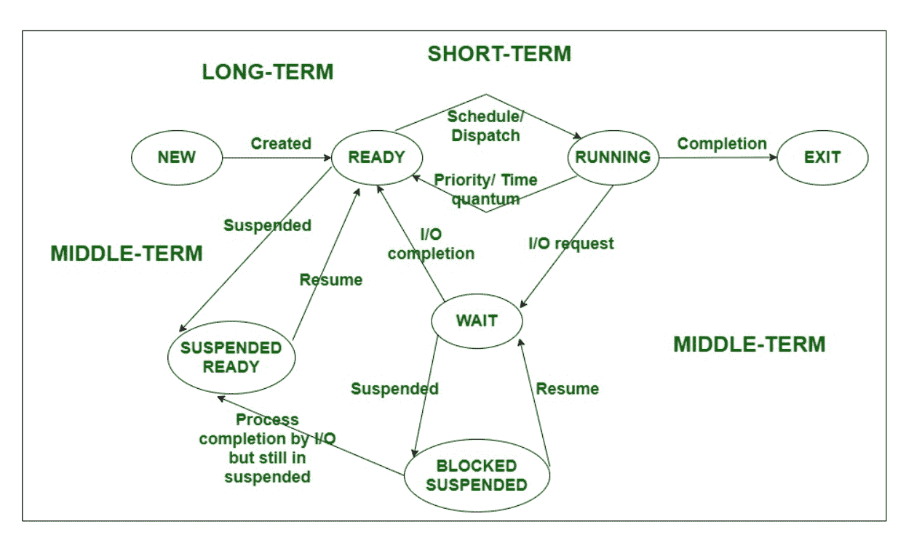

# 短期和中期调度的区别

> 原文:[https://www . geesforgeks . org/短期和中期调度程序之间的差异/](https://www.geeksforgeeks.org/difference-between-short-term-and-medium-term-scheduler/)

先决条件–[进程调度器](https://www.geeksforgeeks.org/process-schedulers-in-operating-system/)

**1。短期调度器:**
短期调度器又称 CPU 调度器。它的主要目标是根据特定的标准提高系统性能。短期调度程序有助于选择准备执行的进程组，并为每个进程分配 CPU。与中期调度器不同，它执行得更频繁，即在几秒钟内。短期调度器对 DOM(多编程程度)的控制较少。

**2。中期调度程序:**
中期调度程序也称为交换调度程序。它的主要目标是从主内存中换出挂起的进程。如果正在运行的进程发出输入/输出请求，它将被挂起。暂停的进程不会显示任何完成进度，因此应该将其移动到辅助存储，从而为新进程提供空间。与短期调度器不同，它的执行不是很频繁。中期调度减少了 DOM(多程序设计的程度)。

**短期和中期调度器的区别:**

| 没有。 | 短期调度程序 | 中期调度程序 |
| 1. | 短期调度器也称为 **CPU 调度器。** | 中期调度器也称为**交换调度器。** |
| 2. | 与中期调度器相比，短期调度器的速度非常快。 | 它的速度比短期调度器慢。 |
| 3. | 它对编程程度的控制较少。 | 它降低了编程的程度。 |
| 4. | 它在分时系统中的存在非常少。 | 中期调度是分时系统的一部分。 |
| 5. | 在短期调度程序中，进程会从就绪状态转换到执行状态。 | 在中期调度器中，不会出现进程转换状态。 |
| 6. | 它的功能是选择那些准备执行的进程。 | 它的功能是将进程重新引入内存。 |

