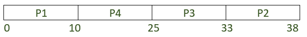
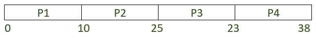
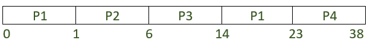

# SJF 和 LJF CPU 调度算法的差异

> 原文:[https://www . geesforgeks . org/difference-sjf-and-ljf-CPU-调度-算法/](https://www.geeksforgeeks.org/difference-between-sjf-and-ljf-cpu-scheduling-algorithms/)

**<u>[最短作业优先](https://www.geeksforgeeks.org/program-for-shortest-job-first-or-sjf-cpu-scheduling-set-1-non-preemptive/)</u> :**
最短作业优先(SJF)算法是一种 CPU 调度算法，旨在对作业进行重新排序，以便选择突发时间最小的进程进行下一次执行。它用于减少等待执行的其他进程的平均等待时间。这可能是[先占](https://www.geeksforgeeks.org/program-shortest-job-first-scheduling-set-2srtf-make-changesdoneplease-review/?ref=rp)或者[不先占](https://www.geeksforgeeks.org/program-for-shortest-job-first-or-sjf-cpu-scheduling-set-1-non-preemptive/)。它的抢先版叫做最短剩余时间优先(SRTF)。

当作业进入时，它会根据其突发时间插入就绪队列。SJF 最小化了平均等待时间，因为它在为突发时间较长的进程提供服务之前，先为突发时间较短的进程提供服务。

使用这种算法的主要优点是，它增加了平均周转时间和平均等待时间，从而提高了系统的有效性。

虽然它最小化了平均等待时间，但它可能会惩罚具有更高突发时间的进程。如果执行时间较短的进程在就绪列表中，则突发时间较长的进程往往会留在就绪列表中，而较小的进程会收到服务。在极端情况下，可能会出现这样的情况:总是执行时间短的进程将得到服务，而执行时间长的进程将无限期等待。较长执行时间进程的这种[饥饿](https://www.geeksforgeeks.org/starvation-and-aging-in-operating-systems/)是该算法的局限性。

**<u>[最长作业第一](https://www.geeksforgeeks.org/longest-remaining-time-first-lrtf-cpu-scheduling-algorithm/)【T4:</u>**
最长作业第一(LJF)另一方面与 SJF 正好相反。它旨在对作业重新排序，以便为下一次执行选择具有最大突发时间的进程。它是一种非抢占式调度算法，一旦一个进程开始执行，它就不能在处理之间被中断，任何其他进程只能在分配的进程完成处理并被终止后才能执行。当作业进入时，它会根据其突发时间插入就绪队列。这也可能是先发制人或非先发制人。
它的抢先版叫做最长剩余时间优先(LRTF)。

该算法的主要缺点是它可能导致进程饥饿。[车队效应](https://www.geeksforgeeks.org/convoy-effect-operating-systems/)是另一个问题，导致吞吐量降低。因此这种算法很少使用。

| 最短工作优先(SJF) | 最长工作优先(LJF) |
| --- | --- |
| 先执行短流程，然后执行长流程。 | 先执行较长的流程，然后执行较短的流程。 |
| 吞吐量增加是因为可以在更短的时间内执行更多的进程。 | 吞吐量降低是因为在一定时间内可以执行的进程减少了。 |
| 不会导致护航效应。 | 可能会导致护航效应。 |
| 它具有较小的平均周转时间和平均等待时间，从而提高了系统的效率。 | 它有非常大的平均周转时间和平均等待时间。这导致处理缓慢，并降低了系统的有效性。 |

**考虑以下示例:**

| 过程 | 到达时间 | 突发时间 |
| --- | --- | --- |
| 第一亲代 | Zero | Ten |
| P2 | one | five |
| P3 | Two | eight |
| P4 | Two | Fifteen |

让我们试着用 SJF 和 LJF 做一个比较研究来解决这个问题。

**1。最长作业第一:**
甘特图看起来像:



```
Average waiting time (AWT),
= ((0-0) + (33-1) + (25-2) + (10-2)) / 4 
= 63/4 
= 15.75

Average turnaround time (ATAT),
= ((10-0) + (38-1) + (33-2) + (25-2))/4 
= 101/4 
= 25.25 
```

**2。(一)。最短作业优先(非优先):**
甘特图如下:



```
Average waiting time (AWT),
= ((0-0) + (10-1) + (15-2) + (23-2)) / 4 
= 43 / 4 
= 10.75

Average turnaround time (ATAT),
= ((10-0) + (15-1) + (23-2) + (38-2)) / 4 
= 81 / 4 
= 20.25 
```

**2。(b)。最短作业优先(抢先):**
甘特图如下:



```
Average waiting time (AWT),
= ((0-0) + (1-1) + (6-2) + (23-2)) / 4 
= 25 / 4 
= 6.25

Average turnaround time (ATAT),
= ((23-0) + (6-1) + (14-2) + (38-2)) / 4 
= 76 / 4 
= 19 
```

从上面的例子可以清楚地看出，SJF 算法比 LJF 算法更有效。