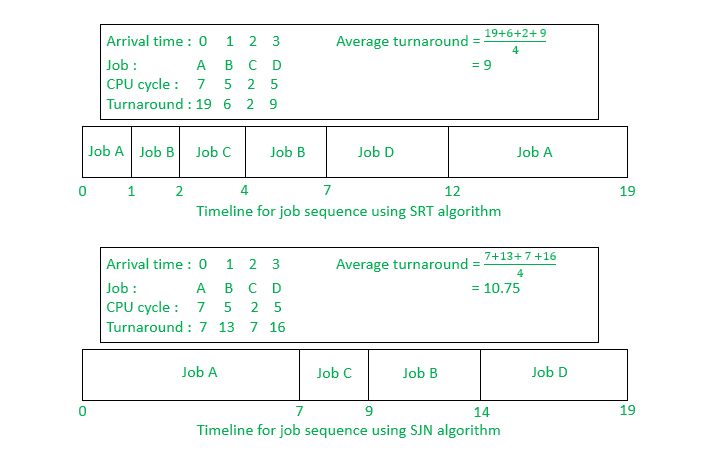

# SJF 和 SRJF CPU 调度算法的区别

> 原文:[https://www . geesforgeks . org/difference-sjf-and-srjf-CPU-调度-算法/](https://www.geeksforgeeks.org/difference-between-sjf-and-srjf-cpu-scheduling-algorithms/)

**1。** [**【最短作业优先(SJF)**](https://www.geeksforgeeks.org/program-for-shortest-job-first-or-sjf-cpu-scheduling-set-1-non-preemptive/) **:**
最短作业优先(SJF)是一种调度策略，选择执行时间最小的等待进程进行下一步执行。它也被称为最短作业下一步(SJN)或最短流程下一步(SPN)。它是一种非抢占式调度算法。

**2。** [**【最短剩余作业优先(SRTF)**](https://www.geeksforgeeks.org/introduction-of-shortest-remaining-time-first-srtf-algorithm/) **:**
最短剩余作业优先(SRJF)是 SJF 调度的抢先版。在这种调度算法中，选择剩余时间最少的进程来执行。到达时间相同的流程将把 SRTF 转换为 SJF。

**相似之处:**

*   SJF 和 SRJF 实际上都是不可行的，因为不可能预测过程的突发时间。
*   SJF 和 SRJF 都可能导致进程饥饿，因为如果不断添加短进程，长进程可能会被无限期推迟。
*   一旦所有进程都在就绪队列中可用，SJF 和 SRJF 就被认为是相同的。这是因为在将进程添加到就绪队列后，不会执行抢占。

**差异:**T2】

| 最短工作优先: | 最短剩余工作优先: |
| 它是一种非抢先算法。 | 这是一种抢先算法。 |
| 它比 SRJF 涉及更少的开销。 | 它涉及的管理费用比 SJF 还多。 |
| 它的执行速度比 SRJF 慢。 | 它的执行速度比 SJF 快。 |
| 这导致相对较低的吞吐量。 | 随着执行时间的减少，它会提高吞吐量。 |
| 它最大限度地减少了每个进程的平均等待时间。 | 它可能会也可能不会最小化每个进程的平均等待时间。 |
| 它可能会遭遇优先级反转。 | 它可能会受到护航效应的影响。 |
| 它涉及较少数量的上下文切换。 | 它涉及更多的上下文切换。 |
| 先执行短流程，然后执行长流程。 | 流程越短，运行速度越快，流程越长，响应时间越短。 |