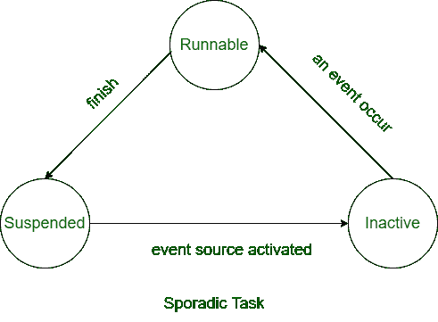

# 零星和非周期性实时任务的区别

> 原文:[https://www . geesforgeks . org/零星和非周期性实时任务的区别/](https://www.geeksforgeeks.org/difference-between-sporadic-and-aperiodic-real-time-tasks/)

实时系统中有两种类型的[任务:周期性任务和动态任务。](https://www.geeksforgeeks.org/tasks-in-real-time-systems/)

其他动态任务分为:

**1。零星实时任务:**
在任意随机时刻重复出现且有硬性期限的实时任务称为零星实时任务。零星实时任务与非周期性实时任务有一定的相似性，但这些任务不同于非周期性实时任务。基本上所有的高关键任务都是零星任务。

例如，工业中的火灾处理任务或系统中的紧急消息到达都是零星的实时任务。

**2。非周期实时任务:**
在任意随机时间重复出现的具有软截止期的动态任务称为非周期实时任务。两个非周期性实时任务之间的时间间隔甚至可以为零。非周期性实时任务一般包括软实时任务。

例如，在键盘上打字或鼠标移动是不定期的实时任务。

**零星和非周期性实时任务的区别:**

| 零星任务 | 非周期性任务 |
| --- | --- |
| 它有一个艰难的期限。 | 它有软期限或没有期限。 |
| 这是一项非常关键的任务。 | 它是低或中等的关键任务。 |
| 两个连续实例之间的最小间距不能为零。 | 两个连续实例之间的最小间隔可以为零。 |
| 它包括硬实时任务。 | 它包括软实时任务。 |
| 所有零星任务的最后期限都可以轻松满足。 | 要在期限内完成所有非周期性任务是很困难的。 |
| 它通过验收测试。 | 不定期任务不进行测试。 |
| 它仅在有足够的空闲时间时执行。 | 它的执行不依赖于可用的空闲时间。 |
| 当空闲时间较少时，它会被调度程序拒绝。 | 它永远不会被调度程序拒绝。 |
| 它包括系统给出的命令。 | 它包括用户给出的交互命令。 |
| 示例:系统中的安全警报程序。 | 示例:在系统中记录任务。 |

