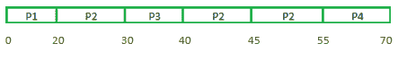

# 【SRJF 和 LRJF CPU 调度算法的区别

> 原文:[https://www . geesforgeks . org/difference-srjf-and-lrjf-CPU-调度-算法/](https://www.geeksforgeeks.org/difference-between-srjf-and-lrjf-cpu-scheduling-algorithms/)

**1。** [**【最短剩余作业优先(SRJF)**](https://www.geeksforgeeks.org/program-for-shortest-job-first-or-sjf-cpu-scheduling-set-1-non-preemptive/) **:**
最短剩余作业优先也叫最短剩余时间优先是抢先版的最短作业优先调度算法。
在最短剩余作业优先中，运行时间(即剩余时间)最小的进程被调度为下一个运行，在 SRJF 中，如果一个新的进程到达 CPU 调度器，需要更少的突发时间来执行，一个正在运行的进程将被**抢占**。

**2。** [**【最长剩余作业优先(LRJF)**](https://www.geeksforgeeks.org/longest-remaining-time-first-lrtf-cpu-scheduling-algorithm/) **:**
最长剩余作业优先又称最长剩余时间优先与 SRJF 正好相反。在这种类型的中央处理器调度中，处理时间最长的进程被调度为下一个运行，如果突发时间更长的新进程进入队列，运行的进程将被**抢占**。

差异表:

<figure class="table">

| 最短剩余作业优先 | 最长剩余作业优先(LRJF) |
| --- | --- |
| 短流程首先执行，在
任何时刻，如果时间较短的流程
到达，将首先执行。
 | 长流程首先执行，在
任意时刻，如果出现长流程
，将首先执行。 |
| 它在
时间附近没有大的平均转弯，因此比 LFJT
更有效 | 它具有非常大的平均周转时间
和等待时间，因此
降低了
操作系统
的有效性 |
| 它不会导致车队效应 | 会导致护航效应。 |
| 在更短时间内执行更多的过程 | 在一定时间内执行的进程较少 |

**我们分别解决一个问题:**
LJFT:

<figure class="table">

| 处理 | 到达时间 | 突发时间 |
| --- | --- | --- |
| 第一亲代 | Zero | Two |
| P2 | Zero | four |
| P3 | Zero | eight |

</figure>

**最长剩余工单第一:**
甘特图:


因此最终的表格将是:
LJFT :

<figure class="table">

| 处理 | 到达时间 | 突发时间 | 完成时间 | 解题时间 | 等待时间 |
| --- | --- | --- | --- | --- | --- |
| 第一亲代 | Zero | Two | Twelve | Twelve | Ten |
| P2 | Zero | four | Thirteen | Thirteen | nine |
| P3 | Zero | eight | Fourteen | Fourteen | six |

```
Turn around time = Completion time - Arrival time 

Average turn around time, 
= [(12-0) + (13-0) + (14-0)]/3
= (12 + 13 + 14)/3
= 13

Waiting time = Turn around time - Burst time

Average waiting time,
= [(12-2) + (13-4) + (14-8)]/3
= (10 + 9 + 6)/3
= 8.34 
```

**问题二:**

LJFT

ljft〔t0〕

| 处理 | 到达时间 | 突发时间 |
| --- | --- | --- |
| 第一亲代 | Zero | Twenty |
| P2 | Fifteen | Twenty-five |
| P3 | Thirty | Ten |
| P4 | Forty-five | Fifteen |

**最短剩余时间优先:**
甘特图:



因此最终的表将是:
SRFT

<figure class="table">

| 处理 | 到达时间 | 突发时间 | 完成时间 | 解题时间 | 等待时间 |
| --- | --- | --- | --- | --- | --- |
| 第一亲代 | Zero | Twenty | Twenty | Twenty | Zero |
| P2 | Fifteen | Twenty-five | Fifty-five | Forty | Fifteen |
| P3 | Thirty | Ten | Forty | Ten | Zero |
| P4 | Forty-five | Fifteen | Seventy | Twenty-five | Ten |

```
Turn around time = Completion time - Arrival time 

Average turn around time, 
= [(20-0) + (55-15) + (40-10) + (70-45)]/4
= (20 + 40 + 30 + 25)/4
= 28.75

Waiting time = Turn around time - Burst time

Average waiting time,     
= [(20-20) + (40-25) + (10-10) + (25-15)] / 4
= (0 + 15 + 0 + 10) / 4
= 6.25 
```

</figure>

</figure>

</figure>