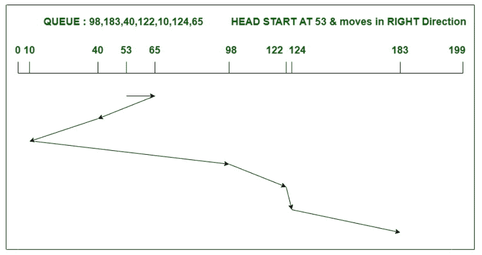
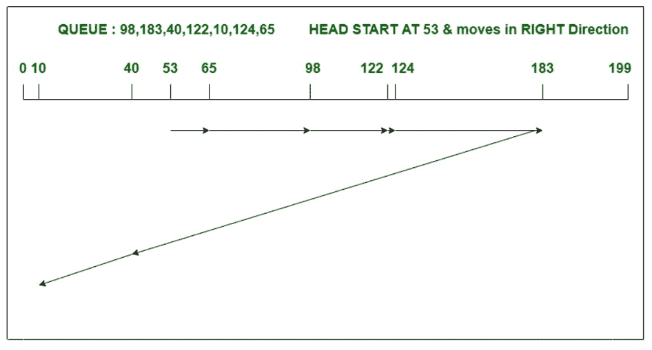

# SSTF 和 LOOK 磁盘调度算法的区别

> 原文:[https://www . geesforgeks . org/sstf 和 look-disk-scheduling-algorithm/](https://www.geeksforgeeks.org/difference-between-sstf-and-look-disk-scheduling-algorithm/)

**1。 [SSTF 磁盘调度算法](https://www.geeksforgeeks.org/program-for-sstf-disk-scheduling-algorithm/) :**
SSTF 代表最短寻道时间优先。如名称所指定的，该算法服务于最接近头部或指针当前位置的任务请求。这里，头部的方向在决定整个头部运动中起着至关重要的作用。如果两个请求之间出现联系，那么负责人将按照正在进行的方向处理遇到的请求。

**示例–**
考虑一个具有 200 个磁道(0-199)的磁盘，该磁盘队列中的 I/O 请求顺序如下:98、183、40、122、10、124、65。读/写磁头的当前磁头位置是 53，并将向右移动。使用 SSTF 算法计算读/写磁头的磁道移动总数。



头部运动总数，

```
= (65-53)+(65-40)+(40-10)+(98-10)
              +(122-98)+(124-122)+(183-124)
= 240 
```

**2。 [LOOK 磁盘调度算法](https://www.geeksforgeeks.org/look-disk-scheduling-algorithm/) :**
Look 算法其实是 SCAN 算法的改进版。在这种算法中，磁头在磁盘的一端开始第一个请求，并通过服务其间的所有请求向另一端移动。与扫描不同，在这种情况下，磁头不是一直到最后一个磁道，而是一直到最后一个请求，然后改变方向。与 SSTF 不同，它不服务于最接近头部或指针当前位置的任务请求。

**示例–**
考虑一个具有 200 个磁道(0-199)的磁盘，该磁盘队列中的 I/O 请求顺序如下:98、183、40、122、10、124、65。读/写磁头的当前磁头位置是 53，并将向右移动。使用 LOOK 算法计算读/写磁头的磁道移动总数。



头部运动总数，

```
= (65-53)+(98-65)+(122-98)
              +(124-122)+(183-124)+(183-40)+(40-10)
= 303 
```

**SSTF 和 LOOK 磁盘调度算法的区别:**

<center>

|  | 查找调度算法 | SSTF 调度算法 |
| 1. | LOOK 的表现比 SSTF 好。 | SSTF 表现落后。 |
| 2. | 查找导致总寻道时间增加。 | 与 LOOK 相比，它减少了总寻道时间。 |
| 3. | 它提供了平均等待时间和响应时间的低方差。 | 该算法提供了高方差平均响应时间和等待时间。 |
| 4. | 如上例所示，当 head 在一个方向上服务最后一个请求时，它的方向会反转。 | 但在这里，方向负责人起着重要的作用，以打破要求之间的束缚。 |
| 5. | 在这个算法中，有一个寻找结束请求的开销。 | 在这里，查找最近的请求会产生开销。 |
| 6. | LOOK 不会对任何请求造成饥饿。 | 在这里，远离头部的请求将遭受饥饿。 |
| 7. | LOOK 算法可以比 SSTF 更有效地处理请求。 | 这里的请求处理不如 LOOK 算法好。 |

</center>