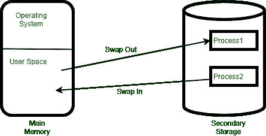

# 交换和上下文切换的区别

> 原文:[https://www . geeksforgeeks . org/交换和上下文切换的区别/](https://www.geeksforgeeks.org/difference-between-swapping-and-context-switching/)

程序是为完成特定任务而设计的指令集。类似地，进程指的是计算机程序的运行时实例。在程序执行期间，几个线程可能并行运行。单线程进程将线程本身称为进程。

**1。上下文切换:**
操作系统使用这种技术在状态之间切换进程，通过 CPU 执行其功能。这是一个保存旧进程的上下文(状态)并将其加载到新进程(恢复)中的过程。每当中央处理器在一个进程和另一个进程之间切换时，就会发生这种情况。基本上，中央处理器的寄存器和程序计数器在任何时候的状态都代表一个上下文。这里，当前执行过程的保存状态意味着将所有活动寄存器复制到印刷电路板(过程控制块)。此外，在此之后，恢复进程的状态以运行或执行下一步，这意味着将活动寄存器的值从印刷电路板复制到寄存器。

**2。交换:**
这是一个进程从主内存(内存)临时交换(移动)到辅助内存(磁盘)的过程。主存储器速度很快，但空间比辅助存储器少，因此非活动进程被移动到辅助存储器，系统稍后将存储器从辅助存储器交换到主存储器。在交换过程中，大部分时间用于传输信息，交换的内存量与总时间成正比。交换又分为两个概念:换入和换出。

换入是从硬盘中取出程序并将其移回主内存或随机存取存储器的过程。
换出将程序从内存或主内存中移除，并将其移动或存储到硬盘或辅助存储器中。

**交换和上下文切换的区别:**

<figure class="table">

| 

上下文开关程序

 | 

交换

 |
| --- | --- |
| 这是一个存储旧进程的状态并将其加载到新进程中的过程。 | 本质上，这是一种复制整个过程的方法。 |
| 当内核将对中央处理器的控制从一个进程转移到另一个已经准备好运行的状态时，就会发生上下文切换。 | 交换发生在整个过程移动到磁盘时。 |
| 上下文切换确定进程是否处于暂停模式。 | 谈到交换，它涉及内存，有多少内存被交换。 |
| 上下文切换将进程从运行状态切换到就绪状态，而调度程序负责将 CPU 资源分配给就绪队列中的进程。 | 这是一个操作系统术语，我们用来指磁盘和主内存之间的数据交换。 |
| 活动进程进行上下文切换。 | 非活动进程进行交换。 |
| 它提供了更高程度的多任务处理。 | 它提供了更大程度的多道程序设计。 |
| 它有助于更好地利用操作系统。 | 这有助于更好地利用内存。 |

</figure>