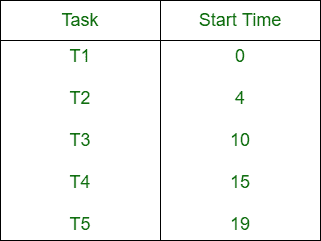
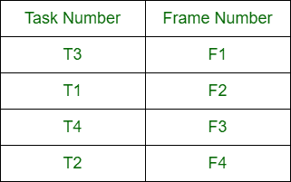

# 表驱动和循环调度的区别

> 原文:[https://www . geesforgeks . org/表驱动和循环调度的区别/](https://www.geeksforgeeks.org/difference-between-table-driven-and-cyclic-scheduling/)

时钟驱动调度是由时钟中断决定调度点的调度算法。时钟驱动的调度有两种类型:

**1。表驱动调度:**
在表驱动调度中，所有任务的开始时间都是预先计算好的，在系统配置时存储在表中。存储所有任务的调度时间的表称为调度表。

**2。循环调度:**
在循环调度中，预先计算好的调度一次又一次地重复。任务集中的每个任务在每个周期中重复相同的次数。

**表驱动和循环调度的区别:**

| 表驱动调度 | 循环调度 |
| --- | --- |
| 预计算任务的开始时间，从而安排任务。 | 预计算时间表反复重复。 |
| 每个任务只安排一次。 | 每个任务都被重复安排。 |
| 表驱动调度在大型应用程序中较少使用。 | 循环调度在大型应用程序中经常使用。 |
| 效率不是很高。 | 它比表驱动的效率高。 |
| 每当计划任务时，它都会设置计时器。 | 它仅在系统启动调度时设置定时器。 |
| 它在嵌入式系统中并不常用。 | 它经常在嵌入式系统中使用。 |
| 在选择定时帧的情况下，它更熟练。 | 可以选择大尺寸的定时帧。 |

