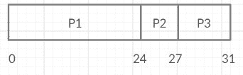

# CPU 调度中周转时间(TAT)和等待时间(WT)之差

> 原文:[https://www . geeksforgeeks . org/周转时间-tat-和等待时间-wt-in-cpu-scheduling 之差/](https://www.geeksforgeeks.org/difference-between-turn-around-time-tat-and-waiting-time-wt-in-cpu-scheduling/)

在 [CPU 调度](https://www.geeksforgeeks.org/cpu-scheduling-in-operating-systems/)中，我们经常需要借助到达、突发和完成时间来求平均周转和等待时间。让我们简单了解一下它们:

**周转时间(TAT):**

1.  它是从提交流程到完成流程的时间间隔。
2.  差 b/w <u>完成时间</u>和<u>到达时间</u>称为周转时间。

**完成时间(CT):** 这是流程完成其执行的时间。
**到达时间(AT):** 这是流程到达就绪状态的时间。

```
TAT = CT - AT
```

**等待时间(WT):**

1.  进程在就绪队列中等待获取 CPU 所花费的时间。
2.  b/w <u>周转时间</u>和<u>爆发时间</u>的时间差称为等待时间。

**突发时间(BT):** 这是进程执行所需的时间。

```
WT = TAT - BT
```

现在有了等待时间和突发时间，我们还可以通过以下方式计算周转时间:

```
TAT = BT + WT
```

**示例:**

<center>

| 过程 | 突发时间(秒。) |
| --- | --- |
| 第一亲代 | Twenty-four |
| P2 | three |
| P3 | four |

</center>

**解决方案:**



<center>**Figure –** Gantt Chart</center>

```
Avg. TAT = (24 + 27 + 31) / 3 = 27.33 sec
Avg. WT  = (0 + 24 + 27) / 3 = 17.0 sec 
```

让我们看看周转时间和等待时间的区别:

<center>

| 没有。 | 解题时间 | 等待时间 |
| --- | --- | --- |
| 1. | 从进程进入就绪队列等待执行到进程完成执行的时间。 | 进程在就绪队列和输入/输出完成中花费的时间。 |
| 2. | 不同的中央处理器调度算法对同一组进程产生不同的 TAT。 | 中央处理器调度算法不影响进程执行或输入/输出的时间，只影响进程在就绪队列中等待的时间。 |
| 3. | 周转时间通常受到输出设备速度的限制。 | 等待时间没有这样大的影响。 |

</center>