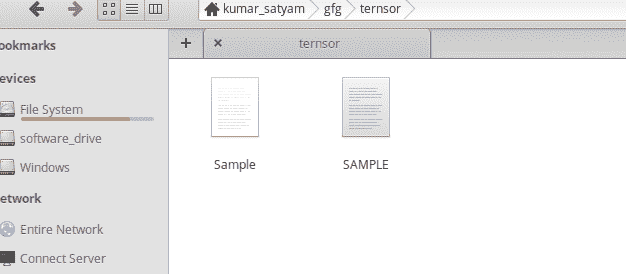
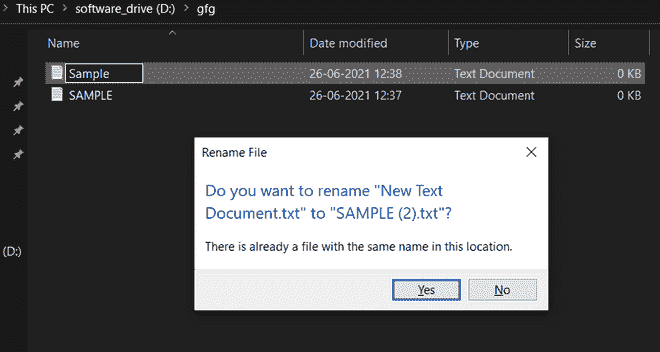

# 【UNIX 和 Windows 操作系统的区别

> 原文:[https://www . geesforgeks . org/UNIX 和 windows 操作系统的区别/](https://www.geeksforgeeks.org/difference-between-unix-and-windows-operating-system/)

在本文中，我们将探讨 UNIX 和 Windows 操作系统之间的主要区别。

### **[**【UNIX】****:**](https://www.geeksforgeeks.org/introduction-to-unix-system/)**

**UNIX 是一个强大的多用户多任务操作系统，最初是在美国电话电报公司贝尔实验室开发的。这种操作系统因其最受欢迎的特性，如灵活性、可移植性、网络能力等，在科学界、工程界和学术界非常受欢迎。**

### **[**窗户**](https://www.geeksforgeeks.org/different-operating-systems/) **:****

**微软视窗是一个基于图形用户界面的操作系统，它为大多数基于命令行的功能提供了图形用户友好的选择。微软推出了一系列具有最新功能的版本。**

## **【UNIX 和 Windows 操作系统的区别:**

**在这里，我们将根据各种参数讨论 UNIX 和 Windows 操作系统之间的各种差异。**

### **1.许可:**

**UNIX 是使用 C 和汇编语言作为开源操作系统开发的。由于是开源 UNIX，它的各种 Linux 发行版占了世界上使用最多的操作系统。Unix 及其所有 Linux 发行版都可以在通用公共许可证下获得。**

**Windows 操作系统是微软拥有的专有软件，这意味着其源代码对公众不可用。**

### **2.用户界面:**

**Unix 操作系统相对来说更难掌握，并且会给新来者带来很大的障碍。然而，一些像 Ubuntu 这样的 Linux 发行版正在通过引入更多基于图形用户界面的应用程序来改变这种看法。**

**另一方面，视窗操作系统的设计初衷是尽可能保持用户界面的简单和用户友好，这样非信息技术人员就可以轻松地使用计算机进行工作。**

### **3.处理:**

**UNIX 操作系统支持**多处理**，意思是 m 任何进程同时执行。在多处理中，每个进程都有一个单独的地址空间，可以添加 CPU 来提高计算能力。**

**Windows 支持**多线程**，意思是从单个进程中创建许多线程，以提高计算能力。在多线程中，进程的许多线程同时执行，其中公共地址空间由所有线程共享。**

### **4.文件系统:**

**UNIX 操作系统使用 STD。ERR 和 STD。IO 文件系统或 UFS (Unix 文件系统)，并将所有物理驱动器视为一个逻辑驱动器。它有一个强大而高效的文件系统。文件系统表示为同一根下的分层树。**

****

**另一方面，Windows 使用文件分配表(FAT32)和新技术文件系统(NTFS)系统来管理文件，并要求可执行文件的所有者在执行之前，将文件存储在不同数据驱动器(如 C、D、e)的文件夹中**

### **5.用户帐户:**

**在 Linux 系统中，有三种类型的用户帐户:**

*   ****常规:**这些帐户具有中等特权，用于常规工作，它只能执行仅访问其被授权的那些文件和服务的任务。**
*   ****Root:** 这个账号是一个 Linux 系统的主用户账号，它拥有最高权限工作行政级别工作管理所有服务。这个也被称为超级用户。**
*   ****服务:**这个账户一般是服务用来运行流程的。**

**在 Windows 中，有三种类型的用户帐户:**

*   ****管理员:**该账户控制所有服务，允许用户进行更改并检查其他用户的活动**
*   ****儿童:**此帐户带有家庭安全设置，由管理员分配。**
*   ****访客:**这个账号没有标准账号，没有隐私，它允许其他人使用你的电脑，而不能更改 PC 设置和安装应用程序。**

### ****6。文件名约定:****

**在 Linux 中，我们可以保存两个同名的文件。**

****

****但在 windows** 、**中我们无法保存与**相同的名称**。会产生错误:****

****

### **7.安全性:**

**从设计上来说，UNIX 更安全。Unix 系统上的主要保护是执行。exe”文件要困难得多。在这里，没有明确的许可就不能处理可执行文件，因为 Unix 中的所有进程都被平等对待。但是随着 Unix 发行版越来越倾向于图形用户界面，现在依赖于应用程序安全性本身，这些正在慢慢改变。**

**Unix 系统的另一个优点是清除病毒更容易，因为病毒只能感染用户帐户，根保持完整和纯净。**

**Windows 不太安全，因为用最少的权限执行文件很简单。这些会进一步导致恶意软件不知不觉地安装在系统上。**

### **8.数据备份和恢复:**

**在早期版本的 UNIX 中，当存储数据的设备不可访问时，从系统中回收数据是不可能的。但是在一些像 Ubuntu 这样的 Linux 发行版中，引入了一个新的功能，叫做**实时发行版**可以用来从不可访问的设备中恢复数据。**

**Windows 系统中的数据恢复和备份要简单得多，可以使用其内置的图形用户界面来完成。它还集成了用于数据备份和恢复的 OneDrive。**

### **9.区分大小写:**

**Unix 完全区分大小写，这意味着名称为“GFG.txt”和“gfg.txt”的文件可以被视为两个不同的文件。另一方面，Windows 有可选的区分大小写功能。**

### **10.硬件:**

**在 UNIX 系统中，硬件支持是有限的。某些硬件可能没有为其构建的驱动程序。Windows 几乎拥有所有可用硬件的所有驱动程序。**

### **11.可靠性:**

**Unix 以运行非常稳定而闻名。虽然近年来 Windows 的稳定性有了明显的提高，但大多数 Unix 系统在这方面仍然远远优越。**

<figure class="table">

| 南号码 | 因素 | 一种多用户的计算机操作系统 | Windows 操作系统 |
| --- | --- | --- | --- |
| 1. | 批准 | 它是一个开源系统，可以在通用公共许可证下使用。 | 它是微软拥有的专有软件。 |
| 2. | 用户界面 | 它有一个基于文本的界面，让新手更难掌握。 | 它有一个图形用户界面，使用起来更简单。 |
| 3. | 处理 | 它支持多处理。 | 它支持多线程。 |
| 4. | 文件系统 | 它使用包含标准的 Unix 文件系统(UFS)。ERR 和 STD。输入输出文件系统。 | 它使用文件分配系统(FAT32)和新技术文件系统(NTFS)。 |
| 5. | 安全 | 它更安全，因为对系统的所有更改都需要明确的用户权限。 | 与 UNIX 相比，它不太安全。 |
| 6. | 数据备份和恢复 | 在 Unix 中创建备份和恢复系统是乏味的，但是随着 UNIX 新发行版的引入，它正在改进。 | 它有一个集成的备份和恢复系统，使用起来更简单。 |
| 8.  | 五金器具 | UNIX 系统中硬件支持有限。某些硬件可能没有为其构建的驱动程序。 | 几乎所有的硬件都有驱动程序。 |
| 9. | 可靠性 | Unix 及其发行版以运行非常稳定而闻名。 | 尽管 Windows 近年来一直很稳定，但它仍然无法与 Unix 系统提供的稳定性相匹配。 |

</figure>