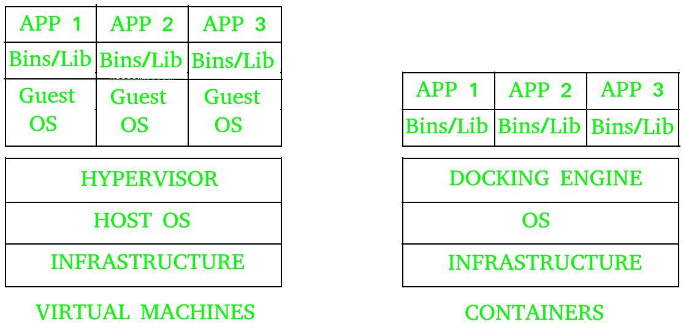

# 虚拟机和容器的区别

> 原文:[https://www . geesforgeks . org/虚拟机和容器的区别/](https://www.geeksforgeeks.org/difference-between-virtual-machines-and-containers/)

虚拟机和容器是在单个平台上部署多个独立服务的两种方式。

**[虚拟机](https://www.geeksforgeeks.org/virtual-machines-in-operating-system/) :**
它运行在一个名为虚拟机管理程序的仿真软件之上，该软件位于硬件和虚拟机之间。虚拟机管理程序是实现虚拟化的关键。它管理物理资源到虚拟机的共享。每个虚拟机运行自己的客户操作系统。它们不如容器灵活，可移植性低。

**容器:**
它位于物理服务器及其主机操作系统的顶部。他们共享一个通用的操作系统，需要小心维护和修补错误。它们比虚拟机更敏捷，可移植性更高。

让我们看看虚拟机和容器之间的区别。

| **SNo。** | **虚拟机(VM)** | **容器** |
| one | 虚拟机是一种软件，允许您在其中安装其他软件，因此您基本上可以虚拟控制它，而不是直接在计算机上安装软件。 | 而容器是一种软件，它允许应用程序独立地具有不同的功能。 |
| 2. | 运行在虚拟机系统上的应用程序可以运行不同的操作系统。 | 而在容器环境中运行的应用程序共享一个操作系统。 |
| 3. | 虚拟机虚拟化了计算机系统。 | 而容器只虚拟化操作系统。 |
| 4. | 虚拟机大小非常大。 | 而容器的尺寸很轻；即几兆字节。
 |
| 5. | 虚拟机需要几分钟才能运行，因为它很大。 | 而容器需要几秒钟才能运行。 |
| 6. | 虚拟机使用大量系统内存。 | 而容器需要的内存非常少。 |
| 7. | 虚拟机更安全。 | 而集装箱不太安全。 |
| 8. | 当我们需要所有操作系统资源来运行各种应用程序时，虚拟机非常有用。 | 当我们需要使用最少的服务器最大化运行的应用程序时，容器是有用的。 |
| 9. | 虚拟机的例子有:KVM、Xen、VMware。 | 而容器的例子有:RancherOS，PhotonOS，Containers by Docker。 |

