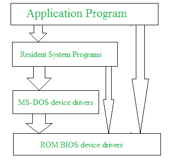
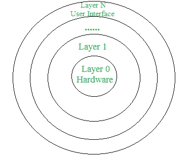
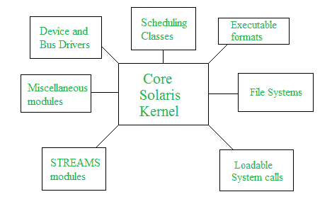

# 操作系统的不同方法或结构

> 原文:[https://www . geesforgeks . org/操作系统的不同方法或结构/](https://www.geeksforgeeks.org/different-approaches-or-structures-of-operating-systems/)

操作系统可以在各种结构的帮助下实现。操作系统的结构主要取决于操作系统的各种常见组件如何相互连接并融合到内核中。据此，我们有以下操作系统结构:

**简单结构:**
这样的操作系统没有很好的定义结构，是小、简单、有限的系统。接口和功能级别没有很好地分开。MS-DOS 就是这样一个操作系统的例子。在微软操作系统中，应用程序能够访问基本的输入输出例程。如果其中一个用户程序失败，这些类型的操作系统会导致整个系统崩溃。
MS-DOS 结构示意图如下。

**结构简单的优点:**

*   由于应用程序和硬件之间的接口很少，它提供了更好的应用程序性能。
*   内核开发人员很容易开发这样的操作系统。

**结构简单的缺点:**

*   结构非常复杂，因为模块之间没有明确的界限。
*   它不强制在操作系统中隐藏数据。

**分层结构:**
一个操作系统可以被分解成多个部分，并保留对系统更多的控制。在这种结构中，操作系统被分成许多层(层次)。底层(第 0 层)是硬件，最顶层(第 N 层)是用户界面。这些层的设计使得每一层仅使用较低层的功能。这简化了调试过程，就好像调试了较低层，并且在调试过程中发生了错误，那么只有当较低层已经被调试时，错误才会出现在该层上。

这种结构的主要缺点是，在每一层，数据都需要修改和传递，这增加了系统的开销。此外，仔细规划图层是必要的，因为图层只能使用较低级别的图层。UNIX 就是这种结构的一个例子。

**层状结构优势:**

*   分层使增强操作系统变得更加容易，因为一个层的实现可以很容易地更改，而不会影响其他层。
*   执行调试和系统验证非常容易。

**层状结构的缺点:**

*   在这种结构中，与简单结构相比，应用性能降低。
*   它需要仔细规划层的设计，因为较高层只使用较低层的功能。

**微内核:**
这种结构通过从内核中移除所有非必需的组件并将其实现为系统和用户程序来设计操作系统。这导致了一个更小的内核，称为微内核。
这种结构的优点是所有新服务都需要添加到用户空间，不需要修改内核。因此，它更安全可靠，就好像一个服务失败了，那么操作系统的其余部分保持不变。Mac OS 就是这类操作系统的一个例子。

**微内核结构优势:**

*   它使操作系统可移植到各种平台。
*   由于微内核很小，因此可以有效地进行测试。

**微内核结构的缺点:**

*   模块间通信水平的提高会降低系统性能。

**模块化结构或方法:**
它被认为是操作系统的最佳方法。它包括模块化内核的设计。内核只有一组核心组件，其他服务作为可动态加载的模块在运行时或引导时添加到内核中。它类似于分层结构，因为每个内核都有定义和保护的接口，但是它比分层结构更灵活，因为一个模块可以调用任何其他模块。
例如，Solaris 操作系统的组织如图所示。

