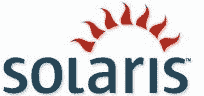
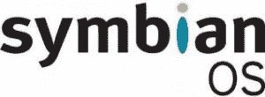

# 不同的操作系统

> 原文:[https://www.geeksforgeeks.org/different-operating-systems/](https://www.geeksforgeeks.org/different-operating-systems/)

**1。MS-DOS:**
MS-DOS 是微软磁盘操作系统的简称，是为 IBM 兼容 x86 微处理器的计算机开发的非图形化命令行操作系统。操作系统使用命令行界面让用户输入命令来导航、打开和操作他们计算机上的文件。

**特征:**

*   它是单用户操作系统，意味着一次只能有一个用户操作。
*   这是一个轻量级操作系统，允许用户直接访问基本输入输出系统及其底层硬件。
*   从外部来源加载数据和程序，并将其放入内存，以便在计算机上使用。
*   使计算机能够执行输入和输出操作，例如从键盘获取命令，在屏幕上打印信息。
*   它在进行文件管理如创建、编辑、删除文件等方面非常有帮助。
*   它还使用各种驱动实用程序控制和管理其他外部设备，如打印机、键盘或外部硬盘。

**缺点:**

*   它不允许多个用户在系统上操作。
*   它不支持图形界面，因此不能用鼠标操作。
*   它不支持多道程序设计，这意味着 ram 中只能有一个进程。
*   它缺乏内存保护，这意味着没有安全性，也不太稳定。
*   当寻址超过 640 兆内存时，它在内存访问方面有困难。

**2。Windows 操作系统:**
Windows 是微软设计的操作系统，可以在标准的 x86 英特尔和 AMD 处理器上使用。它提供了一个称为图形用户界面(GUI)的界面，通过使用鼠标在菜单、对话框、按钮、选项卡和图标中导航，无需记忆命令行命令。操作系统被命名为 windows，因为程序以正方形显示。这个视窗操作系统是为刚在家使用的新手用户和正在开发的专业人士设计的。

**特征:**

*   它被设计为在任何标准 x86 英特尔和 AMD 上运行，因此大多数硬件供应商都为 windows(如戴尔、惠普等)制作驱动程序。
*   它通过使用多核处理器支持增强的性能。
*   它预装了许多生产力工具，有助于在您的计算机上完成各种日常任务。
*   Windows 有非常大的用户群，因此可用的软件程序、实用程序的选择要多得多。
*   Windows 是向后兼容的，这意味着旧程序可以在新版本上运行。
*   自动检测硬件，无需手动安装任何设备驱动程序。

**缺点:**

*   Windows 可能很贵，因为操作系统是付费许可证，而且它的大多数应用程序都是付费产品。
*   Windows 对计算机资源的要求很高，像它应该有很高的 ram 容量，大量的硬盘空间和良好的显卡。
*   如果用户同时加载许多程序，Windows 会变慢并挂起。
*   Windows 包括网络共享，如果用户有一个多台电脑的网络，这将非常有用。
*   Windows 很容易受到病毒攻击，因为它拥有庞大的用户群，用户必须更新操作系统以跟上安全补丁的更新。

**3。LINUX 操作系统:**
LINUX OS 是一个开源的操作系统项目，是一个基于 UNIX 开发的自由分布、跨平台的操作系统。这个操作系统是由 Linus Torvalds 开发的。Linux 这个名字来源于 Linux 内核。它基本上是计算机上的系统软件，允许应用程序和用户在计算机上执行一些特定的任务。Linux 操作系统的发展开创了开源开发的先河，成为软件协作的标志。

**特征:**

*   Linux 是免费的，可以从互联网上下载，也可以在 GNU 许可下重新发布，并且拥有最好的社区支持。
*   Linux 操作系统易于移植，这意味着它可以安装在各种类型的设备上，如移动、平板电脑。
*   它是一个多用户、多任务操作系统。
*   BASH 是可以用来执行命令的 Linux 解释程序。
*   Linux 提供了多层次的文件结构，即层次结构，其中排列了系统所需的所有文件和用户创建的文件。
*   Linux 使用身份验证功能提供用户安全性，并且威胁检测和解决方案非常快，因为 Linux 主要由社区驱动。

**缺点:**

*   没有标准版的 Linux，因此会让用户感到困惑，而且熟悉 Linux 对新用户来说可能是个问题。
*   更难找到支持用户需求的应用程序，因为 Linux 并不主导市场。
*   由于一些应用程序是专门为 Windows 和 Mac 开发的，这些应用程序可能与 linux 不兼容，有时用户可能没有太多选择，无法在 Windows 或 Mac 等不同应用程序之间进行选择，因为大多数应用程序是为拥有庞大用户群的操作系统开发的。
*   有些硬件可能与 Linux 不兼容，因为它对驱动程序的支持不完整，这可能会导致故障。
*   有很多论坛可以解决 Linux 问题，但它可能并不总是符合用户自己的技术理解水平。

**4。Solaris 操作系统:**
Solaris 或 SunOS 是 Sun 公司的 Unix 变体操作系统的名称，最初是为其基于可扩展处理器架构的处理器家族(SPARC)以及基于英特尔的处理器开发的。在此期间，UNIX 工作站市场在很大程度上被这种操作系统所主导。随着互联网的发展，Sun 的 Solaris 系统成为网站安装最广泛的服务器。甲骨文购买了 Sun，后来更名为甲骨文 Solaris。

**特征:**

*   Solaris 以其可扩展性而闻名。它可以处理大量的工作负载，并且仍然为基于数据库、网络和 Java 技术的服务提供无可争议的性能优势。
*   Solaris 系统以其可用性而闻名，这意味着这些操作系统几乎不会在任何时候崩溃，并且由于其面向互联网的设计和广泛的功能，它使得添加新功能或修复任何问题的工作变得容易。
*   它是为网络计算而构建的，因为它为高级网络计算协议提供了优化的网络堆栈和支持，从而为大多数应用程序提供了高性能网络。
*   Solaris 具有先进、独特的安全功能，包括一些世界上最先进的安全功能，如用户权限管理、加密框架和默认安全网络，允许用户安全地交付新的解决方案。
*   提供支持无缝互操作性、测试新软件和高效整合应用程序工作负载的工具。

**缺点:**

*   Solaris 相当昂贵，因为它是一个企业操作系统。此外，Solaris 不免费提供更新。
*   Solaris 缺乏良好的图形用户界面支持，并且对用户不友好。
*   硬件支持远不如许多其他操作系统。
*   由于 Solaris 不能高效地使用不同的硬件，性能会大大降低。
*   由于 CPU 和内存的总消耗，Solaris 有时会变得不稳定并崩溃。

**5。Symbian 操作系统:**
Symbian OS 是世界上使用最广泛的基于 ARM 架构的智能手机操作系统，直到 2014 年才停产。它是由塞班特有限公司开发的，塞班特有限公司是 PDA 设备和智能手机制造商如 Psion、摩托罗拉、爱立信和诺基亚的合作伙伴。塞班操作系统由两个子系统组成，第一个是基于微内核的操作系统及其相关库，另一个是用户交互的操作系统接口。它是专门为智能手机和手持数字设备开发的，因为这种操作系统功耗非常低，基于电池的设备，也适用于基于只读存储器的系统。

**特征:**

*   它的内核被称为 EKA2，具有抢占式多线程、调度、内存管理系统和设备驱动程序。
*   允许第三方软件增强平台，以提高操作系统的性能。
*   塞班界面易于使用，非常用户友好。
*   塞班的应用程序通常使用塞班软件开发工具包(SDK)用 C++或塞班 C++编写。
*   塞班还可以运行用 Python、Java ME、Flash Lite、Ruby 和. NET 编写的应用程序
*   连接变得更加容易和快捷。
*   塞班操作系统具有良好的效率和稳定性。

**缺点:**

*   响应不像其他操作系统那样流畅和敏感。
*   塞班操作系统非常脆弱，很容易受到病毒的影响。
*   虚拟内存不足。

**6。安卓移动操作系统:**
安卓是一个基于谷歌 Linux 的操作系统，它主要是为智能手机和平板电脑等触摸屏移动设备设计的。可用于支持安卓的硬件基于三种架构，即 ARM、英特尔和 MIPS。设计允许用户直观地操作移动设备，手指的移动反映了常见的动作，如捏、刷和敲，使这些应用程序对用户来说很舒服。

**特征:**

*   安卓操作系统是一个开源操作系统，这意味着它是免费的，任何人都可以使用它。
*   安卓提供优化的 2D 和 3D 图形、多媒体、全球移动通信系统连接、多任务处理。
*   安卓操作系统以其友好的用户界面和根据用户口味定制的出色功能而闻名。
*   自从 Playstore 提供了超过 100 万个应用程序以来，它为用户提供了大量的应用选择。
*   想要为安卓操作系统创建应用程序的软件开发人员可以下载安卓软件开发工具包(SDK)，轻松为安卓开发应用程序。
*   安卓系统功耗极低，但性能极高，因为它的硬件基于 ARM 架构。

**缺点:**

*   直观的现代用户体验和界面的设计和编码带来了困难，因为它依赖于 Java。
*   大多数应用程序倾向于在后台运行，即使当用户耗尽电池时也是如此。
*   在任何给定时间，多个程序在后台同时运行，性能必然会受到影响。
*   安卓手机过热，尤其是当沉迷于核心生产力任务或繁重的图形时。
*   应用程序的安全性较低，使用户更容易受到数据泄露的影响。

**7。iOS 移动操作系统:**
iOS 是 iPhone OS 的缩写，是苹果公司专门为其硬件(如 A12 Bionic 芯片)创建和开发的移动操作系统，该芯片目前为其许多移动设备提供动力，包括 iPhone、iPad 和 iPod。iOS 用户界面基于使用多点触控手势，如轻扫、轻敲、捏和反向捏。这些手指动作的目的是向用户提供从多个手指给予多点触摸电容式屏幕显示器的快速响应输入。

**特征:**

*   它用 C、C++、Objective-C 和 Swift 编写，基于 Macintosh OS X。
*   具有出色而直观的用户界面和非常流畅的响应。
*   iOS 的性能无与伦比。
*   iOS 附带了很多默认应用，包括电子邮件客户端、网络浏览器、媒体播放器和手机应用。
*   可从应用商店下载的高质量应用的可用性。
*   苹果为开发者提供了自己的 iOS 软件开发工具包(SDK)，为苹果移动设备创建应用程序。
*   iOS 比其他移动操作系统安全得多，安全漏洞也更少。
*   提供定期更新和安全补丁。

**缺点:**

*   操作系统是闭源的，而不是开源的，因此测试需要很多时间，因为它只对有限的开发人员可用。
*   与其他移动平台相比，iOS 应用程序占用的内存空间非常大。
*   与其他操作系统相比，缺乏定制。
*   不允许第三方安装。
*   拥有高强度的图形和动画会消耗更多电能，并导致电池耗尽。
*   iOS 是一个资源密集型操作系统，由于这个原因，旧设备很难运行它。

**应用及其合适的操作系统:**
这些解释如下。

**1。数据库和 web 服务器管理:**
最适合数据库和 web 服务器管理的操作系统是 SOLARIS，是 Unix 操作系统，它本身是为企业 Web 服务器设计的，在企业 Web 服务器中部署了健壮的应用程序和数据库，吞吐量非常高，需要服务器 24×7 的启动和更少的停机时间。

*   Solaris 拥有 Zettabyte 文件系统(ZFS)，这是一个革命性的文件和逻辑卷管理器，可以控制在任何其他操作系统中都找不到的数据的存储和检索。
*   Solaris 配备了服务管理设施(SMF)，负责系统和应用程序服务的管理，通过确保基本系统和应用程序服务正常运行，即使在硬件或软件故障的情况下也没有任何问题，从而提高系统的可用性，这也称为 Oracle Solaris 预测性自我修复功能。
*   Solaris 提供了令人敬畏的可观察性实用程序，可以用来发现性能错误、功能错误和内核错误。
*   由于 Solaris 更广泛的 CPU 支持以及操作系统本身的体系结构，Solaris 可以在具有大量内核的多插槽多核系统上很好地扩展。Solaris 您可以混合和匹配垂直和水平可扩展性，而大多数其他操作系统只提供垂直扩展。
*   Solaris 始终提供严格的安全性，提供额外的屏障和免疫系统，以防止服务器发生任何数据泄露。

因此，与其他存在原始性能和安全问题的操作系统相比，Solaris 是可靠、非常稳定、非常快速和安全的操作系统，因此它是任何数据库管理系统(如 SQL 和 web 服务服务器)的理想操作系统。

**2。集群计算:**
集群是一种使用多台计算机、存储设备和冗余互连来创建单个高可用性系统的技术。其中的每台计算机都是一个节点。集群计算的最佳首选操作系统是 LINUX，它是一个基于 UNIX 的开源自由分布式操作系统，提供了许多强大的网络功能。

*   由于 Linux 操作系统是高度可定制的，这在资源管理和性能优化中起着重要作用，这使得构建或设置大型多处理器集群
    非常方便，而这种修改在其他操作系统(如 windows)中非常有限或在某些情况下受到限制。
*   当将多台计算机组织成一个集群时，存储访问的管理通常很麻烦，在这种情况下，Linux 的集群文件系统可以在所有连接的集群节点上组织数据存储和访问。
*   Linux 集群文件系统将使用实用程序来关闭故障节点。
*   Linux 是可扩展的，因此很容易向集群添加资源。
*   Linux 还有一个额外的优势，那就是通过包管理器可以很容易地获得大多数科学和工程软件和编译器，而且它们可以很容易地配置和编译，没有任何麻烦。

由于集群应用要求操作系统具有最大的可移植性、性能、可扩展性和强大的计算能力，所以像红帽或 CentOS 这样的 Linux 发行版最适合像贝奥武夫集群这样的计算机集群。

**3。工作效率和日常任务:**
最适合工作效率的操作系统是 WINDOWS，因为它直观、有凝聚力、功能强大且非常用户友好。Windows 提供了最好的软件选择，可以在用户拥有的最广泛的硬件上运行。

*   Windows 操作系统提供了一套内置的实用程序和应用程序，如文本处理器、电子邮件客户端、日历、计算器、图像和视频查看器、编辑器、快照工具、语音记录器和网络浏览器，如果用户愿意，还可以从互联网安装地图、相机、新闻、天气和联系人等应用程序。
*   Windows 在 Office 套件下提供了一套生产力应用程序，如 Word、演示文稿、电子表格等。
*   微软的云存储平台 OneDrive 帮助用户备份文件，并在任何地方的任何设备上使用它们。
*   Windows 提供了大量的界面定制选项。
*   Windows 10 支持全触摸屏，它提供了平板电脑模式，用户可以在使用笔和键盘输入之间切换，以提高工作效率。
*   Windows 甚至提供了一个语音助手，能够执行打开应用程序和网页、通知天气等任务。
*   Windows 操作系统使在屏幕上排列窗口变得更加容易，并允许用户为多任务应用程序创建多个虚拟桌面。

因此，对于用户的创造性、生产性和日常任务，如创建演示文稿、编辑图像、上网等，Windows 是最好的操作系统。