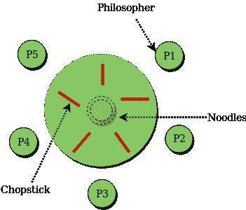

# 使用信号量用餐哲学家问题

> 原文:[https://www . geesforgeks . org/dining-哲学家-问题-使用-信号量/](https://www.geeksforgeeks.org/dining-philosopher-problem-using-semaphores/)

**先决条件–**[进程同步](https://www.geeksforgeeks.org/process-synchronization-set-1/)、[信号量](https://www.geeksforgeeks.org/semaphores-operating-system/)、[使用监视器的用餐哲学家解决方案](https://www.geeksforgeeks.org/dining-philosophers-solution-using-monitors/)
**用餐哲学家问题–**用餐哲学家问题指出，K 个哲学家围坐在一张圆形桌子周围，每对哲学家之间有一根筷子。每个哲学家之间都有一根筷子。如果一个哲学家能拿起他旁边的两根筷子，他就可以吃饭。一根筷子可以被任何一个相邻的筷子夹起，但不能两个都夹起。



**哲学家进餐的信号量解决方案–**
每个哲学家都由以下伪代码表示:

```
process P[i]
 while true do
   {  THINK;
      PICKUP(CHOPSTICK[i], CHOPSTICK[i+1 mod 5]);
      EAT;
      PUTDOWN(CHOPSTICK[i], CHOPSTICK[i+1 mod 5])
   }
```

哲学家有三种状态:**思考、饥饿和进食**。这里有两个信号量:互斥体和哲学家的信号量数组。互斥锁的使用使得没有两个哲学家可以同时取放。数组用于控制每个哲学家的行为。但是，由于编程错误，信号量会导致死锁。
T3】代码–T5】

## C

```
#include <pthread.h>
#include <semaphore.h>
#include <stdio.h>

#define N 5
#define THINKING 2
#define HUNGRY 1
#define EATING 0
#define LEFT (phnum + 4) % N
#define RIGHT (phnum + 1) % N

int state[N];
int phil[N] = { 0, 1, 2, 3, 4 };

sem_t mutex;
sem_t S[N];

void test(int phnum)
{
    if (state[phnum] == HUNGRY
        && state[LEFT] != EATING
        && state[RIGHT] != EATING) {
        // state that eating
        state[phnum] = EATING;

        sleep(2);

        printf("Philosopher %d takes fork %d and %d\n",
                      phnum + 1, LEFT + 1, phnum + 1);

        printf("Philosopher %d is Eating\n", phnum + 1);

        // sem_post(&S[phnum]) has no effect
        // during takefork
        // used to wake up hungry philosophers
        // during putfork
        sem_post(&S[phnum]);
    }
}

// take up chopsticks
void take_fork(int phnum)
{

    sem_wait(&mutex);

    // state that hungry
    state[phnum] = HUNGRY;

    printf("Philosopher %d is Hungry\n", phnum + 1);

    // eat if neighbours are not eating
    test(phnum);

    sem_post(&mutex);

    // if unable to eat wait to be signalled
    sem_wait(&S[phnum]);

    sleep(1);
}

// put down chopsticks
void put_fork(int phnum)
{

    sem_wait(&mutex);

    // state that thinking
    state[phnum] = THINKING;

    printf("Philosopher %d putting fork %d and %d down\n",
           phnum + 1, LEFT + 1, phnum + 1);
    printf("Philosopher %d is thinking\n", phnum + 1);

    test(LEFT);
    test(RIGHT);

    sem_post(&mutex);
}

void* philosopher(void* num)
{

    while (1) {

        int* i = num;

        sleep(1);

        take_fork(*i);

        sleep(0);

        put_fork(*i);
    }
}

int main()
{

    int i;
    pthread_t thread_id[N];

    // initialize the semaphores
    sem_init(&mutex, 0, 1);

    for (i = 0; i < N; i++)

        sem_init(&S[i], 0, 0);

    for (i = 0; i < N; i++) {

        // create philosopher processes
        pthread_create(&thread_id[i], NULL,
                       philosopher, &phil[i]);

        printf("Philosopher %d is thinking\n", i + 1);
    }

    for (i = 0; i < N; i++)

        pthread_join(thread_id[i], NULL);
}
```

**注意–**下面的程序只能用带有信号量和 pthread 库的 C 编译器编译。
**参考文献–**
[餐饮哲学家解决方案–【cs.gordon.edu】](http://cs.gordon.edu/courses/cs322/lectures/transparencies/dining_phil.html)
[餐饮哲学家解决方案–【cs.indiana.edu】](https://www.cs.indiana.edu/classes/p415-sjoh/hw/project/dining-philosophers/index.htm)