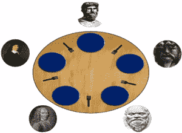
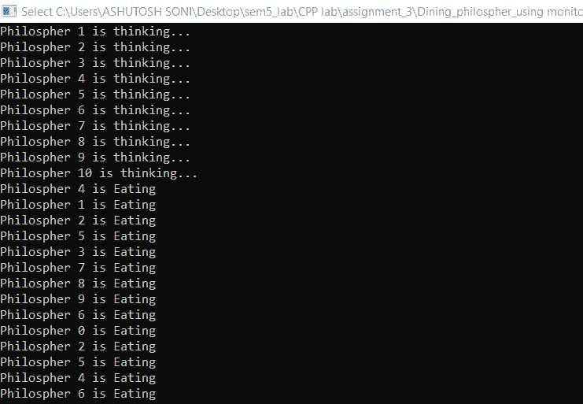

# 哲学家就餐问题

> 原文:[https://www.geeksforgeeks.org/dining-philosophers-problem/](https://www.geeksforgeeks.org/dining-philosophers-problem/)

**概述:**
[就餐哲学家问题](https://www.geeksforgeeks.org/dining-philosopher-problem-using-semaphores/)陈述有 5 个哲学家从事思考和吃饭两种活动。如图所示，在一张桌子上用五个盘子和五把叉子轮流进餐。

**T2 问题的约束和条件:**

1.  每个哲学家都需要两把叉子才能吃饭。
2.  每个哲学家可以拿起左边或右边的叉子，但一次只能拿一个。
3.  哲学家只有在有两把叉子的时候才吃饭。我们必须设计这样一个协议，即前后协议，确保哲学家只有在他或她有两把叉子的情况下才吃饭。
4.  每个叉子要么干净要么脏。



**解决方案:**
它需要满足的正确性属性有:

1.  **互斥原理–**
    没有两个哲学家可以同时拥有这两把叉子。
2.  **摆脱僵局–**
    每个哲学家都可以在一定的有限时间内获得吃饭的机会。
3.  **免于饥饿–**当很少有哲学家在等待时，一个人会有机会吃一会儿东西。
4.  没有严格的替代方案。
5.  合理利用时间。

**算法(大纲):**

```
loop forever
    p1: think
    p2: preprotocol
    p3: eat
    p4: postprotoco
```

**第一次尝试:**
我们假设每个哲学家都用其索引 I 初始化，并且加法是隐式模 5。每个分叉被建模为一个信号量，其中等待对应于拿一个分叉，信号对应于放下一个分叉。

**算法–**

```
semaphore array[0..4] fork ← [1, 1, 1, 1, 1]
loop forever
       p1 : think                
       p2 : wait(fork[i])
       p3 : wait(fork[i + 1])
       p4 : eat
       p5 : signal(fork[i])
       p6 : signal(fork[i + 1])
```

**这个解决方案的问题:**
这个解决方案可能会在交错的情况下导致死锁，即所有哲学家在试图拿起右叉之前先拿起他们的左叉。在这种情况下，所有的哲学家都在等待正确的分叉，但没有人会执行一条指令。

**第二次尝试:**
解决上述情况的一种方法是将进入房间的哲学家数量限制在四个。通过这样做，其中一个哲学家将最终获得分叉并执行所有指令，从而不会导致死锁。

**算法–**

```
semaphore array[0..4] fork ← [1, 1, 1, 1, 1]

   semaphore room ← 4
   loop forever
       p1 : think                
       p2 : wait(room)                        
       p3 : wait(fork[i])                                  
       p4 : wait(fork[i + 1])                                           
       p5 : eat                                                
       p6 : signal(fork[i])         
       p7 : signal(fork[i + 1])                  
       p8 : signal(room)
```

在这个解决方案中，我们以某种方式干扰给定的问题，因为我们只允许四个哲学家。

**第三次尝试:**
我们在尝试中使用了非对称算法，前四位哲学家执行原始解，但第五位哲学家等待右叉，然后等待左叉。

**算法–**

```
semaphore array [0..4] fork ← [1,1,1,1,1]
```

**为** **前四哲学家–**

```
loop forever
   p1 : think            
   p2 : wait(fork[i])                     
   p3 : wait(fork[i + 1])                              
   p4 : eat                                   
   p5 : signal(fork[i])                                            
   p6: signal(fork[i + 1])
```

**第五位哲学家–**

```
loop forever
   p1 : think            
   p2 : wait(fork[0])                     
   p3 : wait(fork[4])                              
   p4 : eat                                   
   p5 : signal(fork[0])                                            
   p6 : signal(fork[4])
```

**注–**
这个解也被称为昌迪/米什拉解。

**本方案优点:**

1.  允许高度并发。
2.  免于饥饿。
3.  摆脱僵局。
4.  更灵活的解决方案。
5.  经济的
6.  公平
7.  有界性。

上面讨论了使用信号量解决问题的方法。现在有了监视器，在这里，监视器维护一个分叉数组，该数组计算每个哲学家可用的空闲分叉的数量。take Forks 操作等待一个条件变量，直到有两个分叉可用。在离开监视器之前，它会减少其邻居可用的分叉数量。吃完后，一个哲学家调用 release Forks，它会更新数组 fork，并检查释放这些 Forks 是否有可能发出信号。

**算法–**

```
monitor ForkMonitor:
integer array[0..4]
fork ← [2,2,2,2,2]                                                       
condition array[0..4]OKtoEat

operation takeForks(integer i)                  
if(fork[i]!=2)
waitC(OKtoEat[i])

fork[i+1]<- fork[i+1]-1
fork[i-1] <- fork[i-1]-1   

operation releaseForks(integer i)
fork[i+1] <- fork[i+1]+1
fork[i-1] <- fork[i-1]

if(fork[i+1]==2)
signalC(OKtoEat[i+1])

if(fork[i-1]==2)
signalC(OKtoEat[i-1])
```

**对于每个哲学家–**

```
 loop forever :
     p1 : think        
     p2 : takeForks(i)                
     p3 : eat                      
     p4 : releaseForks(i)
```

在这里，Monitor 将确保满足上述所有需求。

**在 C++中的实现:**
下面是在 C++中使用监视器的程序。

## C++14

```
//Submitted by : Ashutosh Soni

// Header file include
#include <bits/stdc++.h>
#include <pthread.h>
#include <unistd.h>
using namespace std;

#define N 10
#define THINKING 2
#define HUNGRY 1
#define EATING 0
#define LEFT (phnum + 4) % N
#define RIGHT (phnum + 1) % N

// Philosopher index
int phil[N];
int times = 200;

class monitor {

    // state of the philosopher
    int state[N];

    // Philosopher condition variable
    pthread_cond_t phcond[N];

    // mutex variable for synchronization
    pthread_mutex_t condLock;

public:
    // Test for the desired condition
    // i.e. Left and Right philosopher are not reading
    void test(int phnum)
    {

        if (state[(phnum + 1) % 5] != EATING
            and state[(phnum + 4) % 5] != EATING
            and state[phnum] == HUNGRY) {
            state[phnum] = EATING;

            pthread_cond_signal(&phcond[phnum]);
        }
    }

    // Take Fork function
    void take_fork(int phnum)
    {

        pthread_mutex_lock(&condLock);

        // Indicates it is hungry
        state[phnum] = HUNGRY;

        // test for condition
        test(phnum);

        // If unable to eat.. wait for the signal
        if (state[phnum] != EATING) {
            pthread_cond_wait(&phcond[phnum], &condLock);
        }
        cout << "Philosopher " << phnum << " is Eating"
             << endl;

        pthread_mutex_unlock(&condLock);
    }

    // Put Fork function
    void put_fork(int phnum)
    {

        pthread_mutex_lock(&condLock);

        // Indicates that I am thinking
        state[phnum] = THINKING;

        test(RIGHT);
        test(LEFT);

        pthread_mutex_unlock(&condLock);
    }

    // constructor
    monitor()
    {

        for (int i = 0; i < N; i++) {
            state[i] = THINKING;
        }

        for (int i = 0; i < N; i++) {
            pthread_cond_init(&phcond[i], NULL);
        }

        pthread_mutex_init(&condLock, NULL);
    }

    // destructor
    ~monitor()
    {

        for (int i = 0; i < N; i++) {
            pthread_cond_destroy(&phcond[i]);
        }

        pthread_mutex_destroy(&condLock);
    }
}

// Global Object of the monitor
phil_object;

void* philosopher(void* arg)
{
    int c = 0;
    while (c < times) {
        int i = *(int*)arg;
        sleep(1);
        phil_object.take_fork(i);
        sleep(0.5);
        phil_object.put_fork(i);
        c++;
    }
}

int main()
{

    // Declaration...
    pthread_t thread_id[N];
    pthread_attr_t attr;

    // Initialization...
    pthread_attr_init(&attr);
    pthread_attr_setdetachstate(&attr,
                                PTHREAD_CREATE_JOINABLE);

    for (int i = 0; i < N; i++) {
        phil[i] = i;
    }

    // Creating...
    for (int i = 0; i < N; i++) {
        pthread_create(&thread_id[i], &attr, philosopher,
                       &phil[i]);
        cout << "Philosopher " << i + 1 << " is thinking..."
             << endl;
    }

    // Joining....
    for (int i = 0; i < N; i++) {
        pthread_join(thread_id[i], NULL);
    }

    // Destroying
    pthread_attr_destroy(&attr);
    pthread_exit(NULL);

    return 0;
}
```

**输出:**



上述程序中哲学家就餐问题的输出