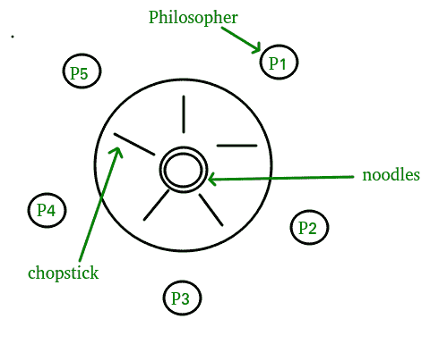

# 使用监视器的哲学家用餐解决方案

> 原文:[https://www . geesforgeks . org/dining-哲学家-解决方案-使用-监视器/](https://www.geeksforgeeks.org/dining-philosophers-solution-using-monitors/)

先决条件:[监控](https://www.geeksforgeeks.org/monitors/)、[进程同步](https://www.geeksforgeeks.org/process-synchronization-set-1/)

**用餐-哲学家问题–**N 个哲学家围坐在一张圆形桌子旁



*   每个哲学家之间都有一根筷子
*   哲学家必须拿起离他最近的两根筷子才能吃饭
*   哲学家必须先拿起一根筷子，然后再拿起第二根，而不是同时拿起两根

我们需要一个算法来在几个进程(哲学家)之间分配这些有限的资源(筷子)，这样解决方案就不会出现死锁和饥饿。

有一些算法可以解决哲学家就餐问题，但它们可能会出现死锁的情况。此外，无死锁解决方案不一定没有饥饿。由于编程错误，信号量会导致死锁。单靠监视器是不足以解决这个问题的，我们需要带有*条件变量*的监视器

**基于监控的哲学家就餐解决方案**

我们通过为哲学家就餐问题提供一个无死锁的解决方案来说明监控器概念。监视器用于控制对状态变量和条件变量的访问。它只告诉何时进入和退出该段。这个解决方案强加了一个限制，即哲学家只有在两个筷子都可用的情况下才能拿起筷子。

要对这个解决方案进行编码，我们需要区分三种状态，在这三种状态中，我们可能会找到一位哲学家。为此，我们引入以下数据结构:

**思考–**当哲学家不想获得任何一把叉子的使用权时。

**饿了么–**当哲学家想要进入临界区的时候。

**吃饭–**当哲学家拿到了两把叉子，也就是说，他已经进入了这个部分。

哲学家我可以设置变量状态[i] =只有当她的两个邻居不吃饭时才吃
(状态[(i+4) % 5]！= EATING)和(state[(i+1) % 5]！= EATING)。

```
// Dining-Philosophers Solution Using Monitors
monitor DP
{
    status state[5];
    condition self[5];

    // Pickup chopsticks
    Pickup(int i)
    {
        // indicate that I’m hungry
        state[i] = hungry;

        // set state to eating in test()
        // only if my left and right neighbors 
        // are not eating
        test(i);

        // if unable to eat, wait to be signaled
        if (state[i] != eating)
            self[i].wait;
    }

    // Put down chopsticks
    Putdown(int i)
    {

        // indicate that I’m thinking
        state[i] = thinking;

        // if right neighbor R=(i+1)%5 is hungry and
        // both of R’s neighbors are not eating,
        // set R’s state to eating and wake it up by 
        // signaling R’s CV
        test((i + 1) % 5);
        test((i + 4) % 5);
    }

    test(int i)
    {

        if (state[(i + 1) % 5] != eating
            && state[(i + 4) % 5] != eating
            && state[i] == hungry) {

            // indicate that I’m eating
            state[i] = eating;

            // signal() has no effect during Pickup(),
            // but is important to wake up waiting
            // hungry philosophers during Putdown()
            self[i].signal();
        }
    }

    init()
    {

        // Execution of Pickup(), Putdown() and test()
        // are all mutually exclusive,
        // i.e. only one at a time can be executing
for
    i = 0 to 4

        // Verify that this monitor-based solution is
        // deadlock free and mutually exclusive in that
        // no 2 neighbors can eat simultaneously
        state[i] = thinking;
    }
} // end of monitor
```

上面的程序是对哲学家就餐问题的监控解决方案。

我们还需要声明

```
condition self[5];
```

这让哲学家 I 可以在她饿了却拿不到她需要的筷子时拖延自己。我们现在可以描述一下我们对哲学家就餐问题的解决方案。筷子的分配由班长“用餐哲学家”控制。每个哲学家，在开始吃饭之前，都必须调用皮卡()操作。这一行为可能导致哲学家进程的中止。手术成功完成后，哲学家可以吃饭了。接下来，哲学家调用 putdown()操作。因此，哲学家 I 必须按照以下顺序调用操作 pickup()和 putdown():

```
DiningPhilosophers.pickup(i);
              ...
              eat
              ...
DiningPhilosophers.putdown(i);

```

很容易说明这个解决方案保证了**没有两个邻居**同时进食，不会出现死锁。然而，我们注意到哲学家有可能饿死。

本文由 **Mayank Rana** 投稿。如果你喜欢 GeeksforGeeks 并想投稿，你也可以使用[contribute.geeksforgeeks.org](http://www.contribute.geeksforgeeks.org)写一篇文章或者把你的文章邮寄到 contribute@geeksforgeeks.org。看到你的文章出现在极客博客主页上，帮助其他极客。

如果你发现任何不正确的地方，或者你想分享更多关于上面讨论的话题的信息，请写评论。