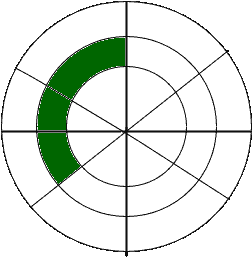
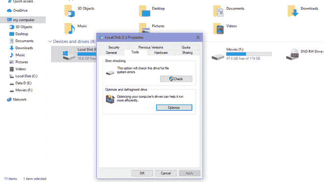
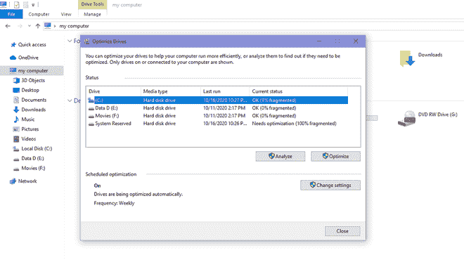
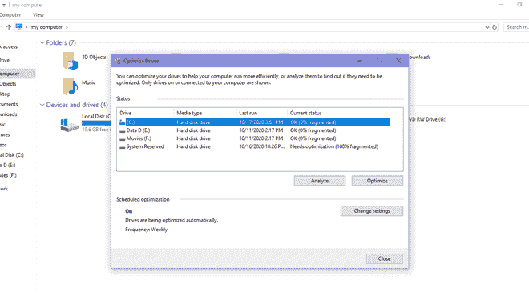

# 操作系统中的磁盘碎片整理

> 原文:[https://www . geesforgeks . org/操作系统磁盘碎片整理/](https://www.geeksforgeeks.org/disk-defragmentation-in-operating-system/)

**碎片**来自大的东西的一小块。

**磁盘碎片:**磁盘碎片是指以非顺序形式分配数据。通常，数据以序列形式存储在硬盘驱动器中，数据头保持跟随输入数据，以便于有效地读取数据，但是当我们从该序列中删除一些较旧的数据时。数据管理的顺序受到干扰，数据看起来像散点，当我们用更大的数据更新旧数据时，操作系统会将整个数据分割成小数据包，并将数据存储在存储区域的不同位置。

**碎片化的缺点:**

1.  磁盘中数据的读写时间增加，因为数据头在磁盘的差异存储区中有要移动的部分。
2.  磁盘的效率和性能下降。
3.  磁盘使用率可以达到 100%。
4.  获取更多存储区结果减少磁盘容量。
5.  由于碎片，硬盘的运行状况可能会受到影响。
6.  机器启动时间慢。
7.  应用程序之间的错误和冲突。

**碎片类型:**

*   **内部碎片化–**
    当内存被分割成已装载的大小块时，就会发生内部碎片化。每当一个方法请求内存时，装入的大小块就被分配给该方法。万一分配给方法的内存比请求的内存大一些，那么分配的内存和请求的内存之间的区别就是内部碎片。
*   **[【外部碎片化】](https://www.geeksforgeeks.org/difference-between-internal-and-external-fragmentation/)–**
    当内存中有足够的区域来满足一个方法的内存请求时，就会发生外部碎片化。但是，无法满足进程的内存请求，因为提供的内存是以不连续的方式提供的。要么应用最适合的内存分配策略，要么应用最适合的内存分配策略，这会导致外部碎片。
*   **数据碎片化–**
    在数据碎片化中，数据以非顺序形式存储。

碎片磁盘

磁盘碎片整理

**磁盘碎片整理:**在这个过程中，所有分散的碎片(数据)重新排列，使得它们以序列形式出现，并带有 Windows 中可用的进一步实用程序。在这个处理程序中，首先检查磁盘中可用碎片的百分比，然后尽可能对所有磁盘进行碎片整理。

**磁盘碎片整理:**

1.  右键单击您计算机上任何我们想要进行碎片整理的可用驱动器，然后单击工具部分，并在优化后。

2.优化后，它将检查所选磁盘中可用的总碎片，然后单击优化。

3.这将需要一些时间，在此过程之后，光盘中将出现 0%碎片。

