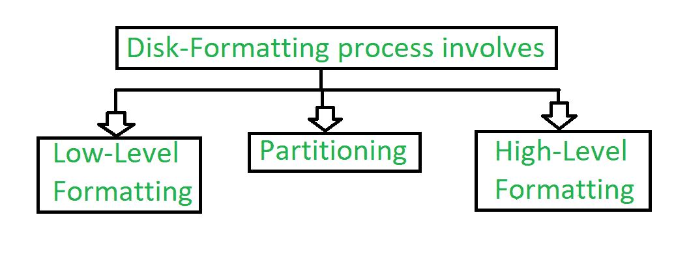
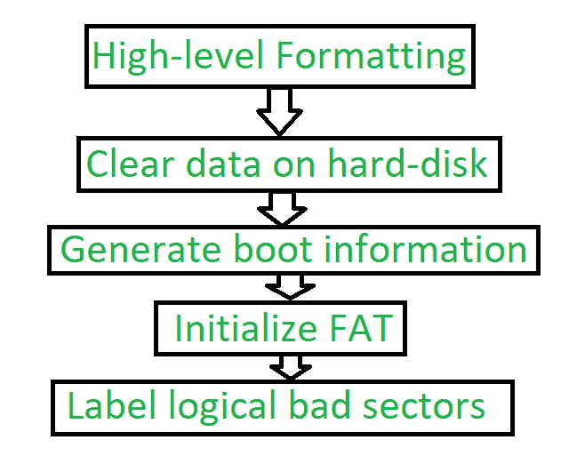

# 磁盘格式化

> 原文:[https://www.geeksforgeeks.org/disk-formatting/](https://www.geeksforgeeks.org/disk-formatting/)

**磁盘格式化**是在我们第一次使用硬盘、软盘、闪存等数据存储设备时，或者可以说是初次使用时，对其进行配置的过程。当用户要使用新的操作系统时，通常需要进行磁盘格式化。当存在空间问题，并且我们需要额外的空间在驱动器中存储更多数据时，也可以这样做。当我们格式化磁盘时，磁盘中现有的文件也会被擦除。

我们可以在磁盘硬盘和固态硬盘上执行磁盘格式化。

当我们将硬盘用于初始使用时，它将搜索病毒。它可以扫描病毒并修复驱动器中的坏扇区。磁盘格式化也有能力清除坏的应用程序和各种复杂的病毒。

我们知道，磁盘格式化会删除数据，并删除驱动器中安装的所有程序。所以可以谨慎从事。我们必须备份所有需要的数据和应用程序。毫无疑问，磁盘格式化需要时间。但是频繁格式化磁盘会降低硬盘的寿命。

**Figure –** Formatting process of disk

**1\. Low-level Formatting :**
Low level formatting is a type of physical formatting. In is the process of marking of cylinders and tracks of the blank hard-disk. After this there is the division of tracks into sectors with the sector markers. Now-a-days low-level formatting is performed by the hard-disk manufactures themselves.

我们的硬盘中有数据，当我们在硬盘中存在数据的情况下执行低级格式化时，所有数据都已被擦除，并且不可能恢复这些数据。有些用户制作这样的格式，可以避免自己的隐私泄露。否则低级会造成硬盘损坏缩短使用寿命。

因此，不建议用户使用这种格式。

**2。**分区:
顾名思义，分区就是划分。分区是将硬盘分成一个或多个区域的过程。这些区域被称为分区。

它可以由用户执行，并且会影响磁盘性能。

**3。高级格式化:**
高级格式化是写作的过程。为新创建的分区或卷写入文件系统、群集大小、分区标签等。这是为了擦除硬盘，并再次在磁盘驱动器上安装操作系统。

**Figure –** Steps of High-level Formatting

Firstly High-level formatting clears the data on hard-disk, then it will generate boot information, the it will initialize FAT after this it will go for label logical bad sectors when partition has existed.

由用户完成的格式化是高级格式化。

一般来说，它不会损害硬盘。使用管理员、Windows 管理单元磁盘管理工具、diskpart 等可以轻松完成。

我们可以使用这样的格式来修复一些问题，如文件系统中的错误、损坏的硬盘驱动器和开发坏扇区。