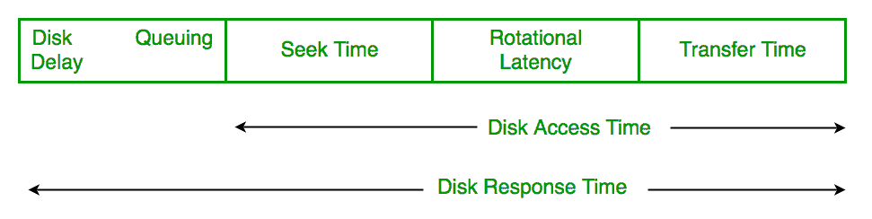
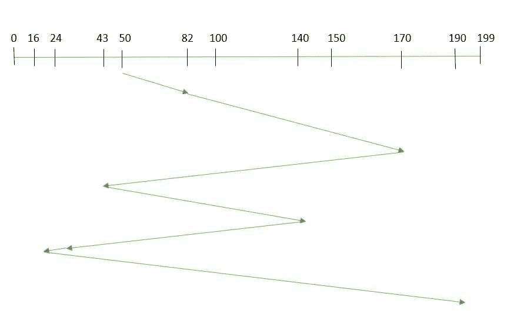
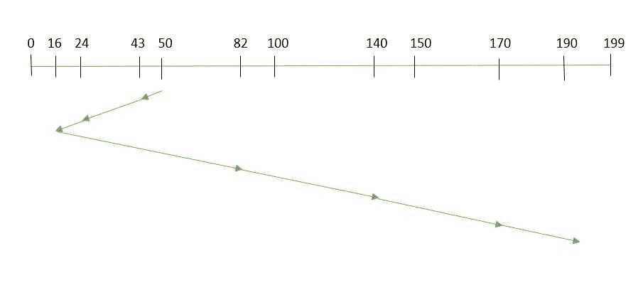
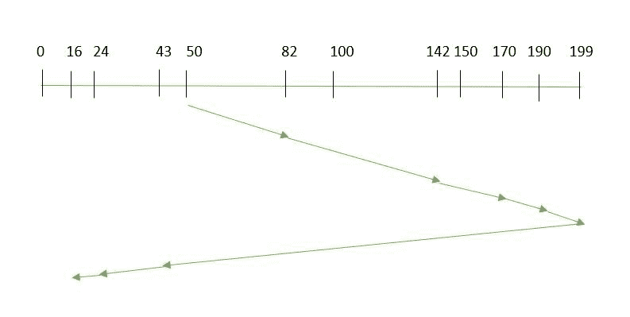
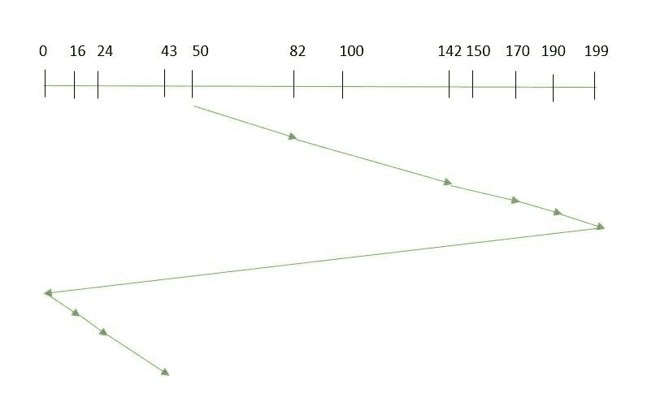
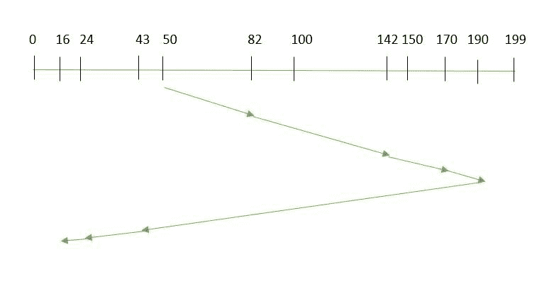
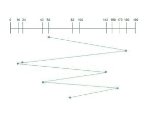

# 磁盘调度算法

> 原文:[https://www.geeksforgeeks.org/disk-scheduling-algorithms/](https://www.geeksforgeeks.org/disk-scheduling-algorithms/)

**磁盘调度**由操作系统来调度到达磁盘的 I/O 请求。磁盘调度也称为输入/输出调度。

磁盘调度很重要，因为:

*   多个输入/输出请求可能通过不同的进程到达，并且磁盘控制器一次只能处理一个输入/输出请求。因此，其他输入/输出请求需要在等待队列中等待，并需要进行调度。
*   两个或多个请求可能相距较远，因此可能会导致磁盘臂移动更大。
*   硬盘是计算机系统中最慢的部分之一，因此需要以高效的方式进行访问。

有许多磁盘调度算法，但在讨论它们之前，让我们先快速了解一些重要术语:

*   **<u>寻道时间</u>** **:** 寻道时间是将磁盘臂定位到要读取或写入数据的指定磁道所花费的时间。所以给出最小平均寻道时间的磁盘调度算法更好。
*   **<u>旋转延迟:</u>** 旋转延迟是指磁盘的所需扇区旋转到某个位置以访问读/写磁头所需的时间。所以给出最小旋转延迟的磁盘调度算法更好。
*   **<u>传输时间:</u>** 传输时间是传输数据的时间。这取决于磁盘的转速和要传输的字节数。
*   **<u>磁盘访问时间:</u>** 磁盘访问时间为:

```

      Disk Access Time = Seek Time + 
                         Rotational Latency + 
                         Transfer Time
```

[](https://media.geeksforgeeks.org/wp-content/uploads/disc-scheduling-algorithms.png)

*   **<u>磁盘响应时间:</u>** 响应时间是请求等待执行其 I/O 操作所花费的平均时间。*平均响应时间*是所有请求的响应时间。*差异响应时间*是相对于平均响应时间来衡量如何服务单个请求。所以给出最小方差响应时间的磁盘调度算法更好。

**<u>磁盘调度算法</u>**

1.  **<u>FCFS:</u>** FCFS is the simplest of all the Disk Scheduling Algorithms. In FCFS, the requests are addressed in the order they arrive in the disk queue.Let us understand this with the help of an example.

    #### **<u>例:</u>**

    假设请求的顺序为- (82，170，43，140，24，16，190)
    并且读/写磁头的当前位置为:50
    
    那么，总寻道时间:
    =(82-50)+(170-82)+(170-43)+(140-43)+(140-24)+(24-16)+(190-16)

优点:

*   每个请求都有公平的机会
*   没有无限期推迟

缺点:

*   不尝试优化寻道时间
*   可能无法提供最好的服务

2.  **<u>SSTF:</u>** In SSTF (Shortest Seek Time First), requests having shortest seek time are executed first. So, the seek time of every request is calculated in advance in the queue and then they are scheduled according to their calculated seek time. As a result, the request near the disk arm will get executed first. SSTF is certainly an improvement over FCFS as it decreases the average response time and increases the throughput of system.Let us understand this with the help of an example.

    #### **<u>例:</u>**

    假设请求顺序为- (82，170，43，140，24，16，190)
    ，读写头当前位置为:50
    

    总寻道时间:

    =(50-43)+(43-24)+(24-16)+(82-16)+(140-82)+(170-40)+(190-170)
    = 208

优点:

*   平均响应时间缩短
*   吞吐量增加

缺点:

*   提前计算寻道时间的开销
*   如果请求的寻道时间比传入请求的寻道时间长，可能会导致请求饥饿
*   响应时间差异大，因为 SSTF 只支持某些请求

3.  **<u>SCAN:</u>** In SCAN algorithm the disk arm moves into a particular direction and services the requests coming in its path and after reaching the end of disk, it reverses its direction and again services the request arriving in its path. So, this algorithm works as an elevator and hence also known as **elevator algorithm.** As a result, the requests at the midrange are serviced more and those arriving behind the disk arm will have to wait.

    #### **<u>例:</u>**

    假设要处理的请求是-82，170，43，140，24，16，190。而读/写臂在 50，也给出了盘臂应该向**“更大值”移动。**
    

    因此，寻道时间计算如下:

    =(199-50)+(199-16)
    =332

优点:

*   高流通量
*   响应时间的低方差
*   平均响应时间

缺点:

*   磁盘臂刚刚访问的位置的请求等待时间很长

4.  **<u>CSCAN</u>** :在 SCAN 算法中，盘臂在反转方向后，再次扫描已扫描的路径。因此，可能有太多的请求在另一端等待，或者可能有零个或很少的请求在扫描区域等待。

在 *CSCAN* 算法中避免了这些情况，在该算法中，磁盘臂不是反转方向，而是到达磁盘的另一端，并从那里开始服务请求。因此，磁盘臂以圆形方式移动，该算法也类似于扫描算法，因此被称为 C-SCAN(圆形扫描)。

#### **<u>例:</u>**

假设要处理的请求是-82，170，43，140，24，16，190。而读/写臂在 50，也给出了盘臂应该向**“更大值”移动。**


寻道时间计算如下:

=(199-50)+(199-0)+(43-0)
= 391

优点:

*   与扫描相比，提供更均匀的等待时间

5.  **<u>LOOK:</u>** It is similar to the SCAN disk scheduling algorithm except for the difference that the disk arm in spite of going to the end of the disk goes only to the last request to be serviced in front of the head and then reverses its direction from there only. Thus it prevents the extra delay which occurred due to unnecessary traversal to the end of the disk.

    #### **<u>例:</u>**

    假设要处理的请求是-82，170，43，140，24，16，190。而读/写臂在 50，也给出了盘臂应该向**“更大值”移动。**
    

    因此，寻道时间计算如下:

    =(190-50)+(190-16)
    =314

6.  **<u>CLOOK:</u>** As LOOK is similar to SCAN algorithm, in similar way, CLOOK is similar to CSCAN disk scheduling algorithm. In CLOOK, the disk arm in spite of going to the end goes only to the last request to be serviced in front of the head and then from there goes to the other end’s last request. Thus, it also prevents the extra delay which occurred due to unnecessary traversal to the end of the disk.

    #### **<u>例:</u>**

    假设要处理的请求是-82，170，43，140，24，16，190。而读/写臂在 50，也给出了磁盘臂应该向更大的值“
    移动

    **因此，寻道时间计算如下:**

    **=(190-50)+(190-16)+(43-16)
    = 341**

7.  ****RSS**–代表随机调度，就像它的名字一样，它就是自然。它用于调度涉及随机属性的情况，如随机处理时间、随机到期日、随机权重和随机机器故障，这种算法是完美的。这就是为什么它通常用于分析和模拟。**
8.  ****LIFO**– In LIFO (Last In, First Out) algorithm, newest jobs are serviced before the existing ones i.e. in order of requests that get serviced the job that is newest or last entered is serviced first and then the rest in the same order.

    **优势**

    *   最大限度地提高位置和资源利用率

    **缺点**

    *   似乎对其他请求有点不公平，如果新的请求不断出现，就会导致旧的和现有的请求饥饿。

    **例**
    假设请求顺序为- (82，170，43，142，24，16，190)
    读写头当前位置为:50

    ** 
9.  ****N-STEP SCAN** – It is also known as N-STEP LOOK algorithm. In this a buffer is created for N requests. All requests belonging to a buffer will be serviced in one go. Also once the buffer is full no new requests are kept in this buffer and are sent to another one. Now, when these N requests are serviced, the time comes for another top N requests and this way all get requests get a guaranteed service

    **优势**

    *   它完全消除了请求的匮乏** 
10.  ****FSCAN**–该算法使用两个子队列。在扫描过程中，第一个队列中的所有请求都将得到服务，新的传入请求将被添加到第二个队列中。所有新请求都将暂停，直到第一个队列中的现有请求得到服务。
    T3】优势

    *   FSCAN 和 N-Step-SCAN 一起防止了“臂粘性”(I/O 调度中的现象，其中调度算法继续服务当前扇区或其附近的请求，从而防止任何寻找)** 

**每种算法都有其独特之处。整体性能取决于请求的数量和类型。
**注:**平均旋转潜伏期一般取 1/2(旋转潜伏期)。
运动**

****1)** 假设一个磁盘有 201 个柱面，编号从 0 到 200。在某个时间，磁盘臂处于柱面 100，并且存在针对柱面 30、85、90、100、105、110、135 和 145 的磁盘访问请求队列。如果最短寻道时间优先(SSTF)用于调度磁盘访问，则在处理了 ___________ 个请求后，将处理柱面 90 的请求。(GATE CS 2014
(A)1
(B)2
(C)3
(D)4
解决方法见[本](https://www.geeksforgeeks.org/gate-gate-cs-2014-set-1-question-29/)。**

****2)** 考虑能够一次加载并执行单个顺序用户进程的操作系统。使用的磁盘头调度算法是先到先得(FCFS)。如果 FCFS 被供应商声称的最短寻道时间优先(SSTF)所取代，以给出 50%的更好基准测试结果，那么用户程序的 I/O 性能会有什么样的预期改进？(GATE CS 2004)
(A)50%
(B)40%
(C)25%
(D)0%
解决方案见[本](https://www.geeksforgeeks.org/gate-gate-cs-2004-question-12/)。**

****3)** 假设给定了具有 100 个磁道的磁盘的以下磁盘请求序列(磁道号):45、20、90、10、50、60、80、25、70。假设读写头的初始位置在轨道 50 上。当使用最短寻道时间优先(SSTF)算法时，与 SCAN(电梯)算法(假设 SCAN 算法开始执行时向 100°移动)相比，读/写磁头将穿越的额外距离是 _ _ _ _ _ _ _ _ _ _ _ 个磁道
(A)8
(B)9
(C)10
(D)11
有关解决方案，请参见本。**

****4)** 考虑一个典型的磁盘，它以每分钟 15000 转(RPM)的速度旋转，传输速率为 50 × 10^6 字节/秒。如果磁盘的平均寻道时间是平均旋转延迟的两倍，并且控制器的传输时间是磁盘传输时间的 10 倍，则读取或写入磁盘的 512 字节扇区的平均时间(以毫秒为单位)是 _______
参见[本](https://www.geeksforgeeks.org/gate-gate-cs-2015-set-2-question-59/)了解解决方案。**

**本文由**安基特·米塔尔**供稿。如果你发现任何不正确的地方，或者你想分享更多关于上面讨论的话题的信息，请写评论。**