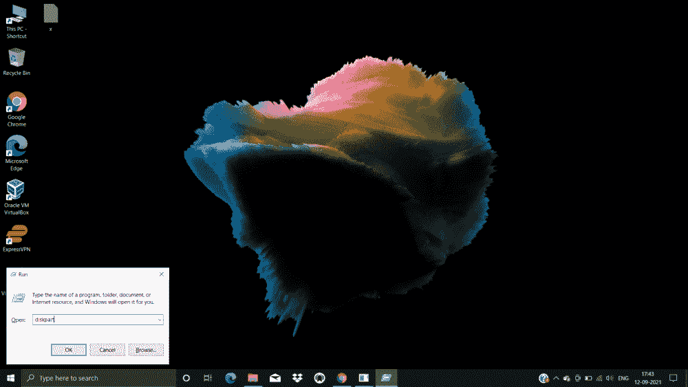

# Windows 中的 Diskpart 命令

> 原文:[https://www.geeksforgeeks.org/diskpart-command-in-windows/](https://www.geeksforgeeks.org/diskpart-command-in-windows/)

DiskPart 是 Windows 操作系统下磁盘管理的有力工具。Diskpart 命令用于管理计算机硬盘、分区和卷。此命令不仅仅限于 Windows 10，在 Windows 8.1、8、7 甚至 Windows 2000 中都可以使用。Diskpart 用于创建或删除分区，清除驱动器或修复驱动器上的错误。

Diskpart 看起来类似于磁盘管理工具，但唯一的区别是 *diskpart* 是一个命令提示符实用程序，它比磁盘管理工具更强大，提供的功能也更多。

让我们看看 Diskpart 如何帮助您管理驱动器、分区和卷。

**注意:**在使用 DiskPart 时，您应该始终以管理员模式运行您的计算机。

### 语法:

```
diskpart <parameter>
```

### 参数:

您可以从 Diskpart 命令解释器运行以下命令:

```
ACTIVE      - Mark the selected partition as active.
ADD         - Add a mirror to a simple volume.
ASSIGN      - Assign a drive letter or mount point to the selected volume.
ATTRIBUTES  - Manipulate volume or disk attributes.
ATTACH      - Attaches a virtual disk file.
AUTOMOUNT   - Enable and disable automatic mounting of basic volumes.
BREAK       - Break a mirror set.
CLEAN       - Clear the configuration information, or all information, off the
             disk.
COMPACT     - Attempts to reduce the physical size of the file.
CONVERT     - Convert between different disk formats.
CREATE      - Create a volume, partition or virtual disk.
DELETE      - Delete an object.
DETAIL      - Provide details about an object.
DETACH      - Detaches a virtual disk file.
EXIT        - Exit DiskPart.
EXTEND      - Extend a volume.
EXPAND      - Expands the maximum size available on a virtual disk.
FILESYSTEMS - Display current and supported file systems on the volume.
FORMAT      - Format the volume or partition.
GPT         - Assign attributes to the selected GPT partition.
HELP        - Display a list of commands.
IMPORT      - Import a disk group.
INACTIVE    - Mark the selected partition as inactive.
LIST        - Display a list of objects.
MERGE       - Merges a child disk with its parents.
ONLINE      - Online an object that is currently marked as offline.
OFFLINE     - Offline an object that is currently marked as online.
RECOVER     - Refreshes the state of all disks in the selected pack.
             Attempts recovery on disks in the invalid pack, and
             resynchronizes mirrored volumes and RAID5 volumes
             that have stale plex or parity data.
REM         - Does nothing. This is used to comment scripts.
REMOVE      - Remove a drive letter or mount point assignment.
REPAIR      - Repair a RAID-5 volume with a failed member.
RESCAN      - Rescan the computer looking for disks and volumes.
RETAIN      - Place a retained partition under a simple volume.
SAN         - Display or set the SAN policy for the currently booted OS.
SELECT      - Shift the focus to an object.
SETID       - Change the partition type.
SHRINK      - Reduce the size of the selected volume.
UNIQUEID    - Displays or sets the GUID partition table (GPT) identifier or
             master boot record (MBR) signature of a disk.
```

### 打开并列出驱动器或分区或卷:

在我们继续在驱动器、分区或卷上实现 DiskPart 命令之前，列出它们是很重要的。按照以下步骤列出驱动器:

*   按下**视窗+R** 键并点击**确定后，输入*磁盘部件*。**



*   在磁盘部件命令窗口中，输入**列出磁盘**并点击**进入**


*   这将列出所有可用的驱动器，并为它们指定一个从 0 开始的编号。
*   如果你想看所有的卷，那么输入**列出卷**并点击**进入。**


*   这将列出从 0 开始为其指定了编号的所有可用卷。

上面的文章，解释了 Windows 上 *diskpart* 命令的用例和参数。