# 分布式应用范例

> 原文:[https://www . geesforgeks . org/distributed-application-范型/](https://www.geeksforgeeks.org/distributed-application-paradigms/)

范式意味着一种想法或模式。在本文中，我们将看到分布式应用程序范例的分类。

**抽象级别:**


**消息传递范例:**
这是进程间通信的基本方法。发送方和接收方之间的数据交换。进程发送代表请求的消息。接收者接收并处理它，然后作为回复发回。

```
Operations: send, receive
Connections: connect, disconnect 
```

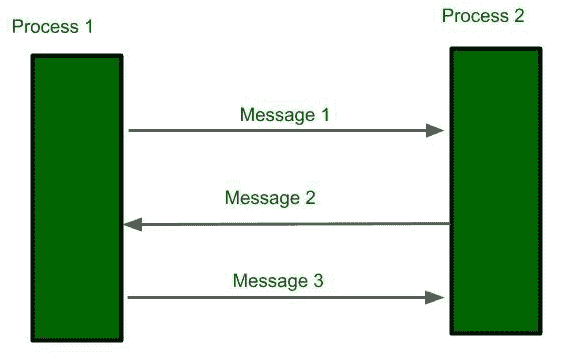

**客户端服务器范例:**
在这种方法中，服务器充当服务提供者，客户端发出请求并等待服务器的响应。这里的服务器是转储机。直到客户端打电话服务器不通信。许多互联网服务是客户端-服务器应用程序。

```
Server Process: listen, accept
Client Process: issue the request, accept the response 
```

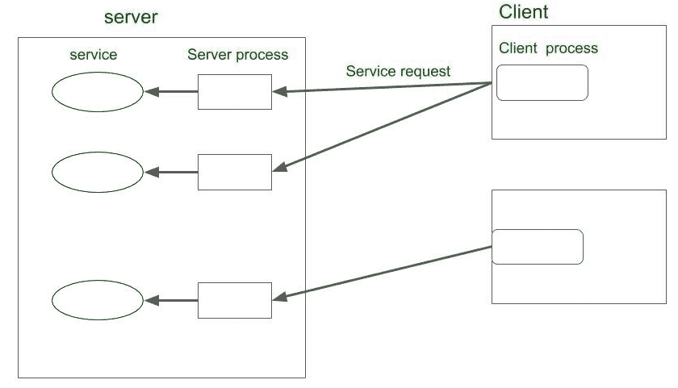

**对等范例:**
进程之间的直接通信。这里没有客户端或服务器，任何人都可以向他人提出请求并获得响应。

**示例:**一个众所周知的对等文件传输示例。

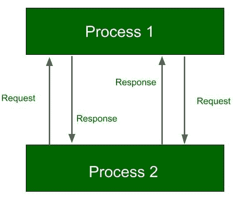

**消息系统范式:**
消息系统充当独立进程之间的中介。它还充当交换机，进程通过它以解耦方式异步交换消息。发送方发送消息，该消息首先在消息系统中丢弃，然后转发到与接收方相关联的消息队列。

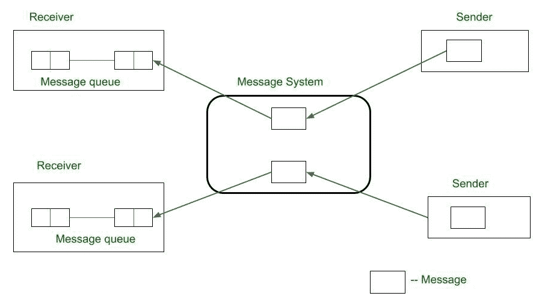

**类型:**

*   点对点消息模型
*   发布/订阅模型

**点对点消息模型:**
通过消息系统将消息从发送方转发给接收方。消息系统保存消息库，并将消息直接转发到接收者的消息队列。与基本的消息传递模型不同，它提供异步消息传递。

**公众/订阅模型:**
在这个模型中，每条消息都与特定的主题或事件相关联。任何对消息感兴趣的人都可以在事件发生之前订阅它。当等待的事件发生时，流程发布带有事件或主题的消息。然后，消息系统将消息分发给所有订户。
**示例:** IBM MQ 服务，微软消息队列

**远程过程调用:**

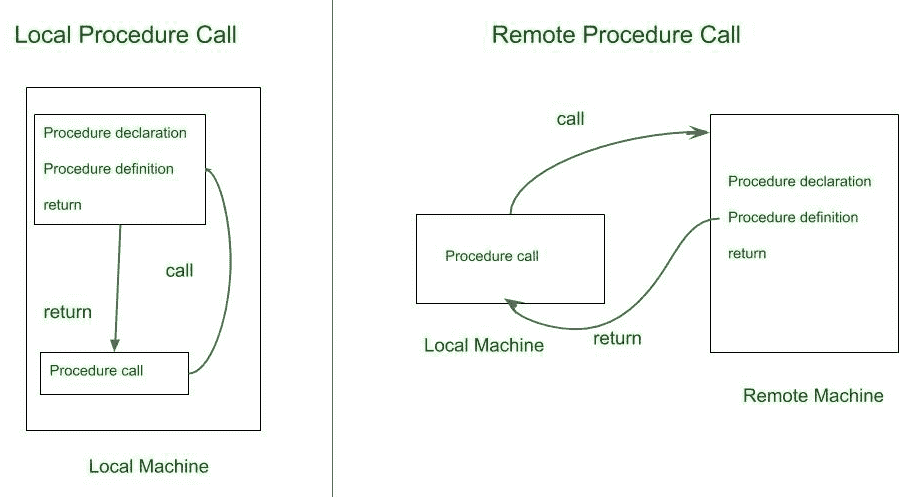

本地过程调用只发生在本地机器上。远程过程调用发生在两台远程机器之间。

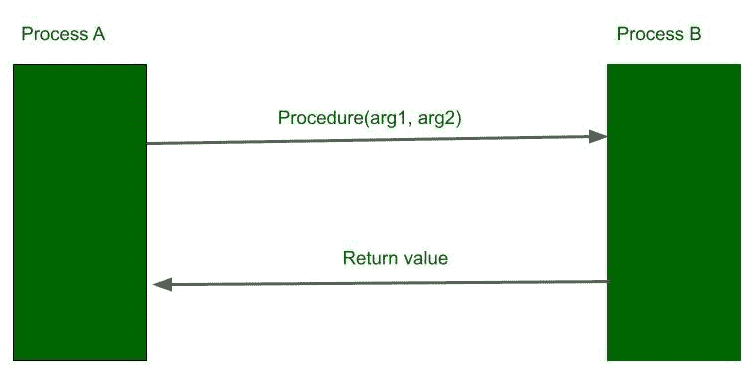

RPC 涉及两个独立的进程，它们可能驻留在单独的机器上。希望用参数列表请求过程调用的过程。过程 B 操作该过程并将值返回给过程 a

**分布式对象范例:**
应用程序访问分布在网络上的对象。对象提供方法，通过调用这些方法，应用程序可以访问服务。

**类型:**

*   远程方法调用
*   对象请求代理
*   物体空间

**远程方法调用:**
RMI 更像 RPC，但主要区别是，它是面向对象的方法。进程调用对象中的方法，该对象可能位于远程主机中。参数可以随调用一起传递。

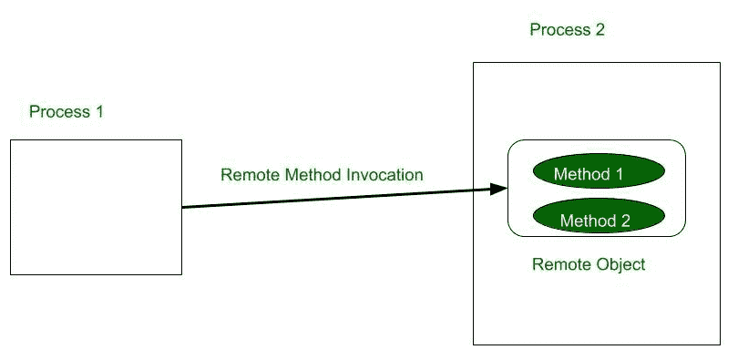

**对象请求代理(ORB):**
ORB 充当对象和对象请求者之间的中介，它允许请求者可以访问多个远程对象。应用程序向对象请求代理(ORB)发出请求，该代理将请求定向到提供服务的适当对象。

**例:** CORBA

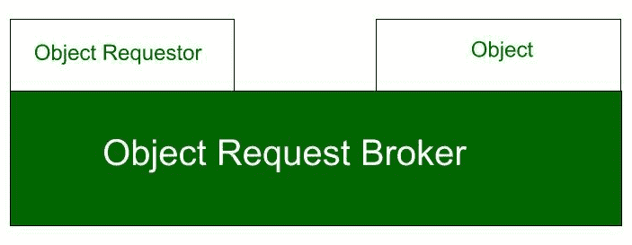

**对象空间:**
对象作为逻辑实体放置在名为*对象空间*的空间中。提供程序将其对象条目放在对象空间中。订阅的请求可以访问这些对象。

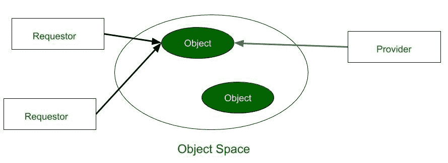

**移动代理范例:**
移动代理从始发主机开始，通过主机传输到主机。在每个主机上，代理可以访问服务或资源来完成任务。

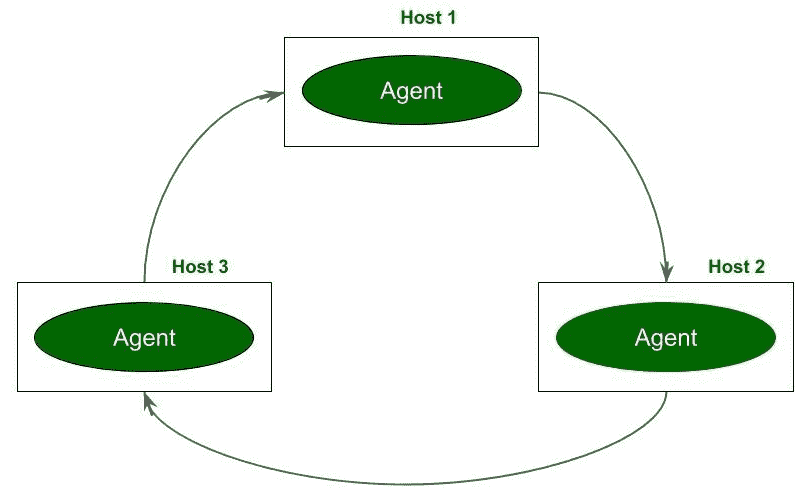

**网络服务范式:**
所有服务对象都在全局目录服务中注册。如果进程需要服务，可以在运行时联系目录服务。请求者被提供一个引用，使用该引用进程与服务交互。服务由全局唯一标识符标识。
**例:**爪哇吉妮

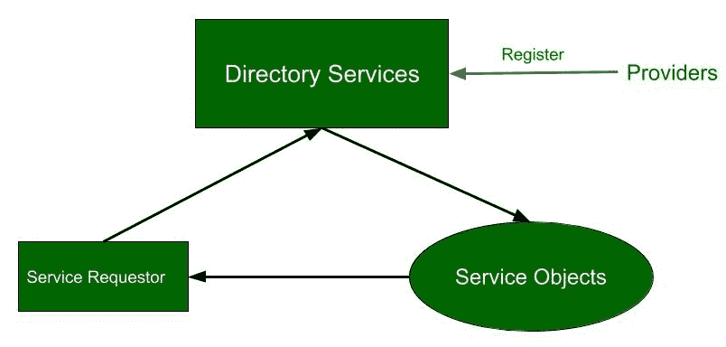

**协作应用范例:**
进程作为一个组参与协作会话。每个参与过程都可以向部分或全部组提供输入。

**类型:**

*   基于消息的群件范例
*   基于白板的群件范例

**基于消息的群件范例:**
一台主机可以组播向组内所有主机或组内部分主机发送数据。

**基于白板的群件范例:**
信息在群中的公共板上可用，群中的任何人都可以访问它。任何人都可以在共享显示器上读取或写入数据

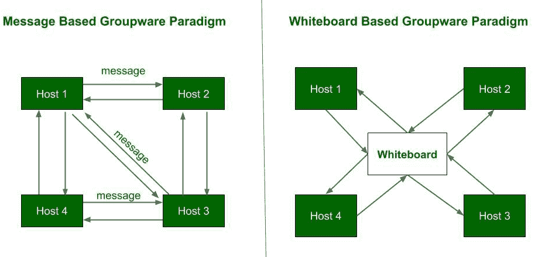