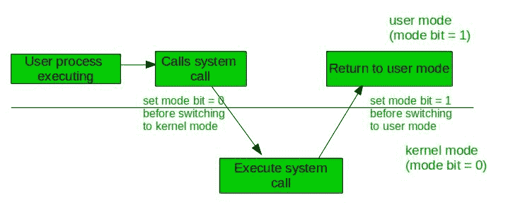

# 操作系统中的双模操作

> 原文:[https://www.geeksforgeeks.org/dual-mode-operations-os/](https://www.geeksforgeeks.org/dual-mode-operations-os/)

一个程序中的错误可能会对许多进程产生不利影响，它可能会修改另一个程序的数据，也可能会影响操作系统。例如，如果一个进程卡在无限循环中，那么这个无限循环可能会影响其他进程的正确操作。因此，为了确保操作系统的正确执行，有两种操作模式:

**用户模式–**
当计算机系统由用户应用程序运行时，如创建文本文档或使用任何应用程序，则系统处于用户模式。当用户应用程序向操作系统请求服务或发生中断或[系统调用](https://www.geeksforgeeks.org/operating-system-introduction-system-call/)时，将从用户模式转换到内核模式以满足请求。
**注意:**要从内核模式切换到用户模式，模式位应为 1。

下图描述了中断发生时会发生什么情况:

**内核模式–**
系统引导时，硬件以内核模式启动，加载操作系统时，以用户模式启动用户应用。为了给硬件提供保护，我们有特权指令，只在内核模式下执行。如果用户试图在用户模式下运行特权指令，那么它将把指令视为非法的，并且是对操作系统的陷阱。一些特权指令是:

1.  处理中断
2.  从用户模式切换到内核模式。
3.  投入产出管理。

**注意:**要从用户模式切换到内核模式，位应为 0。

接下来阅读–[用户级线程 Vs 内核级线程](https://www.geeksforgeeks.org/operating-system-user-level-thread-vs-kernel-level-thread/)