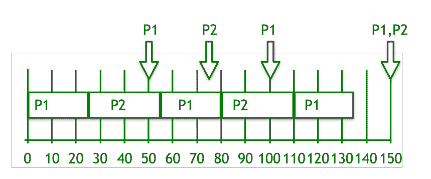

# 最早截止时间优先(EDF) CPU 调度算法

> 原文:[https://www . geesforgeks . org/early-deadline-first-EDF-CPU-scheduling-algorithm/](https://www.geeksforgeeks.org/earliest-deadline-first-edf-cpu-scheduling-algorithm/)

**最早截止时间优先(EDF)** 是一种用于实时系统的最优动态优先级调度算法。
可用于静态和动态实时调度。

EDF 使用作业优先级进行调度。它根据绝对期限为任务分配优先级。截止日期最近的任务优先级最高。优先级被动态地分配和改变。与实时系统中的其他调度算法相比，EDF 非常高效。它可以使 CPU 利用率达到 100%左右，同时仍然保证所有任务的截止日期。

EDF 包括内核过载。在 EDF 中，如果 CPU 使用率低于 100%，那么就意味着所有的任务都在截止日期前完成了。法国电力公司找到了一个最佳可行的时间表。可行的时间表是系统中的所有任务都在期限内执行的时间表。如果 EDF 不能为实时系统中的所有任务找到一个可行的调度，那么这意味着实时系统中没有其他任务调度算法能够给出一个可行的调度。当任务可以运行时，所有准备执行的任务都应该向法国电力公司宣布它们的截止日期。

EDF 调度算法不需要任务或进程是周期性的，任务或进程也需要固定的 CPU 突发时间。在 EDF 中，如果任何其他具有较早截止日期的周期性实例准备好执行并变为活动的，则任何正在执行的任务都可以被抢占。最早截止日期优先调度算法允许抢占。

**例:**
考虑两个过程 P1 和 P2。

让 P1 的周期为 p 1 = 50
让 P1 的加工时间为 t 1 = 25

让 P2 的周期为周期 2 = 75
让 P2 的加工时间为 t 2 = 30

**求解步骤:**

1.  P1 的截止日期更早，所以 P1 优先于 P2。
2.  最初 P1 运行并完成了 25 次的执行。
3.  25 次之后，P2 开始执行，直到 50 次，P1 能够执行。
4.  现在，比较(P1，P2) = (100，75)的截止日期，P2 继续执行。
5.  P2 在时间 55 完成其处理。
6.  P1 开始执行，直到时间 75，当 P2 能够执行。
7.  现在，再次比较(P1，P2) = (100，150)的截止日期，P1 继续执行。
8.  重复以上步骤…
9.  最后，在时间 150，P1 和 P2 具有相同的截止日期，因此 P2 将继续执行，直到其处理时间，之后 P1 开始执行。

**EDF 调度算法的局限性:**

*   瞬态霸王问题
*   资源共享问题
*   高效实现问题