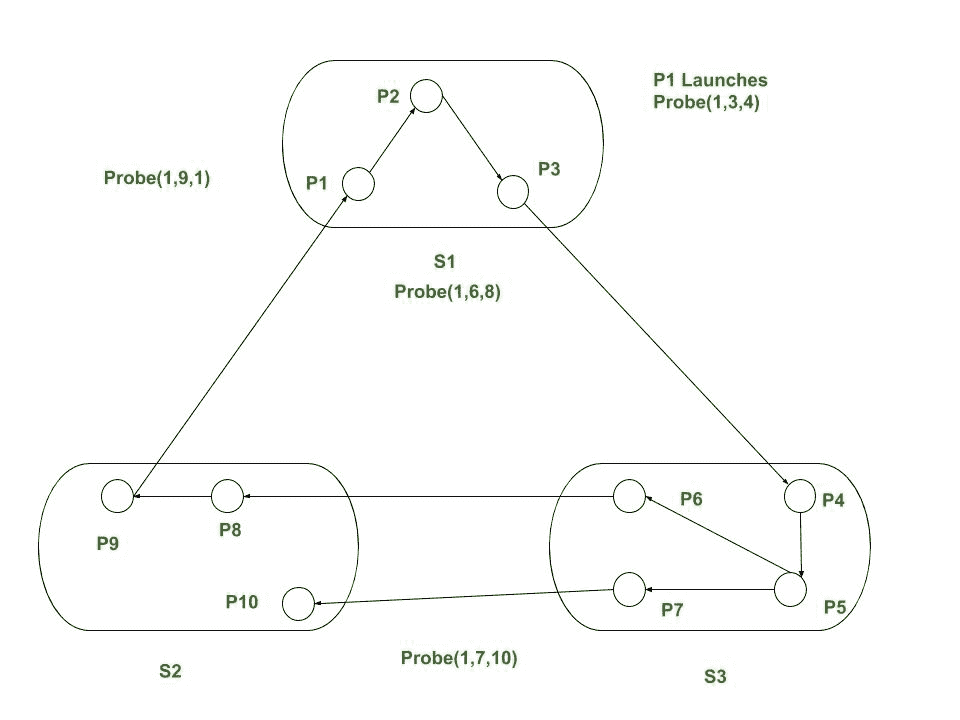
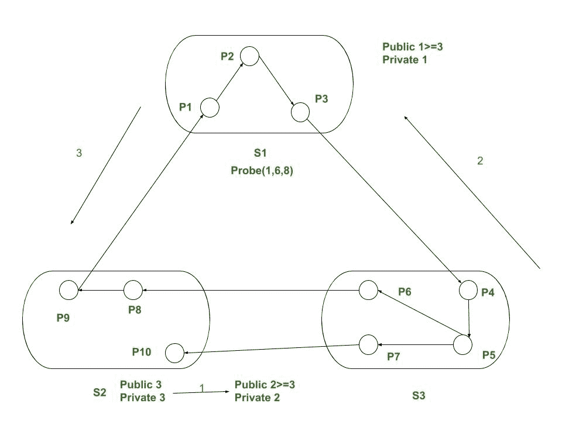

# 边缘追踪算法

> 原文:[https://www.geeksforgeeks.org/edge-chasing-algorithms/](https://www.geeksforgeeks.org/edge-chasing-algorithms/)

死锁可能是一个虚拟的缺点，可能会在合作或竞争过程的某个点出现。死锁是这样一种状态:由于每种技术都需要一个固定的过程、解决问题所需的资源，以及由于这个原因预期使用其他同等组织中的其他方法所拥有的最终资产的释放，使得任何方法都不可能继续进行，从而导致一组方法被阻塞。

死锁涉及以下元素:

**1。资源:**
操作小工具和有用的资源管理器系统可以关注死锁场景。有限数量的资产在系统内上市。这些资源分布在一系列竞争方法中。

*   **可重复使用的来源–**
    可重复使用的援助是一次使用最简便的方法就能正确使用的援助，并且不会因使用而耗尽。进程积累辅助单位，它们随后通过不同的策略释放这些单位以供应用。
    可重用资源的示例包括处理器、输入/输出通道、输入/输出设备、一号和二级内存、文件、数据库、信号量等。

*   **Expendable sources –**
    The expendable aid is one that can be created and destroyed. There’s no restriction on quantity of expendable assets of a particular kind. Samples of expendable sources are interrupts, indicators messages, and expertise in I/O buffers.A technique ought to request a resource before victimizing it and need to unleash useful resource once victimizing it. The quantity of assets requested won’t exceed complete wide variety of assets on market within gadget.

    **2。请求:**
    请求可以理解为任何处理器请求使用任何资源。如果请求不能被实时批准，那么请求技术必须等待，直到它积累资源。

    **3。**
    当资源分配给处理器时，就会出现这种状态。

    **4。释放:**
    执行所需操作后，资源被设置为自由状态，这可能与资源释放有关。

    **分布式死锁检测算法:**
    算法程序将在每次有死锁压力的情况下启动。算法程序可以通过使用方法的本地网站或定位任意位置方法等待来启动。分布式情况将通过拍摄设备并检查其是否处于僵局状态来检测。

    分布式死锁检测算法程序可以分为如下四类:

    *   **路径推入–**
        路径信息-发送到等待节点到封锁节点。
    *   **边缘追踪–**
        在图边缘调度探测消息区域单元。
    *   **扩散计算–**
        在图边上调度的回声消息定位单元。
    *   **全球民族探测–**
        扫出、扫入 WFG 创造与还原。

    **边缘追踪算法:**

    *   边缘追踪算法在任何情况下都利用唯一的消息，僵局检测由程序 P <sub>i</sub> 启动，并且它的英里数通过方式 P <sub>i</sub> 的房屋网站发送到程序 P <sub>k</sub> 的房屋网站。
    *   探测信息沿着世界 TWF 图的边缘传播。如果探测消息返回到其启动过程，则检测到僵局。

    **注–**
    一个布尔阵，随军家属，对于每一个术 P <sub>i</sub> ，都是保持的。如果 P <sub>j</sub> 意识到 P <sub>i</sub> 依赖于它，依赖(j)就准备好为真。否则，就大错特错了。

    **示例:**设想一个如图所示的系统，如果方法 P <sub>1</sub> 启动情况检测，它将探头(1，3，4)发送到 S <sub>2</sub> 。由于 P <sub>6</sub> 正在等待 P <sub>8</sub> ，P <sub>7</sub> 正在等待 P <sub>10</sub> 。S <sub>2</sub> 向 S <sub>3</sub> 发送探头(1，6，8)和(1，7，10)，S<sub>3</sub>依次向 S <sub>1</sub> 发送探头(1，9，1)。在接收探头(1，9，1)时，S <sub>1</sub> 宣布 P <sub>1</sub> 受阻(死锁)。

    

    ```
    If Pi is locally dependent on itself then declare deadlock
    Else for all Pj and Pk such that
        Pi is locally dependent upon Pj, and
        Pj is waiting on Pk, and
        Pj and Pk are on totally different sites
             Send probe(i,j,k) to home site of Pk
    ```

    收到探测(I，j，k)后，定位会采取后续行动。

    ```
    If
    Pk is blocked, and
    dependentk(i) is false. and
    Pk has not replied to any or all requests of Pj
    then
            begin
        dependentk(i)= true;
        if k = i then declare that Pi is under deadlock
        else for all Pm and Pn such that
            Pk is locally dependent upon Pm, and
            Pm is waiting on Pn and
            Pm  and Pn are on totally different sites,
            send Prob(I,m,n) to house sites of Pn
    end
    ```

    使用边缘追踪算法的给定示例的解决方案:

    1.  初 P <sub>6</sub> 向 P <sub>8</sub> 索要其公共标签，并将其自己的 2 改为 3。
    2.  P <sub>3</sub> 询问 P <sub>4</sub> 并将其公共标签 1 改为 3。
    3.  P <sub>9</sub> 询问 P <sub>1</sub> 并找到自己的公共标签 3，然后检测情况。
    4.  p→【p】→<sub>【2】</sub>→【p】<sub>【3】</sub>→【p】<sub>【4】</sub>→【p】<sub>【5】→<sub>6【t】</sub></sub>

    