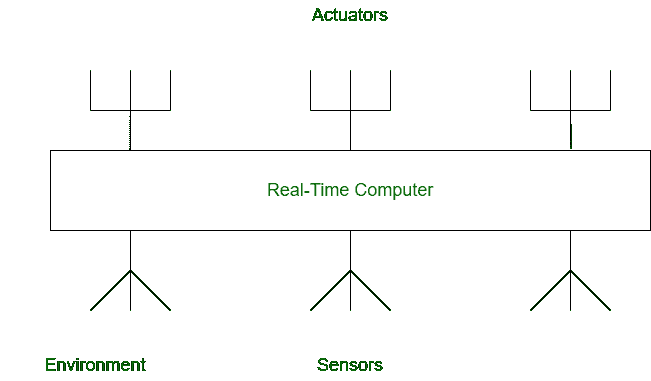

# 嵌入式实时系统

> 原文:[https://www.geeksforgeeks.org/embedded-real-time-system/](https://www.geeksforgeeks.org/embedded-real-time-system/)

**[实时系统](https://www.geeksforgeeks.org/real-time-systems/)** 是用于执行某些特定任务的系统。它是一个用于各种硬实时和软实时任务的计算系统。这些具体任务与时间限制有关。分配给实时系统的任务需要在给定的时间间隔内完成。

[嵌入式系统](https://www.geeksforgeeks.org/introduction-of-embedded-systems-set-1/)是由计算机硬件和软件为特定功能组合而成的集成系统。它可以说是由于某种特殊原因而开发的专用计算机系统。但它不是我们传统的计算机系统或通用计算机，这些是嵌入式系统，它们可以独立工作，也可以附属于一个更大的系统来完成一些特定的功能。这些嵌入式系统可以在没有人工干预或稍加人工干预的情况下工作。

设计用于执行实时任务的嵌入式系统被称为嵌入式实时系统或实时嵌入式系统。

**嵌入式实时系统的类型:**
嵌入式实时系统有两种类型:

*   **硬嵌入式实时系统–**
    这些是用于执行硬实时任务的嵌入式实时系统。这些系统的设计非常复杂。这些是精确的系统。
*   **软嵌入式实时系统–**
    这些是用于执行软实时任务的嵌入式实时系统。这些都是简单设计的系统，有可能不准确。

**嵌入式实时系统的结构:**
在嵌入式实时系统中，系统的不同组件自然是分布广泛的。硬、软两种实时嵌入式系统结构相同。实时系统的结构包括各种嵌入的硬件和软件设备，使得特定任务可以在时间限制允许的情况下执行。

下图显示了嵌入式实时系统的结构:

1.  **执行器–**
    执行器是与传感器相反的装置。执行器用于将电气事件转换为物理信号，而传感器用于执行相反的工作。它可以根据用户的要求将电信号转换成物理事件或特征。它从系统获取输入，并向环境提供输出。从致动器获得的输出可以来自任何物理动作。一些常用的致动器是加热器和马达。
2.  **传感器–**
    传感器与执行器完全相反。传感器用于不时感知环境。它用于将物理事件或特征转换为电信号。这是一种硬件设备，它从环境中获取输入，并向系统提供输出。来自环境的感测数据被处理以确定必要的纠正措施。