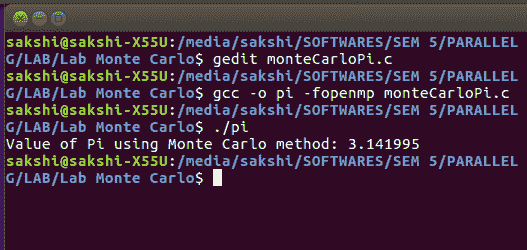

# 用蒙特卡罗|并行计算方法估算圆周率的值

> 原文:[https://www . geeksforgeeks . org/使用蒙特卡罗并行计算方法估算 pi 值/](https://www.geeksforgeeks.org/estimating-the-value-of-pi-using-monte-carlo-parallel-computing-method/)

给定两个整数 **N** 和 **K** 表示并行处理中的试验次数和总线程数。任务是使用并行化程序部分的[开放多处理(OpenMP)](https://www.geeksforgeeks.org/openmp-introduction-with-installation-guide/) 技术，使用蒙特卡罗算法找到 PI 的[估计值。](https://www.geeksforgeeks.org/estimating-value-pi-using-monte-carlo/)

**示例:**

> **输入:** N = 100000，K = 8
> **输出:**最终估计 Pi = 3.146600
> 
> **输入:** N = 10，K = 8
> T3】输出:圆周率最终估计值= 3.24
> 
> **输入:** N = 100，K = 8
> **输出:**最终估计 Pi = 3.0916

**方法:**上面给定的问题[使用蒙特卡罗](https://www.geeksforgeeks.org/estimating-value-pi-using-monte-carlo/)估计圆周率的值已经用标准算法解决了。这里的想法是使用并行计算使用 [OpenMp](https://www.geeksforgeeks.org/openmp-introduction-with-installation-guide/) 来解决问题。按照以下步骤解决问题:

*   初始化 3 个变量 **x，y** 和 **d** 存储随机点的 **X** 和 **Y** 坐标以及随机点距原点距离的平方。
*   用值 **0** 初始化两个变量**pcicle**和 **pSquare** ，以存储位于半径圆 **0.5** 和边长正方形 **1** 内的点。
*   现在开始用 OpenMp 和下一节的[还原()](https://www.openmp.org/spec-html/5.0/openmpsu107.html)进行并行[处理:](https://www.geeksforgeeks.org/openmp-introduction-with-installation-guide/)
    *   在范围**【0，N】**内迭代，使用 **srand48()** 和 **drand48()** 在每次迭代中找到 **x** 和 **y** ，然后找到点( **x，y)** 距原点的距离的平方，然后如果该距离小于或等于 **1** ，则按 **1** 递增**pcicle**
    *   在上述步骤的每次迭代中，将 **pSquare** 的计数增加 **1** 。
*   最后，在上述步骤之后，如下计算估计 pi 的值，然后打印获得的值。
    *   **Pi = 4.0 *(双)pcicle/(双(pSquare))**

下面是上述方法的实现:

## C++

```
// C++ program for the above approach
#include <iostream>
using namespace std;

// Function to find estimated
// value of PI using Monte
// Carlo algorithm
void monteCarlo(int N, int K)
{

    // Stores X and Y coordinates
    // of a random point
    double x, y;

    // Stores distance of a random
    // point from origin
    double d;

    // Stores number of points
    // lying inside circle
    int pCircle = 0;

    // Stores number of points
    // lying inside square
    int pSquare = 0;
    int i = 0;

// Parallel calculation of random
// points lying inside a circle
#pragma omp parallel firstprivate(x, y, d, i) reduction(+ : pCircle, pSquare) num_threads(K)
    {

        // Initializes random points
        // with a seed
        srand48((int)time(NULL));

        for (i = 0; i < N; i++)
        {

            // Finds random X co-ordinate
            x = (double)drand48();

            // Finds random X co-ordinate
            y = (double)drand48();

            // Finds the square of distance
            // of point (x, y) from origin
            d = ((x * x) + (y * y));

            // If d is less than or
            // equal to 1
            if (d <= 1)
            {

                // Increment pCircle by 1
                pCircle++;
            }

            // Increment pSquare by 1
            pSquare++;
        }
    }

    // Stores the estimated value of PI
    double pi = 4.0 * ((double)pCircle / (double)(pSquare));

    // Prints the value in pi
    cout << "Final Estimation of Pi = "<< pi;
}

// Driver Code
int main()
{

    // Input
    int N = 100000;
    int K = 8;

    // Function call
    monteCarlo(N, K);
}

// This code is contributed by shivanisinghss2110
```

## C

```
// C program for the above approach

#include <omp.h>
#include <stdio.h>
#include <stdlib.h>
#include <time.h>

// Function to find estimated
// value of PI using Monte
// Carlo algorithm
void monteCarlo(int N, int K)
{
    // Stores X and Y coordinates
    // of a random point
    double x, y;
    // Stores distance of a random
    // point from origin
    double d;

    // Stores number of points
    // lying inside circle
    int pCircle = 0;

    // Stores number of points
    // lying inside square
    int pSquare = 0;

    int i = 0;

// Parallel calculation of random
// points lying inside a circle
#pragma omp parallel firstprivate(x, y, d, i) reduction(+ : pCircle, pSquare) num_threads(K)
    {
        // Initializes random points
        // with a seed
        srand48((int)time(NULL));

        for (i = 0; i < N; i++) {
            // Finds random X co-ordinate
            x = (double)drand48();

            // Finds random X co-ordinate
            y = (double)drand48();

            // Finds the square of distance
            // of point (x, y) from origin
            d = ((x * x) + (y * y));

            // If d is less than or
            // equal to 1
            if (d <= 1) {
                // Increment pCircle by 1
                pCircle++;
            }
            // Increment pSquare by 1
            pSquare++;
        }
    }
    // Stores the estimated value of PI
    double pi = 4.0 * ((double)pCircle / (double)(pSquare));

    // Prints the value in pi
    printf("Final Estimation of Pi = %f\n", pi);
}

// Driver Code
int main()
{
    // Input
    int N = 100000;
    int K = 8;
    // Function call
    monteCarlo(N, K);
}
```

**Output**

```
Final Estimation of Pi = 3.146600
```



以上 C 程序的输出

**时间复杂度:**O(N * K)
T3】辅助空间: O(1)