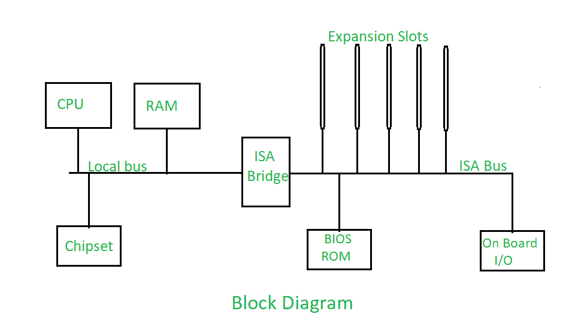

# PCS 中的扩展总线

> 原文:[https://www.geeksforgeeks.org/expansion-buses-in-pcs/](https://www.geeksforgeeks.org/expansion-buses-in-pcs/)

**扩展总线:**
扩展总线允许 CPU 与[外围设备](https://www.geeksforgeeks.org/peripherals-devices-in-computer-organization/)进行通信。因为基本的个人电脑系统不能满足用户的所有需求，所以需要扩展总线和相关的插槽。一般来说，扩展总线插槽或输入/输出总线设计为向电脑添加更多设备提供了机会。我们可以插声卡、显卡、SCSI 控制卡、网络接口卡等。插入电脑主板上提供的扩展总线插槽。

**框图如下:**

**扩展总线的功能:**

1.  扩展总线插槽是计算机背面附近主板上提供的细长连接器，用于连接计算机系统中的所有附加卡。
2.  它们提供与电脑主逻辑电路的直接电连接。因此，它的目的是使用户能够向计算机系统添加扩展板，这在增强个人计算机的能力方面起着至关重要的作用。
3.  扩展总线决定了可以添加到系统中的确切内容–有多少附加卡、扩展卡上有多少内存、其他系统组件以及设置系统的难易程度。
4.  它为数据、地址和控制信号提供了一个通用的通道，连接着 PC 机的各个部件。
5.  总线设计还必须确保数据实际上到达它应该到达的地方，即通过总线电路，计算机以确定的顺序从一点向另一点发送确定的数字位模式。
6.  扩展总线提供特殊信号，使附加卡的工作与计算机的其余部分同步。

在现代个人电脑中，主板内置了许多基本的外围设备。因此，可能会出现扩展槽未被使用的情况，但这并不意味着该系统中的扩展总线未被使用。所有内置控制器和端口仍然使用输入/输出总线与中央处理器通信，也就是说，它们的工作方式就像是插入系统扩展总线插槽的附加卡。

自从第一台个人计算机问世以来，个人计算机平台上出现了许多扩展总线类型，其基本目标是提供更快的输入/输出速度，以获得更好的系统性能。对更好性能的需求主要源于三个主要方面的改进:

*   更快的处理器
*   不断增长的应用软件需求
*   更快的音频和视频多媒体需求
*   更快的外设。