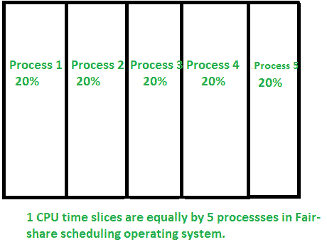
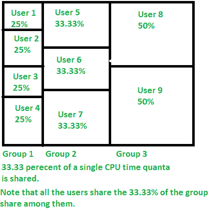

# 公平共享 CPU 调度

> 原文:[https://www.geeksforgeeks.org/fair-share-cpu-scheduling/](https://www.geeksforgeeks.org/fair-share-cpu-scheduling/)

**公平份额调度**是一种[调度算法](https://www.geeksforgeeks.org/cpu-scheduling-in-operating-systems/)，由朱迪·凯和皮尔斯·劳德于 20 世纪 80 年代在悉尼大学首次设计。它是计算机操作系统的一种调度算法，可以动态地将时间量“平均”分配给用户。

时间量是进程运行所允许的处理器时间。但是在[循环调度](https://www.geeksforgeeks.org/program-round-robin-scheduling-set-1/)中，时间片或时间量以循环顺序平均分配，由于时间片以循环方式分布，任何等量的时间量都会产生类似的输出，因此，在这种情况下需要任意分布。

**公平份额调度的特殊性:**
该算法将处理器时间平均分配给用户，例如，有 5 个用户(A、B、C、D、E)同时执行一个进程，调度器划分 CPU 周期，使得所有用户获得相同的 CPU 周期份额(100%/5)，即 20%。即使一个用户移动到第二个上，而另一个在第一个上，该算法也是如此具体，以至于它确保该用户在第二个过程中只被赋予 10%的属性，使其总计为 20%。

调度器在逻辑上划分相等的量，即使增加了另一层分区，例如，如果存在 3 个组，每个组中有不同数量的人，算法仍然会为这些组划分相同的时间，100%/3= 33.33%，这 33.33%将根据组中存在的用户数量在相应的组中平均共享。

总而言之，公平份额调度是一种高效的策略，可以创造一致的用户体验。