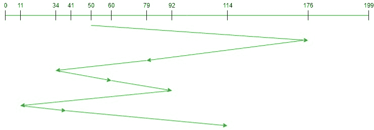

# FCFS 磁盘调度算法

> 原文:[https://www . geesforgeks . org/FCFS-磁盘-调度-算法/](https://www.geeksforgeeks.org/fcfs-disk-scheduling-algorithms/)

**先决条件:** [磁盘调度算法。](https://www.geeksforgeeks.org/disk-scheduling-algorithms/)
给定一组磁盘磁道号和初始磁头位置，如果使用**先到先服务(FCFS)** 磁盘调度算法，我们的任务是找到访问所有请求磁道的寻道操作总数。

**先到先得(FCFS)**
FCFS 是最简单的[磁盘调度算法](https://www.geeksforgeeks.org/disk-scheduling-algorithms/)。顾名思义，该算法按照请求到达磁盘队列的顺序来处理它们。该算法看起来非常公平，并且没有饥饿(所有请求都是按顺序服务的)，但通常它不会提供最快的服务。

**算法:**

1.  Let Request 数组表示一个数组，该数组存储按到达时间升序请求的磁道索引。“head”是磁盘磁头的位置。
2.  让我们按默认顺序一个接一个地获取轨迹，并计算轨迹与头部的绝对距离。
3.  用此距离增加总寻道计数。
4.  当前维修的履带位置现在成为新的头部位置。
5.  转至步骤 2，直到请求阵列中的所有磁道都没有得到服务。

**示例:**

```
Input: 
Request sequence = {176, 79, 34, 60, 92, 11, 41, 114}
Initial head position = 50

Output:
Total number of seek operations = 510
Seek Sequence is
176
79
34
60
92
11
41
114
```

下图显示了使用 FCFS 为请求的磁道提供服务的顺序。



因此，总寻道计数计算如下:

```
= (176-50)+(176-79)+(79-34)+(60-34)+(92-60)+(92-11)+(41-11)+(114-41)
= 510
```

**实施:**
实施 **FCFS** 如下。请注意，距离用于存储磁头和当前磁道位置之间的绝对距离。

## C++

```
// C++ program to demonstrate
// FCFS Disk Scheduling algorithm

#include <bits/stdc++.h>
using namespace std;

int size = 8;

void FCFS(int arr[], int head)
{
    int seek_count = 0;
    int distance, cur_track;

    for (int i = 0; i < size; i++) {
        cur_track = arr[i];

        // calculate absolute distance
        distance = abs(cur_track - head);

        // increase the total count
        seek_count += distance;

        // accessed track is now new head
        head = cur_track;
    }

    cout << "Total number of seek operations = "
         << seek_count << endl;

    // Seek sequence would be the same
    // as request array sequence
    cout << "Seek Sequence is" << endl;

    for (int i = 0; i < size; i++) {
        cout << arr[i] << endl;
    }
}

// Driver code
int main()
{

    // request array
    int arr[size] = { 176, 79, 34, 60, 92, 11, 41, 114 };
    int head = 50;

    FCFS(arr, head);

    return 0;
}
```

## Java 语言(一种计算机语言，尤用于创建网站)

```
// Java program to demonstrate
// FCFS Disk Scheduling algorithm
class GFG
{
static int size = 8;

static void FCFS(int arr[], int head)
{
    int seek_count = 0;
    int distance, cur_track;

    for (int i = 0; i < size; i++)
    {
        cur_track = arr[i];

        // calculate absolute distance
        distance = Math.abs(cur_track - head);

        // increase the total count
        seek_count += distance;

        // accessed track is now new head
        head = cur_track;
    }

    System.out.println("Total number of " +
                       "seek operations = " +
                        seek_count);

    // Seek sequence would be the same
    // as request array sequence
    System.out.println("Seek Sequence is");

    for (int i = 0; i < size; i++)
    {
        System.out.println(arr[i]);
    }
}

// Driver code
public static void main(String[] args)
{
    // request array
    int arr[] = { 176, 79, 34, 60,
                  92, 11, 41, 114 };
    int head = 50;

    FCFS(arr, head);
}
}

// This code is contributed by 29AjayKumar
```

## 蟒蛇 3

```
# Python program to demonstrate
# FCFS Disk Scheduling algorithm

size = 8;

def FCFS(arr, head):

    seek_count = 0;
    distance, cur_track = 0, 0;

    for i in range(size):
        cur_track = arr[i];

        # calculate absolute distance
        distance = abs(cur_track - head);

        # increase the total count
        seek_count += distance;

        # accessed track is now new head
        head = cur_track;

    print("Total number of seek operations = ",
                                   seek_count);

    # Seek sequence would be the same
    # as request array sequence
    print("Seek Sequence is");

    for i in range(size):
        print(arr[i]);

# Driver code
if __name__ == '__main__':

    # request array
    arr = [ 176, 79, 34, 60,
            92, 11, 41, 114 ];
    head = 50;

    FCFS(arr, head);

# This code contributed by Rajput-Ji
```

## C#

```
// C# program to demonstrate
// FCFS Disk Scheduling algorithm
using System;

class GFG
{
static int size = 8;

static void FCFS(int []arr, int head)
{
    int seek_count = 0;
    int distance, cur_track;

    for (int i = 0; i < size; i++)
    {
        cur_track = arr[i];

        // calculate absolute distance
        distance = Math.Abs(cur_track - head);

        // increase the total count
        seek_count += distance;

        // accessed track is now new head
        head = cur_track;
    }

    Console.WriteLine("Total number of " +
                    "seek operations = " +
                              seek_count);

    // Seek sequence would be the same
    // as request array sequence
    Console.WriteLine("Seek Sequence is");

    for (int i = 0; i < size; i++)
    {
        Console.WriteLine(arr[i]);
    }
}

// Driver code
public static void Main(String[] args)
{
    // request array
    int []arr = { 176, 79, 34, 60,
                  92, 11, 41, 114 };
    int head = 50;

    FCFS(arr, head);
}
}

// This code is contributed by PrinciRaj1992
```

## java 描述语言

```
<script>

// Javascript program to demonstrate
// FCFS Disk Scheduling algorithm
var size = 8;

function FCFS(arr, head)
{
    var seek_count = 0;
    var distance, cur_track;

    for(var i = 0; i < size; i++)
    {
        cur_track = arr[i];

        // Calculate absolute distance
        distance = Math.abs(cur_track - head);

        // Increase the total count
        seek_count += distance;

        // Accessed track is now new head
        head = cur_track;
    }

    document.write("Total number of " +
                   "seek operations = " +
                   seek_count);

    // Seek sequence would be the same
    // as request array sequence
    document.write("<br>Seek Sequence is");

    for(var i = 0; i < size; i++)
    {
        document.write("<br>" + arr[i]);
    }
}

// Driver code

// request array
var arr = [ 176, 79, 34, 60,
            92, 11, 41, 114 ];
var head = 50;

FCFS(arr, head);

// This code is contributed by Amit Katiyar

</script>
```

**Output:** 

```
Total number of seek operations = 510
Seek Sequence is
176
79
34
60
92
11
41
114
```