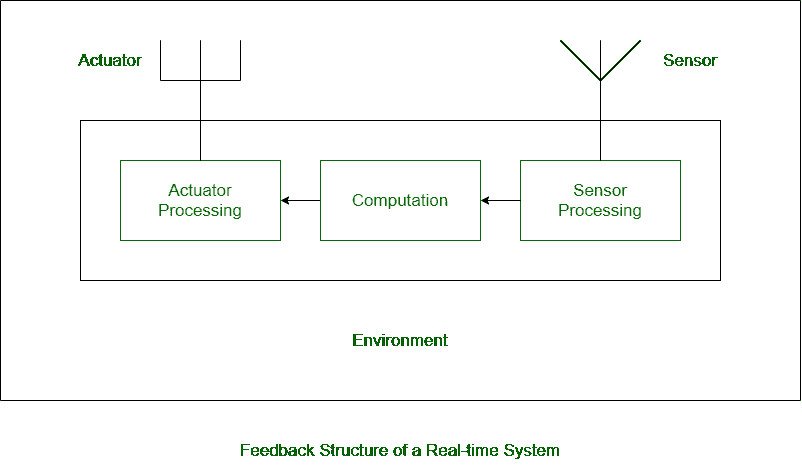

# 实时系统的反馈结构

> 原文:[https://www . geesforgeks . org/feedback-structure-of-a-time-system/](https://www.geeksforgeeks.org/feedback-structure-of-a-real-time-system/)

[实时系统](https://www.geeksforgeeks.org/real-time-systems/)是一种用于执行某些特定任务的计算系统。这些具体任务与时间限制有关。与实时系统相关的任务需要在给定的时间间隔内完成。

**实时系统的反馈结构:**
在实时系统中，系统的不同组件自然是广泛分布的。分布式和集中式两种实时系统都有反馈结构。实时系统的反馈结构包括嵌入的各种硬件和软件设备，使得特定任务可以在时间限制允许的情况下执行。实时系统所涉及的准确性和正确性使得模型变得复杂。实时系统的反馈结构与实时系统的基本模型有很大不同。这里我们将仔细看看实时系统的反馈结构模型，它有一些常用的术语和硬件。

下图表示实时系统的反馈结构:

1.  **传感器–**
    传感器用于周期性感知环境。它用于将一些物理事件或特征转换成电信号。这是一种硬件设备，它从环境中获取输入，并向系统提供输出。来自环境的感测数据被处理以确定必要的纠正措施。
2.  **传感器处理–**
    当传感器从环境中检测到数据时，它会为计算过程准备数据。它涉及调节和其他过程。该过程需要以兼容的形式获得数据，以便在系统中进行计算。
3.  **计算–**
    计算是完成任务所需的计算和运算过程。这是实时系统内发生的主要过程。它从传感器获取数据输入，并输出给实时系统的执行器。
4.  **执行器处理–**
    它就像传感器处理一样，但做相反的工作。它从系统中获取输入，并将其提供给系统的执行器。这基本上用于使输出与环境兼容，以便用户可以轻松理解获得的输出。
5.  **执行器–**
    执行器是传感器的反向装置。传感器用于将物理事件转换为电信号，而执行器用于执行反向操作。它用于将电信号转换成物理事件或特征。它从系统中获取输入，并向环境提供输出。从致动器获得的输出可以是任何形式的物理作用。电机和加热器是一些常用的致动器。