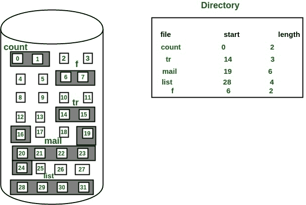
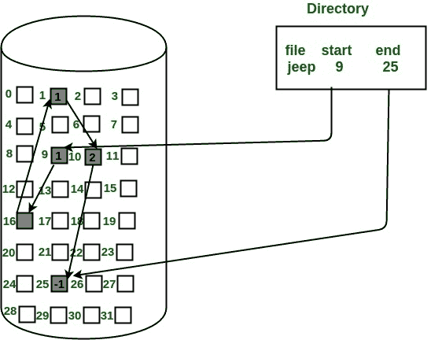
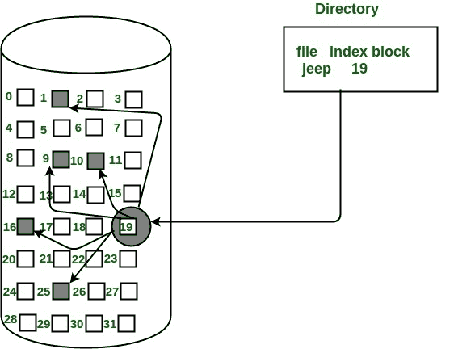
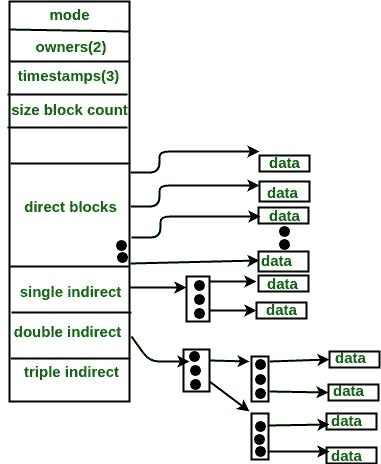

# 文件分配方式

> 原文:[https://www.geeksforgeeks.org/file-allocation-methods/](https://www.geeksforgeeks.org/file-allocation-methods/)

分配方法定义了文件在磁盘块中的存储方式。有三种主要的磁盘空间或文件分配方法。

*   连续分配
*   链接分配
*   索引分配

这些方法背后的主要思想是提供:

*   高效的磁盘空间利用率。
*   快速访问文件块。

所有三种方法都有各自的优缺点，如下所述:

**1。连续分配**

在这种方案中，每个文件占用磁盘上一组连续的块。例如，如果一个文件需要 n 个块，并且给定了块 b 作为起始位置，那么分配给该文件的块将是: *b，b+1，b+2，…b+n-1。*这意味着给定起始块地址和文件的长度(根据所需的块)，我们可以确定文件占用的块。
具有连续分配的文件的目录条目包含

*   起始块地址
*   分配部分的长度。

下图中的*文件【邮件】*从块 19 开始，长度= 6 块。因此，它占据了 *19、20、21、22、23、24* 街区。

 
**优势:**

*   这支持顺序访问和直接访问。对于直接访问，从块 b 开始的文件的第 k 个块的地址可以很容易地获得为(b+k)。
*   这非常快，因为由于文件块的连续分配，寻道数量很少。

**缺点:**

*   这种方法受到内部和外部碎片的影响。这使得它在内存利用率方面效率低下。
*   增加文件大小很困难，因为这取决于特定实例中连续内存的可用性。

**2。链表分配**

在这种方案中，每个文件都是磁盘块的链表，**不需要**连续。磁盘块可以分散在磁盘上的任何地方。
目录条目包含指向开始和结束文件块的指针。每个块都包含一个指针，指向文件占用的下一个块。

*下图中的文件“jeep”显示了块是如何随机分布的。最后一个块(25)包含-1，表示空指针，不指向任何其他块。*

**优势:**

*   这在文件大小方面非常灵活。文件大小可以很容易地增加，因为系统不必寻找连续的内存块。
*   这种方法不会受到外部碎片的影响。这使得它在内存利用率方面相对更好。

**缺点:**

*   因为文件块在磁盘上随机分布，所以需要大量寻道来单独访问每个块。这使得链接分配更慢。
*   它不支持随机或直接访问。我们不能直接访问文件的块。文件的块 k 可以通过块指针从文件的起始块开始顺序遍历 k 个块来访问。
*   链接分配中所需的指针会产生一些额外的开销。

**3。指数分配**

在这个方案中，一个称为**索引块**的特殊块包含指向文件所占用的所有块的指针。每个文件都有自己的索引块。索引块中的 ith 条目包含 ith 文件块的磁盘地址。目录条目包含索引块的地址，如下图所示:

 
**优势:**

*   这支持直接访问文件占用的块，因此提供了对文件块的快速访问。
*   它克服了外部碎片化的问题。

**缺点:**

*   索引分配的指针开销大于链接分配。
*   对于非常小的文件，例如只扩展 2-3 个块的文件，索引分配将为指针保留一个完整的块(索引块)，这在内存利用率方面是低效的。然而，在链接分配中，我们丢失了每个块只有 1 个指针的空间。

对于非常大的文件，单个索引块可能无法容纳所有指针。
可以使用以下机制来解决这个问题:

1.  **链接方案:**该方案将两个或多个索引块链接在一起，用于保存指针。每个索引块将包含一个指针或指向下一个索引块的地址。
2.  **多级索引:**在此策略中，一级索引块用于指向二级索引块，二级索引块又指向文件占用的磁盘块。根据最大文件大小，这可以扩展到 3 个或更多级别。
3.  **组合方案:**在该方案中，一个名为 **Inode(信息节点)**的特殊块包含文件的所有信息，如名称、大小、权限等，Inode 的剩余空间用于存储包含实际文件*的磁盘块地址，如下图所示。*Inode 中的前几个指针指向**直接块**，即指针包含包含文件数据的磁盘块的地址。接下来的几个指针指向间接块。间接块可以是单间接、双间接或三间接。**单间接块**是不包含文件数据的磁盘块，而是包含文件数据的块的磁盘地址。类似地，**双间接块**不包含文件数据，而是包含包含文件数据的块的地址的块的磁盘地址。
    

本文由**萨罗尼·巴韦贾**供稿。如果你喜欢 GeeksforGeeks 并想投稿，你也可以使用[contribute.geeksforgeeks.org](http://www.contribute.geeksforgeeks.org)写一篇文章或者把你的文章邮寄到 contribute@geeksforgeeks.org。看到你的文章出现在极客博客主页上，帮助其他极客。

如果你发现任何不正确的地方，或者你想分享更多关于上面讨论的话题的信息，请写评论。