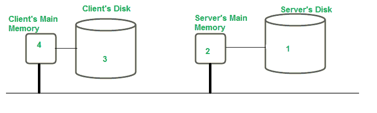

# 分布式文件系统中的文件缓存

> 原文:[https://www . geesforgeks . org/file-cache-in-distributed-file-systems/](https://www.geeksforgeeks.org/file-caching-in-distrubuted-file-systems/)

文件缓存提高了输入/输出性能，因为以前读取的文件保存在主内存中。因为文件在本地可用，所以当对这些文件的请求重复时，网络传输为零。文件系统的性能改进是基于文件访问模式的局部性。[缓存](https://www.geeksforgeeks.org/difference-between-buffering-and-caching-in-os/)也有助于可靠性和可扩展性。

当今大多数分布式文件系统都采用某种形式的缓存。文件缓存方案由许多标准决定，包括缓存数据粒度、缓存大小(大/小/固定/动态)、替换策略、缓存位置、修改传播机制和缓存验证。

**缓存位置:**文件可能保存在带有内存和磁盘的客户机-服务器系统中的客户机或服务器的磁盘或主内存中。

**<u>服务器的磁盘</u> :** 始终是保存文件的原始位置。这里有足够的空间，以防文件被修改变长。此外，所有客户端都可以看到该文件。

**优点:**不存在一致性问题，因为每个文件只有一个副本。当客户端想要读取文件时，需要两次传输:从服务器的磁盘到主内存，以及从客户端的主内存到服务器的磁盘。

**缺点:**

*   这两种转移都可能需要一些时间。通过将文件缓存在服务器的主内存中以提高性能，可以避免一部分传输时间。
*   由于主内存有限，将需要一种算法来确定哪些文件或部分文件应该保留在缓存中。该算法将基于两个因素:缓存单元和缓存满时应用的替换机制。

**<u>服务器主内存</u> :** 问题是当文件缓存在服务器主内存时，是缓存完整的文件还是只缓存磁盘块。如果整个文件被缓存，它可以存储在连续的位置，高速传输会带来良好的性能。磁盘块缓存使缓存和磁盘空间更加高效。
采用标准缓存技术来克服后一个问题。与内存引用相比，缓存引用非常少。在 [LRU(最近最少使用的)](https://www.geeksforgeeks.org/lru-cache-implementation/)可以选择最老的街区进行驱逐。如果磁盘上有最新的副本，则可以丢弃缓存副本。缓存数据也可以写入磁盘。客户端可以轻松透明地访问服务器主内存中的缓存文件。服务器可以轻松地保持磁盘和文件的主内存副本一致。根据客户端的说法，系统中只存在该文件的一个副本。

**<u>客户端磁盘</u> :** 数据也可以保存在客户端硬盘上。虽然减少了网络传输，但在缓存命中的情况下，必须访问磁盘。因为在数据丢失或崩溃的情况下，更改的数据是可用的，所以这种技术提高了可靠性。然后可以从客户端的硬盘上恢复信息。
即使客户端与服务器断开连接，文件仍然可以访问。因为对磁盘的访问可以在本地处理，所以不需要联系服务器，这增强了可扩展性和可靠性。

**优势:**

*   由于在数据丢失的情况下可以恢复数据，可靠性得到提高。
*   客户端磁盘的存储容量明显大于客户端的主内存。可以缓存更多数据，从而获得最高的缓存命中率。大多数分布式文件系统采用文件级数据传输体系结构，其中整个文件都被缓存。
*   由于可以在本地处理对磁盘的访问，可扩展性得到了提高。

**缺点:**

*   唯一的缺点是磁盘缓存与无磁盘工作站不兼容。每个缓存都需要访问磁盘，导致响应时间大幅增加。必须决定是缓存在服务器的主存还是客户端的光盘上。
*   尽管服务器缓存消除了对磁盘访问的需要，但仍需要网络传输。在客户端缓存数据是减少网络传输时间的解决方案。系统应该使用客户端的主内存还是磁盘，取决于系统是需要节省空间还是提高性能。
*   如果磁盘有更多空间，访问速度会很慢。服务器的主存储器能够比客户机的盘更快地提供文件。如果文件非常大，可以在客户端的光盘上进行缓存。下图显示了最简单的方法，即避免缓存。

**<u>客户端的主内存</u> :** 一旦同意将文件缓存在客户端的内存中，缓存就可以在用户进程的地址空间、内核或作为用户进程的缓存管理器中进行。
第二种选择是将文件缓存在每个用户进程的地址空间中，如图所示:

系统调用库负责缓存。文件在流程执行期间被打开、关闭、读取和写入。该库保存最常用的文件，以便在必要时可以重复使用。操作完成后，更新的文件将返回到服务器。当单个进程定期打开和关闭文件时，这种技术效果很好。
对于数据库管理人员来说很好，但对于在文件可能不会被再次访问的情况下工作的程序员来说就不行了。
文件可以缓存在内核中，而不是用户的进程地址空间，如图所示。然而，这种技术需要多次系统调用来访问每次缓存命中的文件。

可以使用单独的用户级缓存管理器来缓存文件。因此，内核不再需要维护文件系统代码，它变得更加孤立和灵活。内核可以决定程序的内存空间分配，而不是运行时的缓存。如果缓存管理器在虚拟内存中运行，内核可以将一些缓存的文件存储在磁盘中，并且在缓存命中时将这些块带到主内存中。

**<u>优势</u> :**

*   这种技术更加独立和灵活(因为内核不再需要维护文件系统代码)
*   当单个进程定期打开和关闭文件时，访问时间会减少。所以，性能增益是最大的。
*   允许无盘工作站。
*   有助于系统的可扩展性和可靠性。

**T1】劣势:T3**

*   需要单独的用户级缓存管理器。
*   客户端缓存原则对于虚拟内存没有任何价值，尽管缓存管理器可以锁定一些经常请求的页面。

### **<u>缓存一致性–缓存更新策略</u> :**

当缓存位于客户端节点上时，文件系统中的许多用户可以同时访问相同的数据或文件。如果所有缓存都包含相同的最新数据，则认为它们是一致的。如果某些用户修改文件，数据可能会变得不一致。使用 DFS 的分布式系统必须保持其数据副本的一致性。
根据何时将更改传播到服务器以及如何验证缓存数据的真实性，提供了许多一致性策略。直写、关闭时写入和集中控制是三种类型。
当缓存位于客户端节点&时，一个用户将数据写入缓存，其他用户也必须可以看到。写入策略决定了何时执行写入。

有四种缓存更新策略:

*   **<u>直写</u> :** 当新用户在此方法中编辑缓存条目时，会立即写入服务器。任何需要从服务器获取文件的过程现在总是会收到最新的信息。考虑以下场景:客户端进程读取文件，缓存它，然后退出该进程。另一个客户端修改相同的文件，并在短时间后将更改发送到服务器。
    如果在第一台机器上用文件的缓存副本启动一个进程，它将获得一个过时的副本。为了避免这种情况，请比较两个副本的修改时间，客户端机器上的缓存副本和服务器上的上传副本，以便与服务器一起验证文件。
*   **<u>延迟写入</u> :** 为了减少持续的网络流量，请定期将所有更新写入服务器或一起批处理。这被称为“延迟写入”这种方法通过允许单个大容量写操作而不是几个微小的写操作来提高性能。在这种情况下，临时文件不存储在文件服务器上。
*   **<u>关闭时写</u> :** 向前一步是，一旦文件关闭，只将文件写回服务器。“关闭时写入”是算法的名称。如果两个缓存文件背对背写入，则第二次写入会覆盖第一次写入。这相当于两个进程在各自的地址空间中读取或写入，然后在单个中央处理器系统中写回服务器。
*   **<u>集中控制</u> :** 出于跟踪的目的，客户端向服务器发送关于其刚打开的文件的信息，然后服务器执行读、写或两者的活动。多个进程可以从同一个文件中读取，但是一旦一个进程打开文件进行写入，所有其他进程都将被拒绝访问。服务器收到文件已关闭的通知后，会更新其表，只有这样，其他用户才能访问该文件。

### <u>缓存验证方案</u>:

修改缓存数据时，修改传播策略会告知服务器节点上文件的主副本何时更新。它不提供其他节点缓存中的文件数据何时更新的信息。文件中的数据可能同时存储在许多节点的缓存中。
当另一个客户端更改服务器上文件主副本中缓存项对应的数据时，该客户端的缓存条目就会过时。需要检查客户端节点缓存的数据是否与主副本匹配。如果不是这种情况，缓存的数据必须失效，并且必须从服务器请求数据的新版本。
要检查缓存数据的有效性，有两种方案:

1.  **<u>客户端发起的方法</u> :** 客户端连接到服务器，并验证其缓存中的数据与主副本一致。检查可以在不同的时间进行，如-
    *   **每次访问前验证:**由于每次访问都必须调用服务器，这就否定了缓存数据的实际目的。
    *   **定期验证:**验证以规则的预定间隔进行
    *   **验证文件的打开:**打开文件时检查缓存条目。
2.  **<u>服务器发起的方法</u> :** 当客户端打开文件时，它会通知文件服务器打开文件的目的——读取、写入或两者兼而有之。然后，文件服务器有责任跟踪哪个客户端在哪个文件上工作，以什么模式工作。当服务器发现文件被各种客户端使用时可能出现不一致时，它会做出反应。
    *   客户端通知服务器关闭，以及关闭文件时对文件所做的任何更改。然后，服务器更新其数据库，以反映哪些客户端在哪些模式下打开了哪些文件。
    *   每当新客户端请求打开已经打开的文件并且服务器发现存在/可能出现任何不一致时，服务器可以拒绝/排队该请求，或者通过请求打开该文件的所有客户端将其从缓存中移除来禁用缓存。