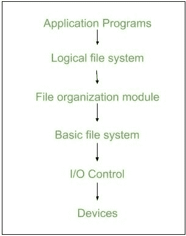
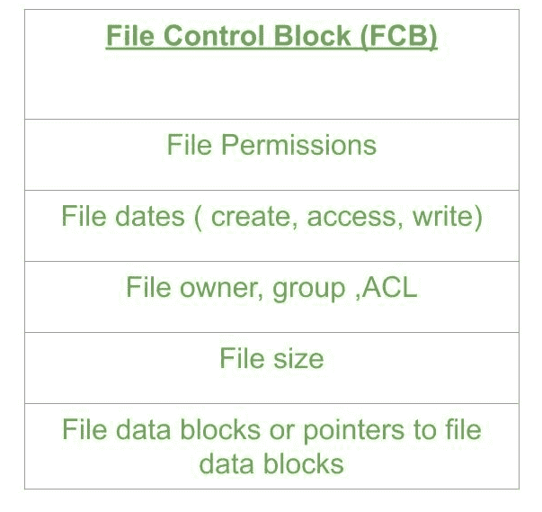

# 操作系统中的文件系统实现

> 原文:[https://www . geesforgeks . org/file-system-implementation-in-operating-system/](https://www.geeksforgeeks.org/file-system-implementation-in-operating-system/)

先决条件–[操作系统中的文件系统](https://www.geeksforgeeks.org/file-systems-in-operating-system/)
文件是相关信息的集合。文件系统驻留在辅助存储上，通过允许存储、定位和检索数据来提供对磁盘的高效和方便的访问。

**文件系统组织在多个层中:**

*   **I/O 控制级别–**
    设备驱动充当设备和 Os 之间的接口，它们帮助在磁盘和主内存之间传输数据。它将块号 a 作为输入，并将低级硬件特定指令作为输出。
    /li >

*   **基本文件系统–**
    它向设备驱动程序发出常规命令，以读取和写入磁盘上的物理块。它管理内存缓冲区和缓存。缓冲区中的块可以保存磁盘块的内容，缓存存储常用的文件系统元数据。*   **文件组织模块–**
    它有关于文件、文件位置及其逻辑和物理块的信息。物理块与编号从 0 到 n 的逻辑块的逻辑编号不匹配。它还有一个跟踪未分配块的可用空间。*   **Logical file system –**
    It manages metadata information about a file i.e includes all details about a file except the actual contents of file. It also maintains via file control blocks. File control block (FCB) has information about a file – owner, size, permissions, location of file contents.

    **优势:**

    1.  代码的重复被最小化。
    2.  每个文件系统都可以有自己的逻辑文件系统。

    **缺点:**
    如果我们同时访问很多文件，那么就会导致性能低下。

    我们可以通过使用两种类型的数据结构来实现**文件系统:**

    **1\. On-disk Structures –**

    1.  **引导控制块–**
        它通常是卷的第一个块，包含引导操作系统所需的信息。在 UNIX 中，它被称为引导块，在 NTFS 中，它被称为分区引导扇区。
    2.  **卷控制块–**
        它有关于特定分区的信息，例如:-空闲块计数、块大小和块指针等。在 UNIX 中它被称为超级块，在 NTFS 中它被存储在主文件表中。
    3.  **目录结构–**
        它们存储文件名和关联的索引节点号。在 UNIX 中，包括文件名和关联的文件名，在 NTFS 中，它存储在主文件表中。
    4.  **每文件 FCB–**
        它包含文件的详细信息，并有一个唯一的标识符号码，允许与目录条目关联。在 NTFS 中，它存储在主文件表中。

    

    **2。内存结构:**
    它们保存在主内存中，有助于缓存的文件系统管理。下面给出了几种内存结构:

    1.  **装载表–**
        它包含每个装载卷的信息。
    2.  **目录结构缓存–**
        该缓存保存最近访问的目录的目录信息。
    3.  **全系统打开文件表–**
        它包含每个打开文件的 FCB 副本。
    4.  **每个进程的打开文件表–**
        它包含由该特定进程打开的信息，并映射到适当的系统范围的打开文件。

    **目录实现:**

    1.  **线性列表–**
        它维护一个指向数据块的文件名的线性列表。这也很耗时。要创建一个新文件，我们必须首先搜索目录，以确保没有现有的文件具有相同的名称，然后我们在目录的末尾添加一个文件。要删除文件，我们在目录中搜索命名文件并释放空间。要重用目录条目，我们可以将条目标记为未使用，或者将其附加到自由目录列表中。
    2.  **哈希表–**
        哈希表从文件名中获取一个计算值，并返回一个指向文件的指针。它减少了目录搜索时间。文件的插入和删除过程很容易。最大的困难是散列表通常是固定大小的，并且散列表依赖于该大小上的散列函数。