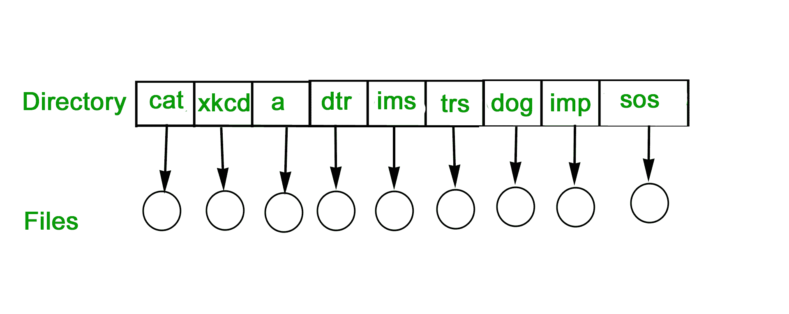
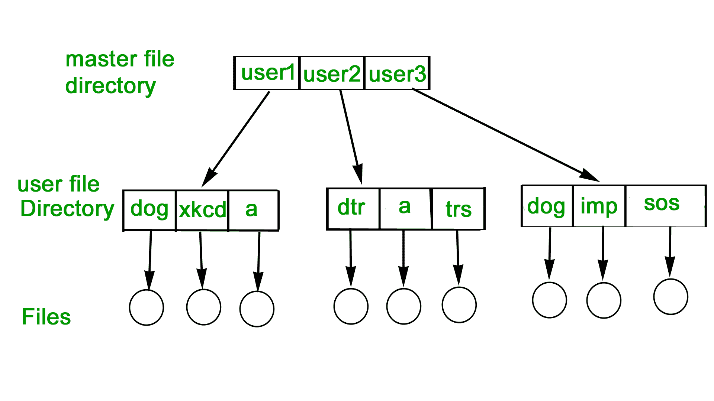
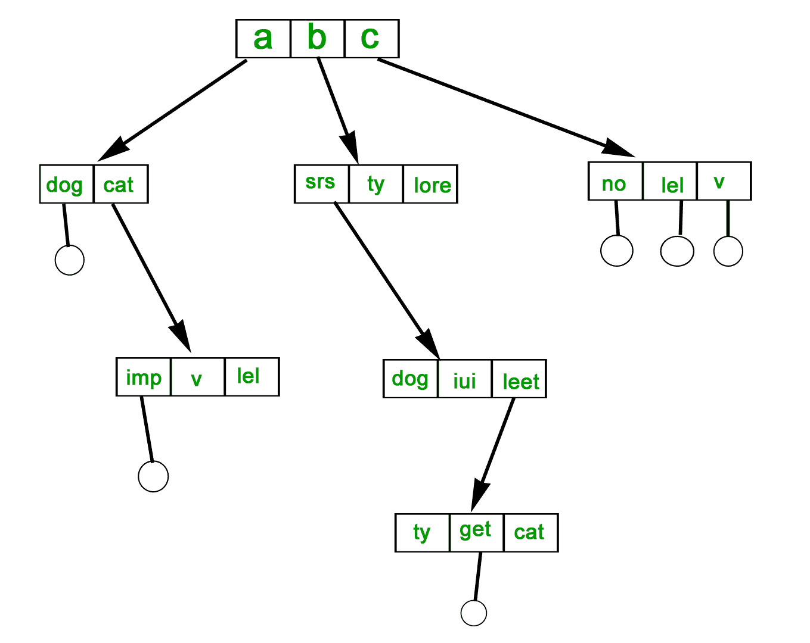
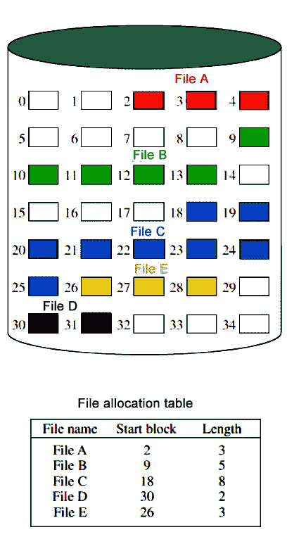
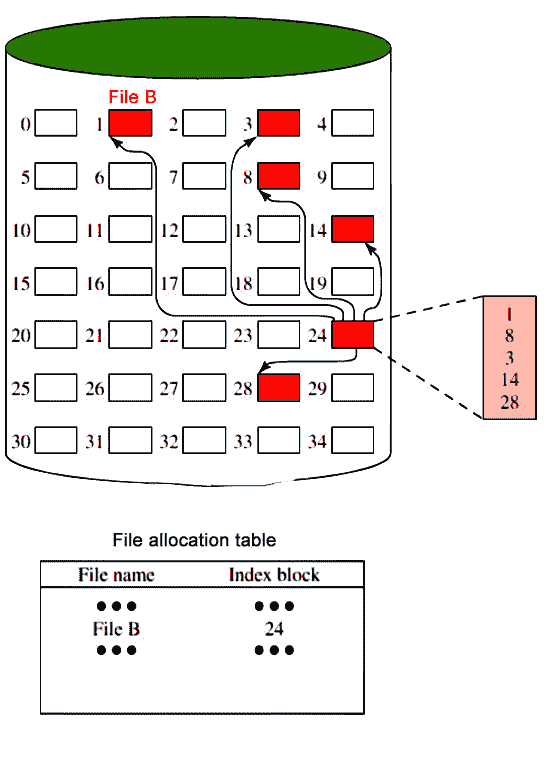
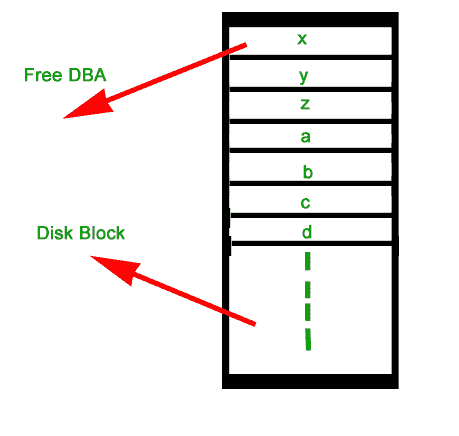

# 操作系统中的文件系统

> 原文:[https://www . geesforgeks . org/操作系统中的文件系统/](https://www.geeksforgeeks.org/file-systems-in-operating-system/)

文件是记录在辅助存储器上的相关信息的集合。Or 文件是逻辑相关实体的集合。从用户的角度来看，文件是逻辑辅助存储的最小分配。

**文件名称分为如下所示的两部分:**

*   名字
*   延长线，用句号隔开。

### 文件属性及其操作:

<figure class="table">

| 属性 | 类型 | 操作 |
| --- | --- | --- |
| 名字 | 文件 | 创造 |
| 类型 | 可执行程序的扩展名 | 打开 |
| 大小 | 使用 jpeg 文件交换格式存储的编码图像文件扩展名 | 阅读 |
| 编成日期 | Xis | 写 |
| 作者 | C | 附加 |
| 上次修改时间 | Java 语言(一种计算机语言，尤用于创建网站) | 缩短 |
| 保护 | 班级 | 删除 |
|   |   | 关闭 |

</figure>

<figure class="table">

| 文件类型 | 普通分机 | 功能 |
| --- | --- | --- |
| 可执行的 | exe，com，bin | 阅读运行机器语言程序 |
| 目标 | obj，o | 已编译，机器语言未链接 |
| 源代码 | c，java，不，asm，a | 各种语言的源代码 |
| 一批 | 蝙蝠，sh | 给命令解释器的命令 |
| 文本 | txt，文档 | 文本数据、文件 |
| 文字处理软件 | wp、tex、rrf、doc | 各种文字处理器格式 |
| 档案馆 | 弧， 拉链， 焦油 | 组合成一个压缩文件的相关文件 |
| 多媒体 | mpeg、mov、rm | 用于包含音频/视频信息 |
| 利润 | xml、html、tex | 它是文本数据和文档 |
| 图书馆 | lib，a，so，dll | 它包含程序员的例程库 |
| 打印或查看 | gif、pdf、jpg | 它是一种用于打印或查看 ASCII 或二进制文件的格式。 |

**文件目录:**
文件的集合就是一个文件目录。该目录包含有关文件的信息，包括属性、位置和所有权。这些信息中的大部分，尤其是与存储相关的信息，都是由操作系统管理的。目录本身是一个文件，可由各种文件管理例程访问。

**设备目录中包含的信息有:**

*   名字
*   类型
*   地址
*   当前长度
*   最大长度
*   上次访问日期
*   上次更新日期
*   所有者 id
*   保护信息

**对目录进行的操作有:**

*   搜索文件
*   创建文件
*   删除文件
*   列出目录
*   重命名文件
*   遍历文件系统

**维护目录的优势是:**

*   **效率:**可以更快地定位文件。
*   **命名:**用户变得方便了，因为两个用户可以对不同的文件使用相同的名称，也可以对同一文件使用不同的名称。
*   **分组:**文件的逻辑分组可以通过属性来完成，例如所有 java 程序、所有游戏等。

**单级目录**
在这种情况下，为所有用户维护单个目录。

*   **命名问题:**两个文件用户不能同名。
*   **分组问题:**用户不能根据需要对文件进行分组。

**二级目录**
在这个单独的目录中为每个用户维护。

*   路径名:由于两个级别，每个文件都有一个路径名来定位该文件。
*   现在，我们可以为不同的用户提供相同的文件名。
*   这种方法搜索效率高。

**TREE-STRUCTURED DIRECTORY:**
目录以树的形式维护。搜索是有效的，也有分组能力。我们有文件的绝对或相对路径名。

**文件分配方法** **:**

**1。连续分配–**
在文件创建时，一组连续的数据块被分配给一个文件。因此，这是一种使用可变大小部分的预分配策略。文件分配表只需要每个文件一个条目，显示文件的起始块和长度。从单个顺序文件的角度来看，这种方法是最好的。一次可以读入多个块，以提高顺序处理的输入/输出性能。检索单个块也很容易。例如，如果一个文件从块 b 开始，并且需要该文件的第 I 个块，那么它在辅助存储上的位置就是 b+i-1。

**劣势–**

*   将出现外部碎片，使得难以找到足够长的连续空间块。压缩算法对于释放磁盘上的额外空间是必要的。
*   此外，通过预分配，有必要在创建时声明文件的大小。

**2。链接分配(非连续分配)–**
分配基于单个区块。每个块包含一个指向链中下一个块的指针。同样，文件表只需要每个文件的一个条目，显示文件的起始块和长度。虽然预分配是可能的，但更常见的是根据需要简单地分配块。任何自由块都可以添加到链中。这些块不必是连续的。如果可用磁盘块可用，文件大小的增加总是可能的。没有外部碎片，因为一次只需要一个数据块，但是可以有内部碎片，但是它只存在于文件的最后一个磁盘数据块中。

**劣势–**

*   文件的最后一个磁盘块中存在内部碎片。
*   在每个磁盘块中维护指针都有开销。
*   如果任何磁盘块的指针丢失，文件将被截断。
*   它只支持文件的顺序访问。

**3。索引分配-**
它解决了连续和链式分配的许多问题。在这种情况下，文件分配表为每个文件包含一个单独的一级索引:该索引为分配给该文件的每个块都有一个条目。分配可以基于固定大小的块或可变大小的块。按块分配可以消除外部碎片，而按可变大小块分配可以提高局部性。这种分配技术支持对文件的顺序和直接访问，因此是最流行的文件分配形式。

**磁盘可用空间管理:**

正如分配给文件的空间必须被管理一样，当前未分配给任何文件的空间也必须被管理。要执行任何文件分配技术，必须知道磁盘上有哪些块可用。因此，除了文件分配表之外，我们还需要一个磁盘分配表。以下是用于自由空间管理的方法。

1.  **Bit Tables** : This method uses a vector containing one bit for each block on the disk. Each entry for a 0 corresponds to a free block and each 1 corresponds to a block in use. 
    For example: 00011010111100110001 

    在这个向量中，每个比特对应于一个特定的块，0 表示该特定的块是空闲的，1 表示该块已经被占用。位表的优点是相对容易找到一个或一组连续的空闲块。因此，位表适用于任何文件分配方法。另一个优点是它尽可能小。

2.  **空闲块列表**:在这种方法中，每个块按顺序分配一个编号，所有空闲块的编号列表保存在磁盘的一个保留块中。

本文由 **Aakansha yadav** 供稿

</figure>