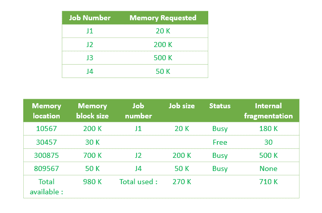

# 操作系统中的首次安装分配

> 原文:[https://www . geesforgeks . org/first-fit-allocation-in-operating-system/](https://www.geeksforgeeks.org/first-fit-allocation-in-operating-systems/)

对于[固定和动态内存分配方案](https://www.geeksforgeeks.org/partition-allocation-methods-in-memory-management/)，操作系统必须保留每个内存位置的列表，注明哪些是空闲的，哪些是繁忙的。然后，随着新作业进入系统，必须分配空闲分区。

这些分区可以通过 4 种方式分配:

```
1. First-Fit Memory Allocation
2. Best-Fit Memory Allocation
3. Worst-Fit Memory Allocation
4. Next-Fit Memory Allocation 
```

这些是**连续**内存分配技术。

**[【First-Fit 内存分配】](https://www.geeksforgeeks.org/program-first-fit-algorithm-memory-management/) :**
该方法保持按内存位置组织的作业忙/闲列表，从低序到高阶内存。在这种方法中，第一个作业要求第一个可用内存的空间大于或等于它的大小。操作系统不会搜索合适的分区，而只是将作业分配到最近的、有足够大小的内存分区。



如上所示，系统将 J1 分配给内存中最近的分区。因此，没有足够空间的分区可供 JBOY3 乐队使用，它被列入了等候名单。

**First-Fit 内存分配的优势:**
处理速度快。由于处理器为作业分配最近的可用内存分区，因此执行速度非常快。

**First-Fit 内存分配的缺点:**
浪费大量内存。处理器忽略分配给作业的分区大小与作业大小相比是否非常大。它只是分配内存。因此，大量内存被浪费，许多作业可能无法在内存中获得空间，必须等待另一个作业完成。