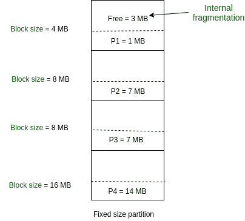

# 操作系统中的固定(或静态)分区

> 原文:[https://www . geesforgeks . org/固定或静态操作系统分区/](https://www.geeksforgeeks.org/fixed-or-static-partitioning-in-operating-system/)

在操作系统中，内存管理是负责分配和管理计算机主内存的功能。内存管理功能跟踪每个内存位置的状态，无论是已分配的还是空闲的，以确保有效和高效地使用主内存。

有两种内存管理技术:**连续**和**非连续**。在连续技术中，执行进程必须完全加载到主内存中。连续技术可分为:

1.  固定(或静态)分区

2.  变量(或动态)划分

**固定分区:**
这是用于将多个进程放入主内存的最古老、最简单的技术。在这种分区中，内存中的分区数量(非重叠)是固定的**，但是每个分区的大小**可能相同，也可能不同**。由于这是一个**连续的**分配，因此不允许跨越。在这里，分区是在执行之前或系统配置期间进行的。**

****

**如上图所示，第一个进程只消耗主内存 4MB 中的 1MB。
因此，第一块的内部碎片为(4-1) = 3MB。
每个块的内部碎片之和=(4-1)+(8-7)+(8-7)+(16-14)= 3+1+1+2 = 7MB。**

**假设 7MB 大小的进程 P5 来了。但是，由于连续分配(因为不允许跨越)，尽管有可用的空闲空间，这个过程还是无法适应。因此，7MB 成为外部碎片的一部分。**

**固定分区有一些优点和缺点。**

****固定分区的优势–****

1.  ****易于实现:**
    实现固定分区所需的算法易于实现。它只需要将一个进程放入某个分区，而不需要关注内部和外部碎片的出现。** 
2.  ****很少的操作系统开销:**
    处理固定分区需要较少的额外和间接计算能力。** 

****固定分区的缺点–****

1.  ****内部碎片:**
    主存使用效率低。任何程序，无论多小，都会占据整个分区。这可能会导致内部碎片。** 
2.  ****外部碎片:**
    各种分区的总未用空间(如上所述)不能用于加载进程，即使有可用空间但不是连续形式(因为不允许跨越)。** 
3.  ****限制进程大小:**
    无法容纳大于主内存中分区大小的进程。分区大小不能根据传入进程大小而变化。因此，上述例子中 32MB 的处理大小是无效的。** 
4.  ****对多道程序设计程度的限制:**
    主内存中的分区是在执行之前或系统配置期间进行的。主内存被分成固定数量的分区。假设内存中有分区，是进程数，那么条件必须满足。大于内存分区数的进程数在固定分区中无效。**