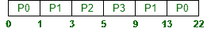

# 固定优先级优先调度

> 原文:[https://www . geesforgeks . org/fixed-priority-preventive-scheduling/](https://www.geeksforgeeks.org/fixed-priority-pre-emptive-scheduling/)

先决条件–[操作系统中的 CPU 调度](https://www.geeksforgeeks.org/cpu-scheduling-in-operating-systems/)
**固定优先级先发制人**调度算法多用于实时系统。
在该调度算法中，处理器确保首先执行优先级最高的任务，而忽略其他要执行的任务。

> 具有最高优先级的进程被首先服务。

**决策模式:**
先发制人:当一个进程到达时，将其优先级与当前进程的优先级进行比较。如果新作业的优先级高于当前进程，则当前进程将被挂起，新进程将被启动。

**实现:**
排序的 FIFO 队列用于此策略。当新进程被识别时，它会根据优先级被放入队列。因此，具有更高优先级的进程被首先考虑，因为它被放置在更高的位置。

**示例:**
让我们以下面的示例为例，它有 4 组流程，以及到达时间和完成流程所需的时间。还提到了所有过程的优先级。以毫秒为单位考虑所有时间值，优先级值越小意味着进程优先级越高。

<center>

| 过程 | 到达时间(T0) | 完成所需的时间 | 优先 |
| p0 蛋白 | Zero | Ten | five |
| 第一亲代 | one | six | four |
| P2 | three | Two | Two |
| P3 | five | four | Zero |

</center>

**甘特图:**



最初只有 P0 存在，允许它运行。但是当 P1 来的时候，它有更高的优先权。所以，P0 被抢先了，P1 可以跑了。这个过程重复进行，直到所有的过程完成它们的执行。

**统计:**

<center>

| 过程 | 到达时间(T0) | 完成时间 | 完成时间(T1) | 周转时间(TAT=T1-T0) | 等待时间 |
| p0 蛋白 | Zero | Ten | Twenty-two | Twenty-two | Twelve |
| 第一亲代 | one | six | Thirteen | Twelve | six |
| P2 | three | Two | five | Two | Zero |
| P3 | five | four | nine | four | Zero |

</center>

平均周转时间:

```
= (22+12+2+4) / 4    
= 40 / 4
= 10 ms 
```

平均等待时间:

```
= (12+6+0+0) / 4    
= 18 / 4
= 4.5 ms 
```

**优势:**
优先考虑。关键流程可以获得更好的响应。

**劣势:**
[低优先级进程可能出现饥饿](https://www.geeksforgeeks.org/starvation-and-aging-in-operating-systems/)。这可以通过使用称为“T5”老化的技术来克服。老化逐渐增加了在系统中等待很长时间的进程的优先级。[上下文切换](https://practice.geeksforgeeks.org/problems/what-is-context-switching)开销是有的。