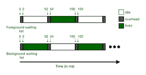

# 前台-后台调度

> 原文:[https://www . geesforgeks . org/前台-后台-日程安排/](https://www.geeksforgeeks.org/foreground-background-scheduling/)

调度基本分为两类第一类是 [**时钟驱动调度**](https://www.geeksforgeeks.org/difference-between-clock-driven-and-event-driven-scheduling/) ，第二类是 [**事件驱动调度**](https://www.geeksforgeeks.org/difference-between-clock-driven-and-event-driven-scheduling/) 。时钟驱动的调度算法是那些由时钟接收的中断帮助确定调度点的算法，它们是 [FCFS](https://www.geeksforgeeks.org/difference-between-first-come-first-served-fcfs-and-round-robin-rr-scheduling-algorithm/) 、[循环调度](https://www.geeksforgeeks.org/difference-between-first-come-first-served-fcfs-and-round-robin-rr-scheduling-algorithm/)等。在事件驱动算法中，事件有助于确定调度点。事件驱动进一步分为三种类型第一种是[简单优先级](https://www.geeksforgeeks.org/program-for-priority-cpu-scheduling-set-1/)，第二种是[速率单调分析](https://www.geeksforgeeks.org/rate-monotonic-scheduling/)，第三种是[最早截止时间优先(EDF)](https://www.geeksforgeeks.org/earliest-deadline-first-edf-cpu-scheduling-algorithm/) 。

**前台-后台调度**属于第一类事件驱动算法，即简单的基于优先级的算法。在该算法中，维护两个等待列表，一个是前台，另一个是后台。首先，每个进程进入前台列表执行，并在那里停留一小段时间，直到达到阈值时间限制，此后，如果进程不完整，则该进程进入后台等待列表，只有当前台列表为空时，才会执行该进程，在后台等待列表中，使用循环调度算法执行该进程。

因此，根据上述过程，前景列表的优先级高于背景列表，前景列表的阈值时间短于背景列表。通常在前台列表中，进程被允许使用 2 个量程，然后它将发送到后台，在后台，进程将获得 4 个量程来完成其所有工作，如果进程仍未完成，则它将返回后台列表的末尾，并等待轮到它再次获得 4 个量程，并且该进程将重复自己，直到进程完成其工作。这种算法有助于那些需要在进程创建后立即执行的情况。

**前台-后台调度器的工作:**
前台-后台调度器按照以下步骤调度实时任务:

1.  **第一步:**
    所有的实时任务分为前台任务和后台任务。前台任务包括周期性任务，后台任务包括零星和非周期性任务。
2.  **Step-2:**
    前台任务优先级最高，后台任务优先级最低。
3.  **步骤-3:**
    调度前台任务时，在所有调度点都考虑最高优先级。
4.  **步骤-4:**
    当前台任务没有准备好调度时，则调度后台任务。
5.  **步骤-5:**
    在后台任务中，遵循与前台任务相同的调度规则。

**前台任务的完成时间:**
如前所述，前台任务包含周期性任务，因此其完成时间与其绝对截止时间相同。

**后台任务完成时间:**
当所有前台任务都被调度后，后台任务才被调度。当任何前台任务被执行时，后台任务等待。

让任务 T <sub>i</sub> 为前台任务，E <sub>i</sub> 为每 P <sub>i</sub> 周期所需的处理时间量。
因此，

```
Avg. CPU utilization for Ti is Ei/Pi 
```

如果有 n 个周期性任务(前台任务)，即

```
T1, T2, T3, ..., Tn 
```

然后是总平均值。前台任务的 CPU 利用率，

```
= (E1/P1) + (E2/P2) + ... + (En/Pn) 
```

因此，平均。每单位时间内可用于执行后台任务的时间为，

```
1 - (E1/P1) + (E2/P2) + ... + (En/Pn) 
```

让 T <sub>b</sub> 为后台任务，E <sub>b</sub> 为所需处理时间，则
为后台任务完成时间(CT <sub>b</sub> )，

```
= Eb / ( 1 - (E1/P1) + (E2/P2) + ... + (En/Pn) ) 
```

**例:**
在实时系统中，任务是使用前台-后台调度算法进行调度的，T <sub>f</sub> 只是 E <sub>f</sub> = 100 ms，P <sub>f</sub> = 200 ms 的前台任务，有一个后台任务 T <sub>b</sub> 其 E<sub>b</sub>= 500 ms
后台任务的完成时间

```
CTb = Eb / (1 - Ef/Pf)
    = 500 / (1 - 100/200)
    = 1000 ms
```

因此，后台任务需要 1000 ms 才能完成。

**前台后台调度优势:**

*   周期性任务被赋予最高优先级。
*   它会先占正在执行的任务的执行，然后再接收优先级更高的任务。

**前台后台调度的缺点:**

*   后台任务可能会饿死。
*   有时先发制人可能会造成混乱。

**示例:**

**1。**假设我们有 3 个任务 T1，前台是 T2、T3，后台是 T4 任务。

<figure class="table">

| 任务编号 | ei(毫秒) | pi(毫秒) |
| T1 级（一种通讯线路的名称） | five | Twenty |
| t2 | Ten | Twenty-five |
| t3 | Fifteen | Fifty |

当 T4 的处理时间要求为 200 毫秒时，计算其完成时间。

**求解:**第一个任务是求额头中所有任务的总和。因此，我们得到了额外任务的总 CPU 利用率

(e1 / p1) + (e2 / p2) + (e3 / p3)

(5/20) + (10/25) +(15/50)

(25 + 40 + 30) / 100

95/100

第二个任务是用总和减去 1。这样，我们就知道在每一个时间单位中，有多少平均时间可用于后台任务

1 – (95/100)

5/100

最后，我们必须用上面的值除以 eB

200/(5/100)

200*100/5

20000/5

Four thousand

所以，后台任务的总完成时间是 4000 ms。

**2。**考虑两个任务，一个在前台 T1，另一个在后台 TB。后台任务 TB 的完成时间为 3000 毫秒，TB 所需的处理时间为 1500 毫秒。当 p1 为 100 毫秒时，计算 T1 所需的处理时间

**解:**给定:ctB=3000 ms，eB=1500 ms，p1=100 ms

CTB = EB/(1–E1/P1)

3000 = 1500/(1–x/100)

2 = 1/((100–x)/100)

2 = 100/(100–x)

200–2x = 100

2x = 100

x = 50

T1 所需的处理时间为 50 毫秒

**前台和后台等待列表上下文切换期间的开销:**



图:前台后台调度的开销

首先，前台任务运行，从图像中可以清楚地看到，它会产生 2 毫秒的开销。开销时间用灰色区域表示，一次运行的列表用绿色表示，被抢占等待轮到或空闲的列表用白色表示。从上图可以明显看出，从 2 到 52 前台列表正在运行后台列表正在等待。一次只允许一个列表运行其任务，例如首先前台任务运行，然后在后台任务的特定时间段后被抢占后台任务的特定时间段完成后，它被前台抢占，等等。在初始状态下，存在 2 ms 的开销，并且在该前台开始其工作之后(如图所示)，很明显，每个前台任务的执行时间增加了两次上下文切换时间(一次是由于其自身，即 0 到 2 ms，另一次是由于后台任务在每次完成后运行，即 52 到 54 ms)。因此，上下文切换时间增加了 4 毫秒，因为在 1 次上下文切换中需要 2 毫秒，因此在 2 次上下文切换中需要 4 毫秒。因此，前台列表的运行时间增加，变为 54 毫秒，而不是 50 毫秒。考虑到前台任务的周期(pi)是 100 毫秒，这意味着每 100 毫秒后，后台任务被抢占，前台任务开始运行。让我们举个例子:

**例。**考虑前台的任务 T1，它的 e1 是 50 毫秒，p1 是 100 毫秒，后台的任务 T2，它的 e2 是 2000。当每个上下文切换的开销为 2 ms 时，计算后台任务的完成时间。

**解:**从上述讨论中，观察到 e1 变为 54 ms

2000 / ( 1 – 54 / 100 )

2000 / ((100 – 54 ) / 100 )

200000 / 46

Four thousand three hundred and forty-seven point eight two

因此，后台任务的完成时间为 4347.82 毫秒

</figure>