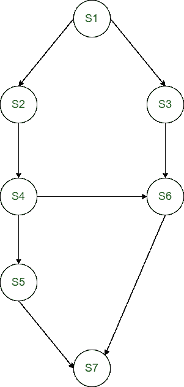
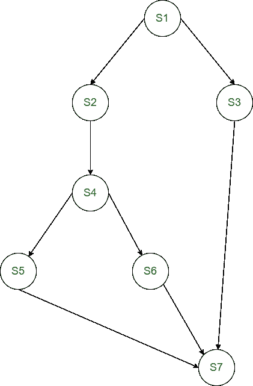

# 并发中的分叉和连接构造

> 原文:[https://www . geeksforgeeks . org/fork-and-join-constructions in-concurrency/](https://www.geeksforgeeks.org/fork-and-join-constructs-in-concurrency/)

先决条件–[进程同步](https://www.geeksforgeeks.org/introduction-of-process-synchronization/)
**分叉:**
**分叉**指令是进程执行中在程序中产生两个并发执行的指令。其中一个并发执行从标记为的语句开始，另一个执行是在跟随*分叉*指令的语句处继续执行。*分叉*系统调用分配有一个参数，即标签(L)。

**Join:**
**Join**指令是进程执行中的一条指令，它提供了将两个并发计算重组为一个计算的媒介。*连接*指令有一个参数整数计数，指定要连接的计算数量。它将整数减一。如果递减后的整数值不为零，则进程终止，否则进程继续执行下一条语句。

**示例-1:**
为下面的分叉/连接程序构建优先图。

```
     S1;
     count1: = 2;
     fork L1;
     S2;
     S4;
     count2: = 2;
     fork L2;
     S5;
     Go to L3;
L1:  S3;
L2:  join count1;
     S6;
L3:  join count2;
     S7;

```

**解决方案:**



**示例-2 :**
为下面的优先图编写一个分叉/连接程序。



**解决方案:**
在 S1 之后需要 fork 语句来创建一个孩子。
S4 叉后语句需要创建一个子。
所有流程需要在 S7 之前加入。

```
     S1;
     count: = 3;
     fork L1;
     S2;
     S4;
     fork L2;
     S5;
     Go to L3;
L2:  S6;
     GOTO L3;
L1:  S3;
L3:  join count;
     S7; 
```