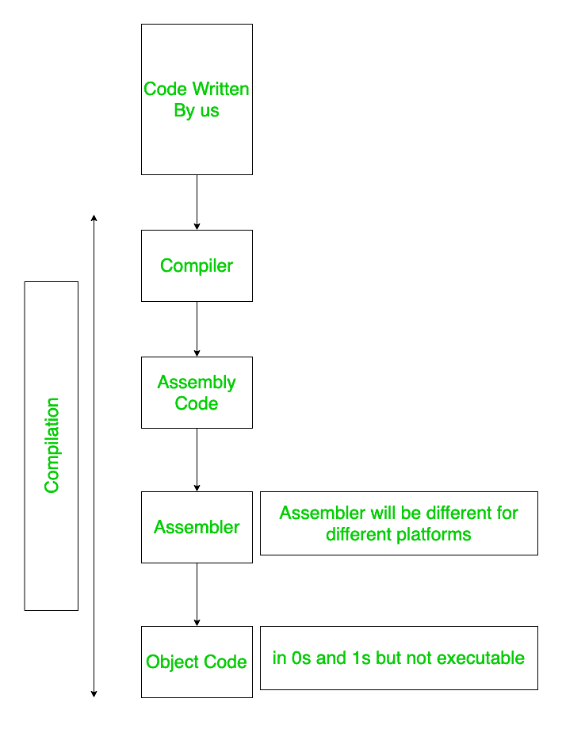
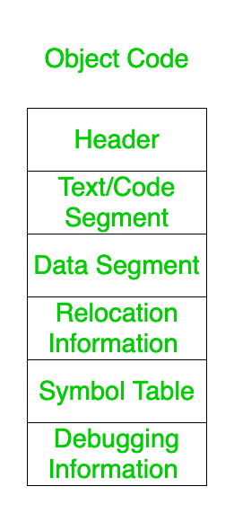
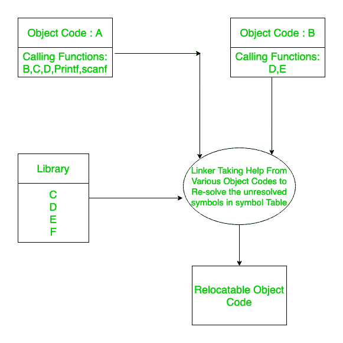

# 程序形成过程

> 原文:[https://www . geeksforgeeks . org/程序形成过程/](https://www.geeksforgeeks.org/formation-of-process-from-program/)

**[进程](https://www.geeksforgeeks.org/introduction-of-process-management/) :** 进程是执行中的程序，称为程序。

但是程序到过程的转换涉及到不同的阶段，这在本文中有明确的定义。此外，在程序被转换成进程后，内存必须分配给主内存中的这些进程，这些内存分配由操作系统使用本文末尾解释的各种方法和算法来处理。

最初，当我们在文本编辑器中编写代码时(无论是哪种语言)，代码都存储在主存储器中。当我们调用编译器时，它会将这些代码转换成汇编代码，也就是说，它将高级代码转换成低级代码。然后汇编程序将编译后生成的汇编代码转换成目标代码。此目标代码属于 0 和 1，但无法直接执行。

为了执行代码，按顺序采用下面解释的步骤。高级代码到低级代码的转换过程是由编译器完成的，这些步骤在编译器设计课程中有明确的定义，其余所有步骤都由操作系统处理。

在现代，编译器为我们完成下面列出的所有工作。因此，在链接和加载到主内存之后，我们不会面临单独编译的麻烦。

**在代码编译期间，它遵循以下定义的步骤:**



在所有上述步骤之后产生的目标代码具有以下部分，即:

```
1. Header
2. Text/Code Segment
3. Data Segment
4. Relocation Information
5. Symbol Table
6. Debugging Information 
```

这些解释如下。

1.  **表头:**
    表示目标代码中有哪些可用的部分，各种部分在主存中出现的位置。它就像一个指针，指向所有部分的位置。
2.  **文本/代码段:**
    它是目标代码中包含实际编写代码的部分。
3.  **数据段:**
    包含数据成员的目标代码部分。

*   **搬迁信息:**
    有 2 种地址–
    *   **即**可重定位地址–
        该地址相对于 0，因为在编译时不知道程序的实际加载位置。
    *   **ii.** Absolute Address –
        The Relocatable Address is converted to Absolute address when the program is finally loaded in the main memory as that point the exact location where the program is loaded would be known.

        

        *   **[Symbol Table](https://www.geeksforgeeks.org/symbol-table-compiler/):**
    Contains all the Symbols i.e all the variables used and all the functions used.It also keeps track of the addresses of functions that are defined by us or functions which are default .

    符号表包含我们定义的函数的地址，但它可能缺少默认函数的地址，因为在我们的程序中，我们不会一次又一次地定义默认函数。因此，默认函数的地址将在符号表中保持未解析状态。

    现在，这个未解析的地址将由链接器在后面的步骤中解析。

    这些程序的设计方式是，从来没有一个单独的目标代码是自给自足的，而是采用各种目标代码来计数，以转换成正确的可执行代码。因此，每个目标代码都需要其他几个目标代码的帮助。

    现在是链接器通过从定义特定函数的各种其他目标代码中获取帮助来重新解决符号表中所有未解析的地址。链接器寻找解析地址的源时，最初会查找与程序相同的目录，如果找不到，则会转到编译器指定的目录。

    **接头分两个阶段工作:**

    **一、第一阶段:**
    在这里，它找出存在哪些段，哪些段要加载。它使用两个表:段表和符号表。

    *   **1。段表–**用于查找要加载的段。
    *   **2。符号表–**用于查找符号表中未解析的待解析符号。

    **二。第二阶段:**
    在这个阶段，链接器实际上解析符号表中所有未解析的符号。

    **注意:**
    如上所述，仍然有一些符号故意不被解析，因为这些是程序常用的，所以直接保存在主内存中。因此，当我们需要解决时，我们直接要求内存中的地址，而不是重复保持相同的代码。这部分代码称为*存根代码*。

    因此，链接器组合所有的目标代码来产生一个单一的目标代码，其中所有的地址将被解析(除了一些常用的)。因此，链接器执行的主要功能是:-

    ```
    1. Relocation
    2. Symbol Resolution 
    ```

    因此，链接器输出一个*可重定位代码*。

    

    现在，加载器将进入画面。加载程序的功能是将程序加载到主存储器中。加载程序知道程序将被加载到哪里。现在，当进程加载到主内存中时，内存分配可以是:-

    **1。连续内存分配:**

    ```
    i. Static allocation
    ii. Dynamic allocation 
    ```

    **2。[非连续内存分配](https://www.geeksforgeeks.org/non-contiguous-allocation-in-operating-system/) :**

    ```
    i. Paging
    ii. Segmentation
    iii. Segmented Paging 
    ```