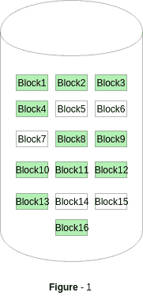
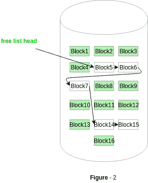

# 操作系统中的空闲空间管理

> 原文:[https://www . geesforgeks . org/操作系统中的自由空间管理/](https://www.geeksforgeeks.org/free-space-management-in-operating-system/)

系统会跟踪空闲磁盘块，以便在创建文件时为其分配空间。此外，要重用删除文件释放的空间，空闲空间管理变得至关重要。系统维护一个空闲空间列表，该列表跟踪未分配给某个文件或目录的磁盘块。可用空间列表可以主要实现为:

1.  **Bitmap or Bit vector –**
    A Bitmap or Bit Vector is series or collection of bits where each bit corresponds to a disk block. The bit can take two values: 0 and 1: *0 indicates that the block is allocated* and 1 indicates a free block.
    The given instance of disk blocks on the disk in *Figure 1* (where green blocks are allocated) can be represented by a bitmap of 16 bits as: **0000111000000110**.

    

    **优势–**

    *   简单易懂。
    *   找到第一个空闲块是有效的。它需要扫描位图中的字(一组 8 位)来寻找非零字。(0 值字的所有位都是 0)。然后通过扫描非零字中的第一个 1 位找到第一个空闲块。

    块数可以计算为:
    *(每个字的位数)*(0 值字的位数)+非零字中第一位 1 的偏移量*。

    对于*图-1* ，我们依次扫描位图中的第一个非零字。
    第一组 8 位(00001110)构成非零字，因为所有位都不是 0。找到非 0 字后，我们寻找第一个 1 位。这是非零字的第五位。因此，偏移量= 5。
    因此，第一个空闲块数= 8*0+5 = 5。

2.  **Linked List –**
    In this approach, the free disk blocks are linked together i.e. a free block contains a pointer to the next free block. The block number of the very first disk block is stored at a separate location on disk and is also cached in memory.

    

    在*图-2* 中，空闲空间列表头指向 Block 5，Block 5 指向 Block 6，下一个空闲块，以此类推。最后一个空闲块将包含一个空指针，指示空闲列表的结束。
    这种方法的一个缺点是自由空间列表遍历所需的 I/O。

3.  **分组–**
    这种方法将空闲块的地址存储在第一个空闲块中。第一个空闲块存储一些，比如 n 个空闲块的地址。在这 n 个块中，前 n-1 个块实际上是空闲的，最后一个块包含下一个空闲的 n 个块的地址。
    这种方法的一个**优势**是可以很容易地找到一组空闲磁盘块的地址。
4.  **Counting –**
    This approach stores the address of the first free disk block and a number n of free contiguous disk blocks that follow the first block.
    Every entry in the list would contain:
    1.  第一个空闲磁盘块的地址
    2.  数字 n

    例如，在图-1 中*，空闲空间列表的第一个条目将是:(【块 5 的地址】，2)，因为块 5 后面有 2 个连续的空闲块。*