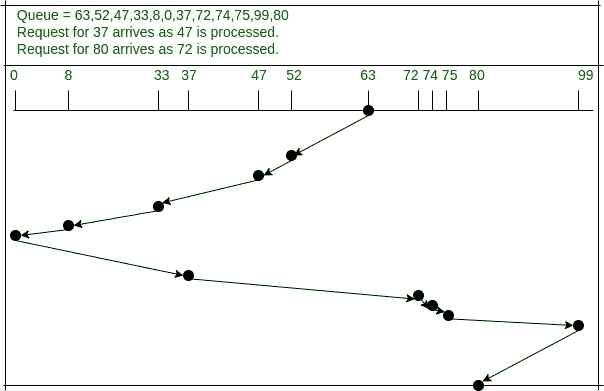

# FScan 磁盘调度算法

> 原文:[https://www . geesforgeks . org/fscan-磁盘-调度-算法/](https://www.geeksforgeeks.org/fscan-disk-scheduling-algorithm/)

**固定周期 SCAN (FSCAN)** 磁盘调度算法主要关注处理**中的高方差[最短寻道时间优先(SSTF)](https://www.geeksforgeeks.org/sstf-full-form/)** 。[扫描算法](https://www.geeksforgeeks.org/scan-elevator-disk-scheduling-algorithms/)也被提出来处理上述情况，但是使用扫描算法在处理位于磁盘极端的请求时会导致长时间的延迟。FSCAN 算法决定磁盘读写头如何移动，以处理 SSTF 方差高的处理问题。

**它是如何工作的？**
FSCAN 使用两个队列，一个队列存储旧的读写请求，另一个队列存储新的读写请求。当处理旧请求时，只处理新请求。FSCAN 算法的变体也可以由 N 个队列组成，这反过来将使响应时间更快。

**如何处理“SSTF 高方差”问题？**
FSCAN 通过“冻结”队列来解决上述问题。一旦扫描开始，扫描开始后到达的请求将在下一次扫描中处理。

**性能分析:**
引用理论分析可以看出，SCAN 的平均响应时间比 FSCAN 低，平均响应时间比最短寻道时间优先(SSTF)高。FSCAN 算法由于高吞吐量和低平均响应时间而具有良好的性能。FSCAN 消除了无限延期的问题。

**示例:如何处理请求**

