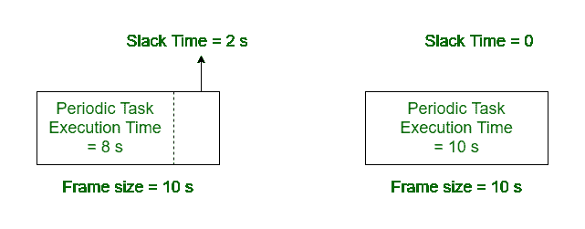

# 广义实时任务调度器

> 原文:[https://www . geeksforgeeks . org/广义-实时-任务调度器/](https://www.geeksforgeeks.org/generalized-real-time-task-scheduler/)

**广义实时任务调度器:**
用于处理或调度所有三类实时任务，即周期、零星和非周期任务的调度器，称为广义任务调度器。它以最熟练的方式安排定期、零星和不定期的任务。

**为什么是广义任务调度器？**
基本上循环调度器用于容纳零星和非周期性任务，但是零星和非周期性任务的到达时间是统计说明的。因此，如果不显著降低系统的整体利用率，就不能将非周期性和零星的任务分配给帧。因此，为了有效地调度这三类任务，在实时系统中引入了广义任务调度器。
用于克服循环调度器、事件驱动、混合调度器和所有实时任务调度器的局限性。

**通用任务调度器的工作:**
通用任务调度器最初只为周期性任务准备调度，即时间框架被分配给周期性任务。现在，在调度周期性任务之后，在帧中可用的空闲时间内调度零星和非周期性任务。
松弛时间是在一个预定的周期性任务完成其执行后，帧中剩余的时间。松弛时间可以是零或非零。当周期性任务的执行时间小于帧大小时，松弛时间为非零。



零星任务只有在有足够的空闲时间时才能安排，而非周期性任务则不同。零星任务需要在截止日期前完成，为了安排零星任务，进行验收测试以检查可用的可宽延时间。
如果松弛时间不够，调度器拒绝零星任务。如果是不定期的任务，不需要进行验收测试。非周期性任务不需要满足截止日期，因此它们被安排在可用的可宽延时间内。

**通用任务调度器的伪代码:**
周期任务的预计算调度存储在表中。假设零星任务已经通过验收测试，只有合格的任务可用。
以下是通用实时任务调度器的伪代码:

```
cyclic scheduler()
{
current-task T = Schedule-table[i];

i = i + 1;
i = i mod N;

// N is the total number of tasks
// in the schedule table

dispatch-current-task(T);

schedule-sporadic-task();
// Current task T completed early,
// sporadic tasks can be scheduled

schedule-aperiodic tasks;
// At the end, aperiodic tasks
// can be scheduled

idle();
// No task to be scheduled
}

```