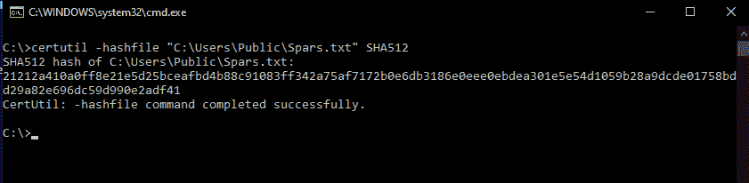

# 使用 CMD 获取文件的哈希

> 原文:[https://www . geesforgeks . org/get-hash-of-a-file-using-cmd/](https://www.geeksforgeeks.org/getting-hash-of-a-file-using-cmd/)

加密哈希是固定大小的字符串(或文本)，用作某些数据的标识符/指纹。这些在确定文件通过通信信道传输后的完整性时特别有用。哈希甚至被某些操作系统级进程用来工作。Windows 操作系统(cmd.exe)的命令处理器为用户提供了通过名为 ***Certutil*** 的实用命令计算文件/目录上的哈希的能力。在本文中，我们将学习在命令提示符(cmd)上计算哈希值。

**命令描述:**
命令 *Certutil* 主要用于处理数字证书，而不是哈希。散列文件的能力是由于其中存在一个 *-hashfile* 开关。

```
> Certutil -hashfile
-hashfile  -- Generate and display cryptographic hash over a file

```

其中 *certutil* 是命令，*-has file*是提供给它的开关。
**语法:**
-hashfile 开关接受两个参数。首先，我们感兴趣获取散列的文件的路径。然后是我们感兴趣的哈希算法。

**创建语法:**

```
Certutil -hashfile (Path_to_file) [HashAlgo]

```

其中 *Path_to_file* 为*必选*(应提供)参数， *HashAlgo* 为可选参数(如未提供，默认为 SHA1)。如果提供了*散列函数*，它应该来自 SHA(安全散列算法)或 MD(消息摘要)加密散列族。命令中允许的一些哈希算法有 MD4、MD5、SHA1、SHA256、SHA512。

**命令的用法:**
为了演示该命令的用法，我们将在文件上运行该命令。我们的示例文件将位于位置“*C:\ Users \ Public \ spars . txt”*。


它包含一些文本数据。因此，要获得文件的 MD5(消息摘要 5)哈希，我们必须执行该命令。

```
certutil -hashfile "C:\Users\Public\spars.txt" MD5
```

该命令在执行时将产生与此类似的输出。

```
MD5 hash of spars.txt:
cb21e6741817a2d3020e02bb94301ae4
CertUtil: -hashfile command completed successfully.

```

要获取上述文件的 SHA512 哈希，命令和输出如下所示:

