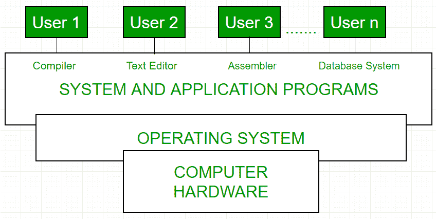

# 从头开始构建操作系统指南

> 原文:[https://www . geesforgeks . org/从头开始构建操作系统指南/](https://www.geeksforgeeks.org/guide-to-build-an-operating-system-from-scratch/)

[**操作系统**](https://www.geeksforgeeks.org/operating-systems/) **:**
一个**操作系统**充当计算机硬件和计算机用户之间的中介。操作系统的主要目的是为应用程序的有效执行提供一个环境。

操作系统管理设备、处理器和内存等资源和服务。流程管理、资源管理、存储管理和安全性是**操作系统**的一些重要功能。

*操作系统的基本架构*

**如何从头构建自己的操作系统？？**

**第一步:**

在开发操作系统之前，有三个最重要的方面需要掌握。它们是计算机科学的基础，基础编程和学习高级和低级编程语言。汇编语言或低级语言用于直接与中央处理器通信。每种类型的中央处理器都讲一种机器语言，每种类型的中央处理器只有一种相应的汇编语言。x86 是最常用的计算机体系结构，C 是开发**操作系统**最常用的高级编程语言。

**参考文献:**

对于低级语言(汇编语言)

*   **现代 X86 汇编语言编程**作者:Daniel Kusswurm。
*   **汇编语言循序渐进:用 Linux 编程**杰夫·邓特曼著。

对于高级语言(现代语言)

*   **克尼根和里奇的 C 编程语言**。
*   **C++:完整参考**
*   **Python 编程**:计算机科学导论。

**第 2 步:**

操作系统开发的下一步是完成操作系统开发教程。

**参考文献:**

以下是从头开始开发**操作系统**的一些有用教程:

*   **来自断刺娱乐的操作系统开发系列**。
*   **关于 OS 开发的小书**作者:埃里克·赫林和亚当·伦伯格。
*   **莫里斯·巴赫设计的 UNIX 操作系统**。

这是从头开始开发操作系统的一个完整的分步过程..