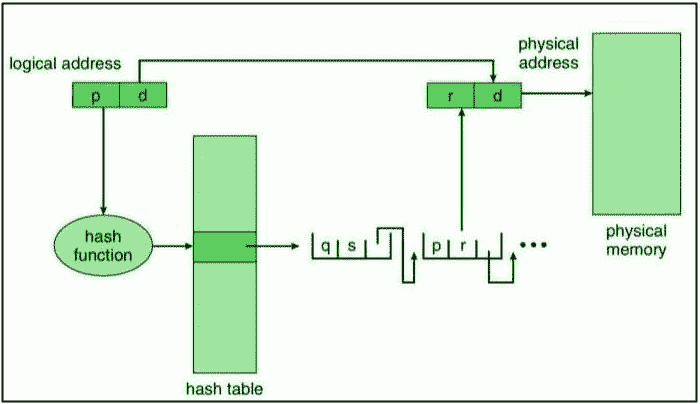

# 操作系统中的散列页表

> 原文:[https://www . geesforgeks . org/操作系统中的散列页表/](https://www.geeksforgeeks.org/hashed-page-tables-in-operating-system/)

以下是构建[页表](https://www.geeksforgeeks.org/page-table-entries-in-page-table/)–[分层分页](https://www.geeksforgeeks.org/multilevel-paging-in-operating-system/)、散列页表和[倒排页表](https://www.geeksforgeeks.org/inverted-page-table-in-operating-system/)的最常见技术。

让我们在本文中探讨更多关于散列页表及其工作原理的内容。

**散列页表:**
在散列页表中，虚拟地址中的虚拟页码被散列到哈希表中。它们用于处理高于 32 位的地址空间。散列表中的每个条目都有一个链接的元素列表，这些元素被散列到同一个位置(为了避免冲突，因为我们可以为不同的页码获得相同的散列函数值)。哈希值是虚拟页码。虚拟页码是不属于页面偏移量的所有位。

对于哈希表中的每个元素，都有三个字段–

1.  虚拟页码(哈希值)。
2.  映射页面框架的值。
3.  指向链表中下一个元素的指针。

**散列页表:**
将虚拟页码与链表第一个元素中的字段 1 进行比较。如果匹配，则使用相应的页面框架(字段 2)来形成所需的物理地址。否则，将检查链表中的后续条目，直到虚拟页码匹配为止。

为了使该算法也适用于 64 位地址空间，使用了聚集页表。

**聚集页表**类似于散列页表，除了散列表中的每个条目引用许多页而不是单个页(如在散列页表中)。因此，集群页表的单个条目可以存储多个物理页帧的映射。

集群页表对于稀疏地址空间特别有用，在稀疏地址空间中，内存引用分散在整个地址空间中(不连续)。