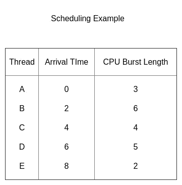
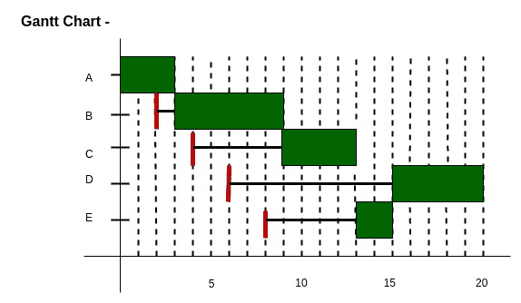

# 最高响应率下一个(HRRN) CPU 调度

> 原文:[https://www . geesforgeks . org/最高响应比-下一个-hrrn-CPU-调度/](https://www.geeksforgeeks.org/highest-response-ratio-next-hrrn-cpu-scheduling/)

**先决条件–**[CPU 调度](https://www.geeksforgeeks.org/gate-notes-operating-system-process-scheduling/)
给定 n 个进程及其到达时间和突发时间，任务是使用 HRRN 调度算法找到平均等待时间和平均周转时间。
名字本身说明我们需要找到所有可用进程的响应率，选择响应率最高的一个。一个进程一旦被选中，将一直运行到完成。

**标准–响应比率**
**模式–非抢先**

```
 Response Ratio = (W + S)/S
```

这里 **W** 是流程到目前为止的等待时间， **S** 是流程的爆发时间。

**HRRN 的表现–**

1.  更短的流程更受欢迎。
2.  没有服务的老龄化增加了比率，较长的工作可以超过较短的工作。



**甘特图–**



**解释–**

*   在 t = 0 时，我们只有一个可用的进程，因此 A 被调度。
*   类似地，在 t = 3 时，我们只有一个可用的进程，所以 B 被调度。
*   现在在 t = 9 时，我们有 3 个过程可用，C，D 和 E。因为，C，D 和 E 分别在 4，6 和 8 个单位后可用。因此，C、D 和 E 的等待时间分别为(9–4 =)5、(9–6 =)3 和(9–8 =)1 个单位。
*   使用上面给出的公式，我们计算出 C、D 和 E 的响应比分别为 2.25、1.6 和 1.5。
*   显然，C 有最高的响应率，所以它得到了安排
*   接下来在 t = 13 时，我们有两个可用的工作 D 和 e。
*   D 和 E 的响应比分别为 2.4 和 3.5。
*   所以接下来选择过程 E，最后选择过程 D。

**实施 HRRN 调度–**

1.  输入进程的数量、到达时间和突发时间。
2.  根据他们的到达时间对他们进行分类。
3.  在任何给定时间，计算响应比率，并选择要安排的适当流程。
4.  将周转时间计算为完成时间-到达时间。
5.  将等待时间计算为周转时间-突发时间。
6.  周转时间除以突发时间得到归一化的周转时间。
7.  将所有进程的等待和周转时间相加，除以进程数，得到平均等待和周转时间。

下面是上述方法的实现:

## C++

```
// C++ program for Highest Response Ratio Next (HRRN) Scheduling
#include <bits/stdc++.h>
using namespace std;
// Defining process details
struct process {
    char name;
    int at, bt, ct, wt, tt;
    int completed;
    float ntt;
} p[10];

int n;

// Sorting Processes by Arrival Time
void sortByArrival()
{
    struct process temp;
    int i, j;

    // Selection Sort applied
    for (i = 0; i < n - 1; i++) {
        for (j = i + 1; j < n; j++) {

            // Check for lesser arrival time
            if (p[i].at > p[j].at) {

                // Swap earlier process to front
                temp = p[i];
                p[i] = p[j];
                p[j] = temp;
            }
        }
    }
}

int main()
{
    int i, j, t, sum_bt = 0;
    char c;
    float avgwt = 0, avgtt = 0;
    n = 5;

    // predefined arrival times
    int arriv[] = { 0, 2, 4, 6, 8 };

    // predefined burst times
    int burst[] = { 3, 6, 4, 5, 2 };

    // Initializing the structure variables
    for (i = 0, c = 'A'; i < n; i++, c++) {
        p[i].name = c;
        p[i].at = arriv[i];
        p[i].bt = burst[i];

        // Variable for Completion status
        // Pending = 0
        // Completed = 1
        p[i].completed = 0;

        // Variable for sum of all Burst Times
        sum_bt += p[i].bt;
    }

    // Sorting the structure by arrival times
    sortByArrival();
    cout << "Name "  << " Arrival Time  " << "   Burst Time   "  <<  "   Waiting Time  "
    << " TurnAround Time  " << "  Normalized TT" ;
    for (t = p[0].at; t < sum_bt;) {

        // Set lower limit to response ratio
        float hrr = -9999;

        // Response Ratio Variable
        float temp;

        // Variable to store next process selected
        int loc;
        for (i = 0; i < n; i++) {

            // Checking if process has arrived and is Incomplete
            if (p[i].at <= t && p[i].completed != 1) {

                // Calculating Response Ratio
                temp = (p[i].bt + (t - p[i].at)) / p[i].bt;

                // Checking for Highest Response Ratio
                if (hrr < temp) {

                    // Storing Response Ratio
                    hrr = temp;

                    // Storing Location
                    loc = i;
                }
            }
        }

        // Updating time value
        t += p[loc].bt;

        // Calculation of waiting time
        p[loc].wt = t - p[loc].at - p[loc].bt;

        // Calculation of Turn Around Time
        p[loc].tt = t - p[loc].at;

        // Sum Turn Around Time for average
        avgtt += p[loc].tt;

        // Calculation of Normalized Turn Around Time
        p[loc].ntt = ((float)p[loc].tt / p[loc].bt);

        // Updating Completion Status
        p[loc].completed = 1;

        // Sum Waiting Time for average
        avgwt += p[loc].wt;
        cout<< "\n" << p[loc].name <<"\t" << p[loc].at;
        cout << "\t\t" << p[loc].bt <<"\t\t"<< p[loc].wt;
        cout <<"\t\t"<<  p[loc].tt <<"\t\t"<< p[loc].ntt;
    }
    cout << "\nAverage waiting time: " << avgwt / n << endl;
    cout <<"Average Turn Around time:"<< avgtt / n;
}
//This code is contributed by shivi_Aggarwal
```

## C

```
// C program for Highest Response Ratio Next (HRRN) Scheduling
#include <stdio.h>

// Defining process details
struct process {
    char name;
    int at, bt, ct, wt, tt;
    int completed;
    float ntt;
} p[10];

int n;

// Sorting Processes by Arrival Time
void sortByArrival()
{
    struct process temp;
    int i, j;

    // Selection Sort applied
    for (i = 0; i < n - 1; i++) {
        for (j = i + 1; j < n; j++) {

            // Check for lesser arrival time
            if (p[i].at > p[j].at) {

                // Swap earlier process to front
                temp = p[i];
                p[i] = p[j];
                p[j] = temp;
            }
        }
    }
}

void main()
{
    int i, j, t, sum_bt = 0;
    char c;
    float avgwt = 0, avgtt = 0;
    n = 5;

    // predefined arrival times
    int arriv[] = { 0, 2, 4, 6, 8 };

    // predefined burst times
    int burst[] = { 3, 6, 4, 5, 2 };

    // Initializing the structure variables
    for (i = 0, c = 'A'; i < n; i++, c++) {
        p[i].name = c;
        p[i].at = arriv[i];
        p[i].bt = burst[i];

        // Variable for Completion status
        // Pending = 0
        // Completed = 1
        p[i].completed = 0;

        // Variable for sum of all Burst Times
        sum_bt += p[i].bt;
    }

    // Sorting the structure by arrival times
    sortByArrival();
    printf("\nName\tArrival Time\tBurst Time\tWaiting Time");
    printf("\tTurnAround Time\t Normalized TT");
    for (t = p[0].at; t < sum_bt;) {

        // Set lower limit to response ratio
        float hrr = -9999;

        // Response Ratio Variable
        float temp;

        // Variable to store next process selected
        int loc;
        for (i = 0; i < n; i++) {

            // Checking if process has arrived and is Incomplete
            if (p[i].at <= t && p[i].completed != 1) {

                // Calculating Response Ratio
                temp = (p[i].bt + (t - p[i].at)) / p[i].bt;

                // Checking for Highest Response Ratio
                if (hrr < temp) {

                    // Storing Response Ratio
                    hrr = temp;

                    // Storing Location
                    loc = i;
                }
            }
        }

        // Updating time value
        t += p[loc].bt;

        // Calculation of waiting time
        p[loc].wt = t - p[loc].at - p[loc].bt;

        // Calculation of Turn Around Time
        p[loc].tt = t - p[loc].at;

        // Sum Turn Around Time for average
        avgtt += p[loc].tt;

        // Calculation of Normalized Turn Around Time
        p[loc].ntt = ((float)p[loc].tt / p[loc].bt);

        // Updating Completion Status
        p[loc].completed = 1;

        // Sum Waiting Time for average
        avgwt += p[loc].wt;
        printf("\n%c\t\t%d\t\t", p[loc].name, p[loc].at);
        printf("%d\t\t%d\t\t", p[loc].bt, p[loc].wt);
        printf("%d\t\t%f", p[loc].tt, p[loc].ntt);
    }
    printf("\nAverage waiting time:%f\n", avgwt / n);
    printf("Average Turn Around time:%f\n", avgtt / n);
}
```

## 蟒蛇 3

```
# Python3 program for Highest Response Ratio
# Next (HRRN) Scheduling

# Function to sort process by arrival time
def sortByArrival(at, n):

    # Selection Sort applied 
    for i in range(0, n - 1):
        for j in range(i + 1, n):

            # Check for lesser arrival time 
            if at[i] > at[j]:

                # Swap earlier process to front
                at[i], at[j] = at[j], at[i]

# Driver code
if __name__ == '__main__':

    sum_bt = 0
    avgwt = 0
    avgTT = 0
    n = 5

    completed =[0] * n
    waiting_time = [0] * n
    turnaround_time = [0] * n
    normalised_TT = [0] * n

    # Predefined arrival times 
    arrival_time = [ 0, 2, 4, 6, 8 ]

    # Predefined burst times 
    burst_time = [ 3, 6, 4, 5, 2 ]
    process = []

    # Initializing the structure variables 
    for i in range(0, n):
        process.append(chr(65 + i))
        sum_bt += burst_time[i]

    # Sorting the structure by arrival times 
    sortByArrival(arrival_time, n)
    print("Name", "Arrival time",
          "Burst time", "Waiting Time",
          "Turnaround ", "Normalized TT")
    t = arrival_time[0]

    while(t < sum_bt):

        # Set lower limit to response ratio 
        hrr = -9999
        temp, loc = 0, 0

        for i in range(0, n):

            # Checking if process has arrived
            # and is Incomplete 
            if arrival_time[i] <= t and completed[i] != 1:

                # Calculating Response Ratio 
                temp = ((burst_time[i] +
                        (t - arrival_time[i])) /
                         burst_time[i])

                # Checking for Highest Response Ratio 
                if hrr < temp:

                    # Storing Response Ratio 
                    hrr = temp

                    # Storing Location
                    loc = i

        # Updating time value 
        t += burst_time[loc]

        # Calculation of waiting time
        waiting_time[loc] = (t - arrival_time[loc] -
                                 burst_time[loc])

        # Calculation of Turn Around Time 
        turnaround_time[loc] = t - arrival_time[loc]

        # Sum Turn Around Time for average 
        avgTT += turnaround_time[loc]

        # Calculation of Normalized Turn Around Time 
        normalised_TT = float(turnaround_time[loc] /
                              burst_time[loc])

        # Updating Completion Status
        completed[loc] = 1

        # Sum Waiting Time for average 
        avgwt += waiting_time[loc]

        print(process[loc], "\t\t", arrival_time[loc],
              "\t\t", burst_time[loc], "\t\t",
              waiting_time[loc], "\t\t",
              turnaround_time[loc], "\t\t",
              "{0:.6f}".format(normalised_TT))

    print("Average waiting time: {0:.6f}".format(avgwt / n))
    print("Average Turn Around time:  {0:.6f}".format(avgTT / n))

# This code is contributed by etcharla revanth rao
```

**输出:**

```
Name    Arrival Time    Burst Time    Waiting Time    TurnAround Time     Normalized TT
A        0        3        0        3        1.000000
B        2        6        1        7        1.166667
C        4        4        5        9        2.250000
E        8        2        5        7        3.500000
D        6        5        9        14        2.800000
Average waiting time:4.000000
Average Turn Around time:8.000000
```

本文由 **Siddhant Bajaj** 供稿。如果你喜欢 GeeksforGeeks 并想投稿，你也可以使用[write.geeksforgeeks.org](https://write.geeksforgeeks.org)写一篇文章或者把你的文章邮寄到 review-team@geeksforgeeks.org。看到你的文章出现在极客博客主页上，帮助其他极客。
如果你发现任何不正确的地方，或者你想分享更多关于上面讨论的话题的信息，请写评论。