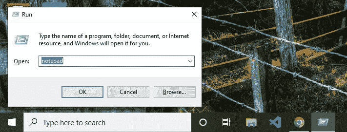
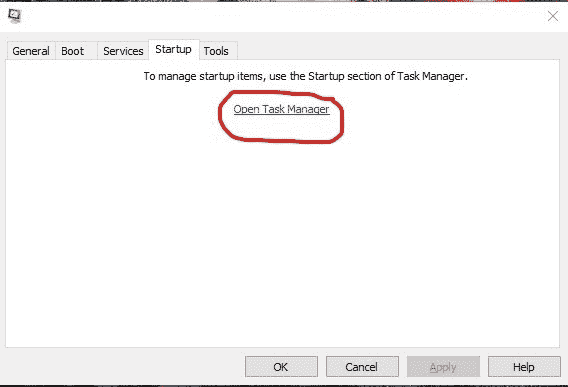
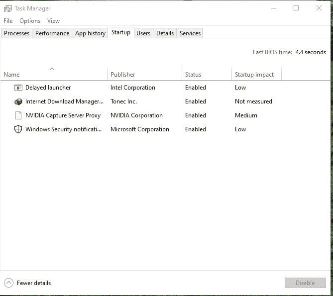
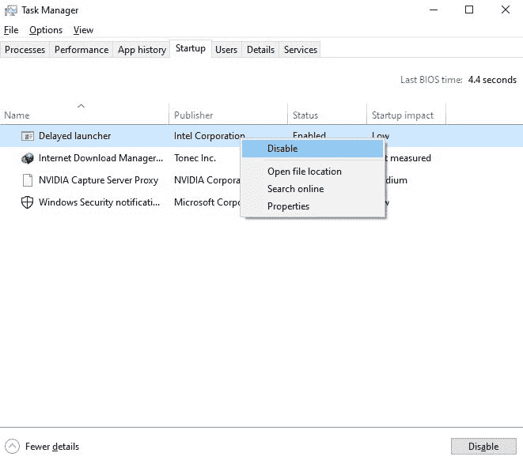
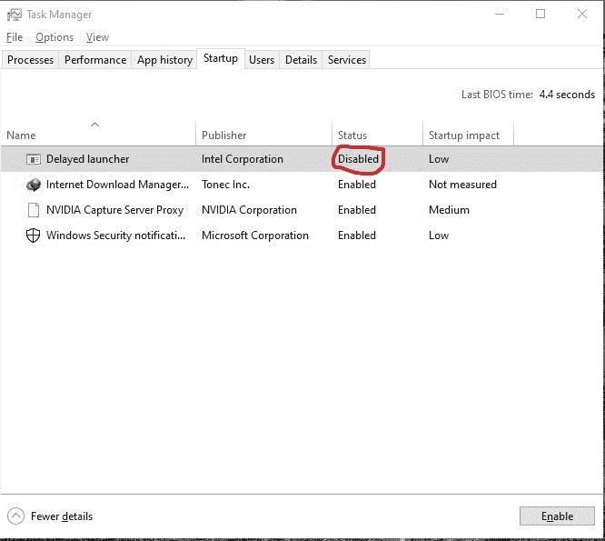

# 如何禁用 Windows 启动服务？

> 原文:[https://www . geesforgeks . org/如何禁用-windows-启动-服务/](https://www.geeksforgeeks.org/how-to-disable-windows-startup-services/)

**Windows 中的启动服务**是系统启动时自动启动的程序或应用程序。这些包含一些在系统启动后需要自动运行的基本服务。这些服务在后台运行，以确保系统的正常功能。

当这些程序或应用程序的自动启动被启用时，它会在启动期间导致 CPU 负载，从而影响系统的性能。

因此，我们也可以禁用这些程序或应用程序的自动启动，以提高系统的性能，但在禁用任何自动启动应用程序之前，请确保它不会导致任何关键问题，因为某些应用程序必须自动启动，系统才能正常运行。

#### 禁用启动服务

禁用 Windows 启动服务的步骤如下:

**第一步:**按键盘上的 **( <link rel="stylesheet" href="https://maxcdn.bootstrapcdn.com/font-awesome/4.6.1/css/font-awesome.min.css"> *** + R ** )*** *。将出现**运行对话框**。

**第二步:**清除文本框内容，然后在其中键入 **msconfig** 。

**第三步:**现在点击回车键。将出现一个对话框。导航至**启动**部分。如果你使用的是 **Windows 7** 你会看到列出的所有启动服务，但是如果你使用的是 **Windows 10** 那么你会看到如下图所示的东西，点击**“打开任务管理器”**查看启动服务。

**步骤 4:** 现在所有的 Windows 启动服务都会在如下所示的对话框中列出:

**步骤 5:** 禁用启动服务。**右键单击要禁用的应用程序**，然后**选择禁用选项**。

**启动服务将成功禁用如下所示:**
*