# 如何在 Windows 10 中获取音量混合器？

> 原文:[https://www . geesforgeks . org/如何获取 windows-10 中的音量混合器/](https://www.geeksforgeeks.org/how-to-get-volume-mixer-in-windows-10/)

Windows 10 发布于 2015 年，几乎所有人都喜欢这个新界面。但是，它删除了早期可用的音量混合器快捷方式。使用它可以直接从任务栏中的音量控制图标轻松调整每个应用程序的音量。

### Windows 10 中的默认音量混合器

Windows 10 将音量混音器功能移到了设置菜单(快捷键:Windows 键+ I)。

```
Settings -> System -> Sound ->  Advanced Sound Options -> App volume and device preferences 
```

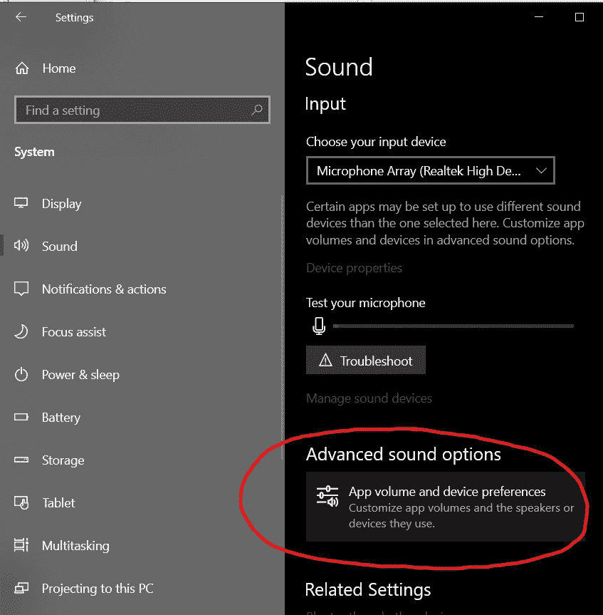

设置菜单

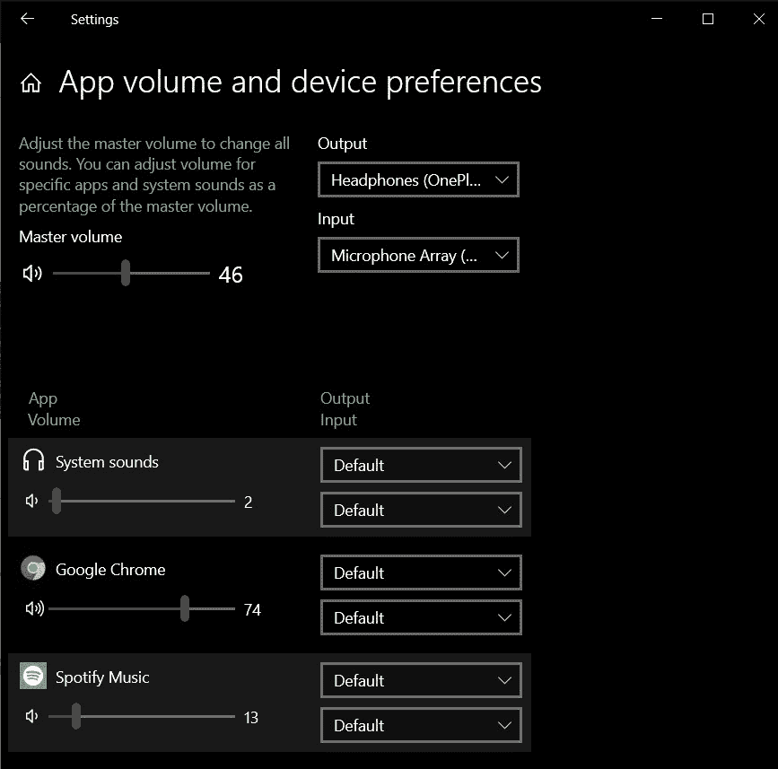

Windows 10 中的默认音量混合器

然而，每次打开设置菜单来改变不同应用程序的音量是相当麻烦的。

因此，更好的方法是使用旧版本上可用的旧的**传统音量混合器**。

### 传统窗口音量混合器

它可以通过一些简单的步骤在 Windows 10 中启用。在这里，我们将编辑 Windows 注册表，任何意外的更改都可能导致您的计算机停止运行。所以，请非常仔细地遵循这些步骤。

1.打开**注册表编辑器**

*   打开运行窗口。在那里输入**注册表编辑**并按回车键打开注册表编辑器。

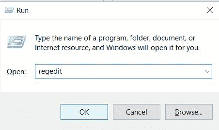

运行-> regedit

*   在窗口开始菜单中搜索“注册表编辑器”。

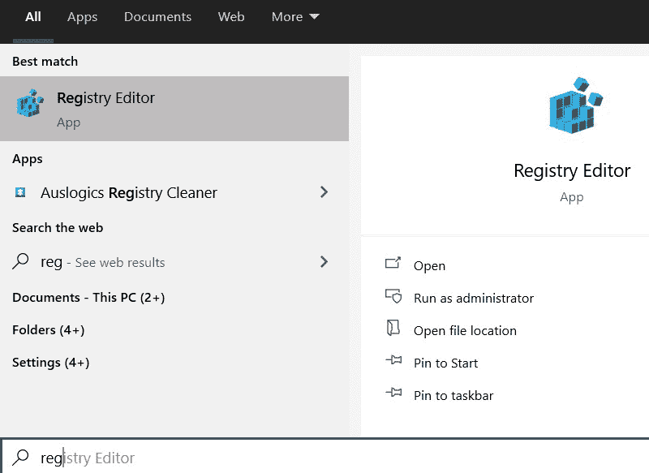

使用开始菜单打开注册表编辑器

选择**是**，如果有任何提示要求许可，则运行应用程序。

2.导航到以下目录:

```
Computer\HKEY_LOCAL_MACHINE\SOFTWARE\Microsoft\Windows NT\CurrentVersion
```

你可以把它粘贴在地址框里，然后按回车键。

3.右键点击**当前版本**，然后转到**新建- >键**并命名为 **MTCUVC。**

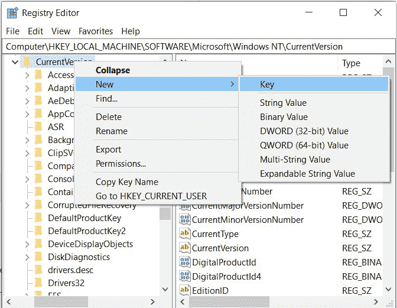

创建新密钥

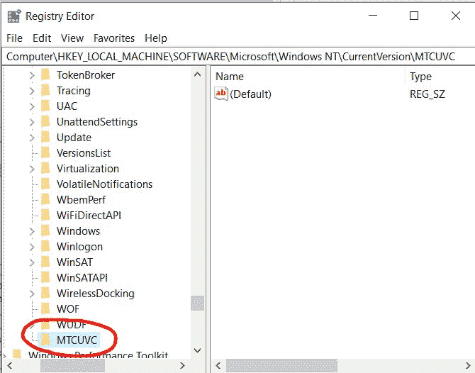

命名密钥

4.右键点击 **MTCUVC** ，然后点击**新建- > DWORD(32 位)值**。将其命名为 **EnableMtcUvc。**

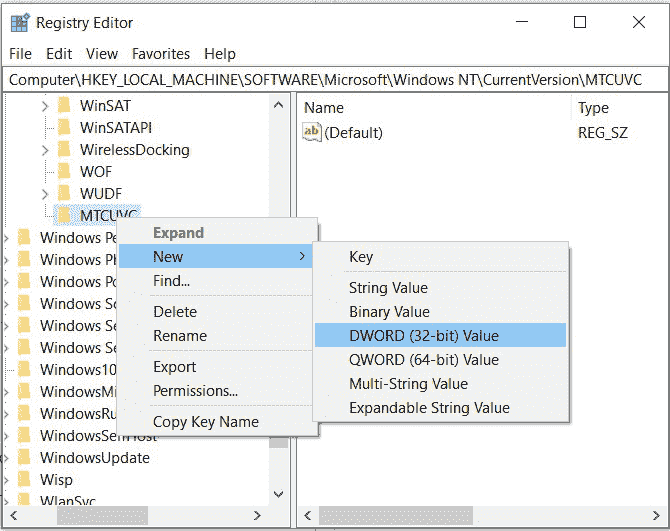

创建新的数据仓库

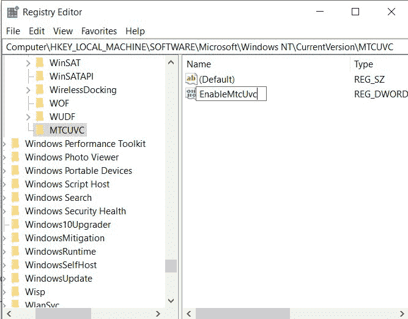

名称 DWORD

5.打开，确保默认**值数据**为 **0** 。

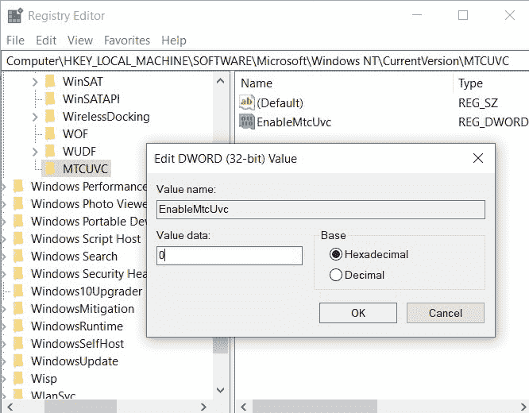

确保值数据为 0

6.现在只需关闭注册表编辑器窗口，点击任务栏上的扬声器图标，就可以获得旧的音量控制。

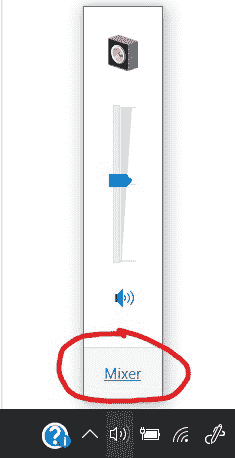

你得到了旧的音量控制


### 返回

如果您想要恢复更改，只需删除在注册表编辑器中创建的 MTCUVC 项。

### 厄普勒斯

另一种方法是使用微软商店上的开源 ear 小号应用程序，它为相同的任务提供了更好的用户界面。

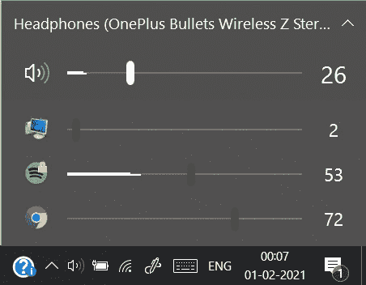

eartrumpet 游泳